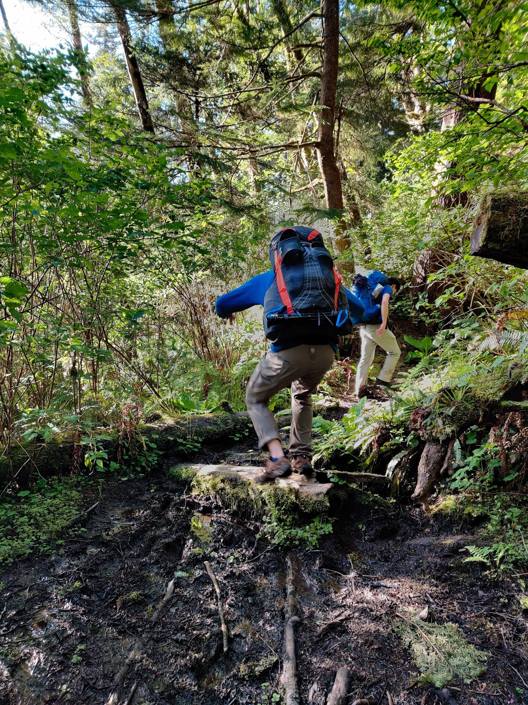
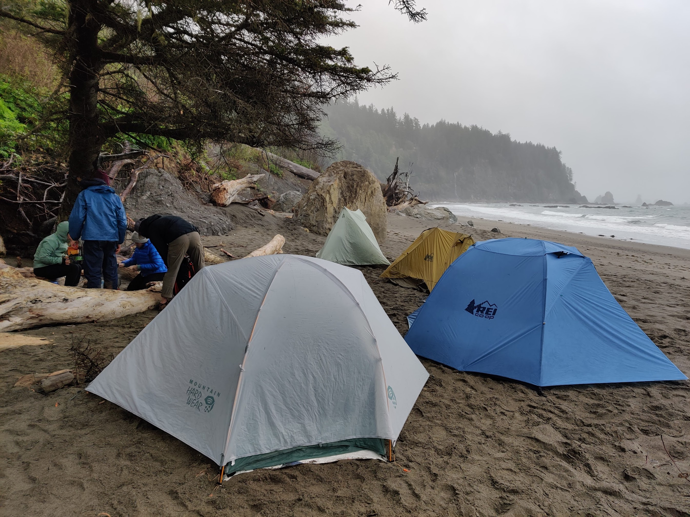

The South Olympic Coast (also called the Wildcatter coast) is an incredible hike along some of the wildest parts of Washington. There aren't many undeveloped sections of the pacific coast left in the US short of the Lost Coast in California, and the northern Olympic coast. We backpacked it for two nights in Spring 2021.

As a point to point through hike, logistics is a little more complicated. We dropped off a car at the Second Beach trailhead for a shuttle and started at Oil City Trailhead (near the Hoh river) going north, but both directions are possible.

## Itinerary

Here's our rough itinerary:

- Day 1
  - Drop off 2nd car at Third Beach Trailhead
  - Start at Oil City Trailhead
  - Hike 7.5 miles to Mosquito Creek Camp

- Day 2
  - Hike 12 miles to Third Beach

- Day 3
  - Hike 2 miles to Third Beach Trailhead

As an alternative to a long second day, you can camp at Strawbery Point or Toleak Point for a shorter mileage.

A shorter version of the hike is possible from Second Beach to Strawberry Point, as an out-and-back hike. We met lots of hikers doing this trip. I think you get most of the highlights of the thru-hike and the most interesting beaches, while avoiding the less maintained trails at the southern end of the trail.

The NPS has a [very detailed writeup](https://www.nps.gov/olym/planyourvisit/south-coast-route.htm) about the South Coast trail that is an absolute read, with more detail on the trail conditions and tide restrictions to be aware of.



## Trail Report

**Day 1**

We started at the Oil City Trailhead at around 2:30 PM, and after a quick meander through a forest, we arrived at the beach. Right from the start of this section you hit a big boulder patch to cross, which took some time and took a little bit of scrambling. This is the first tidal section we have to be careful about, but we luckily planned for it and had plenty of time to clear this 1 mile section at low tide.

After clearing the rocky section, we get our first glance at the imposing Hoh Head. The trail used to cross this cliffy outcropping by the beach, but due to dangerous rockfalls that section of the beach is closed to hikers. To allow safe passage, a steep inland trail exists. Look for a rope ladder at the end of the first beach.

The inland trail could definitely use more maintenance and love, and it sometimes can hardly be called a trail. We encountered a few landslides and blowdowns that had to be navigated around, not to mention many many muddy sections that slowed us down. This section also seemed to go on for seemingly forever, and is pretty dull with only occasional views of the sea. Crossing this section took us almost the entire afternoon, until we finally arrived at Mosquito Creek, our first night campsite.

Mosquoto Creek is, despite its name, a rather nice place to spend the night. There's plenty of tree cover to protect you from the elements, and you get a nice view of the sea from up a small hill. A 5 minute walk takes you to Mosquoto Creek, where there is drinking water. The water is tainted brown, a bit like tea, because of the tannins in the creek water, but is otherwise safe to drink with no taste.

We made camp, had a little campfire, cooked and slept well.

**Day 2**

If the theme if the first day was hiking that rather muddy trail in the forest, the theme of the second day would be beach walking. We got to see interesting sea stacks, tidepools, and other sea critters. Unfortunately the weather was a bit overcast that day, and looking a bit gloomy at times, but we didn't get rained on much.

There is still a few overland sections, but they are much shorter. We stopped at a waterfall around Goodman Creek and Falls Creek, which was nice to see. I went for a dip under the waterfall even if the water is glacial! These two creeks requires fording, but it wasn't too bad.

The sea stacks really picks up around Toleak Point and Strawberry Point, and those areas were extremely popular with other campers. This is a great spot to stop if you're looking for a great sunset! We met many backpackers who hiked here from Third Beach to camp, and are not attempting the whole thru-hike to Oil City.

Finally, we set up camp on right on Third Beach after making sure that our tent sites are above the high tide line. The weather wasn't too great and so instead of waiting for the sunset we ate, settled in the biggest tent and played cards, before calling it a night.

**Day 3**

The weather was a lot better today! I woke up to a beautiful morning with the accompanying soundtrack of crashing waves. We packed everything up, had breakfast, and hiked out the remaining 2 miles out to the Third Beach Trailhead parking lot. It was pretty much entirely flat except for a slight hill to get out of the beach, and followed a nice, wide trail out. It was much better than trail on our first day!

Overall, it's an exhausting hike, the overland sections were grueling and the Hoh Head trail was not in the best shape, so it was a little demoralizing when our mileage is much slower than what we are used to when hiking normally. 

## Permits
As is with most National Parks, reservations for the campsites are required. You can get a backcountry permit [here](https://www.recreation.gov/permits/4098362). Luckily, the quota for the campsites are quite high, so scoring a permit shouldn't be difficult, but expect lots of company on weekends.

You also need to reserve a [shuttle](https://www.hikeolympic.com/trailhead-shuttle-schedule) to be dropped off between trailheads, as this is a through hike. We opted instead to drop off a second car. Keep in mind that driving between the two trailheads will take about an hour.

Since the coast is pretty far from Seattle, if you are coming from there, you likely will need to commit to a long drive before and after the hike, or stay at a campground or lodging nearby. Forks is the biggest town nearby with services and supplies, and the nearest NPS campground is at Mora or Kalaloch.

## When to go
The Olympic coast is accessible year-round, but this trail will be extremely muddy in the wet months (November to March).

## How to get here
The Olympic Coast is about 4 hours drive from Seattle. It's a long drive, and you'll be tempted to make some stops along the National Park along the way!

## What to pack
I’ll probably write a more in-depth post about my backpacking gear later, but it’s good to carry your 10 essentials as with any hike.

There are plenty of resupply/filter points by the creeks, and the water definitely needs to be filtered.

A bear canister is also required for all overnight trips om on the coast per NPS regulation, and as always, please observe Leave No Trace principles. Enjoy!

