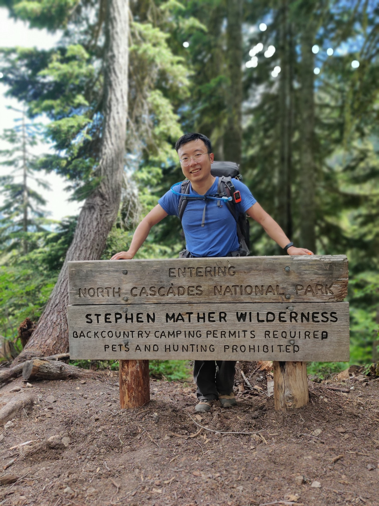
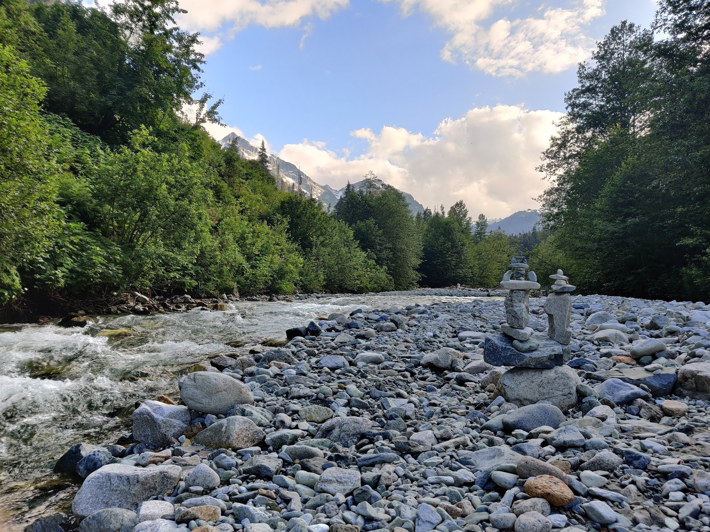
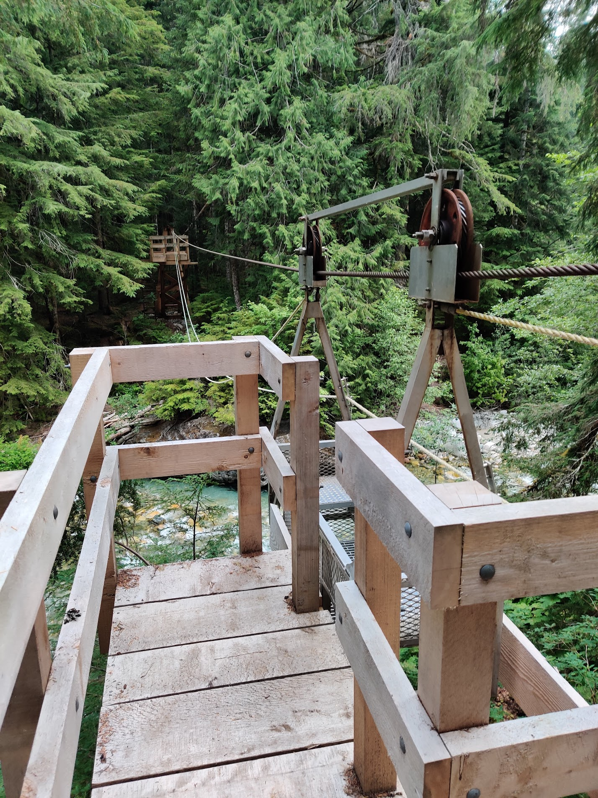
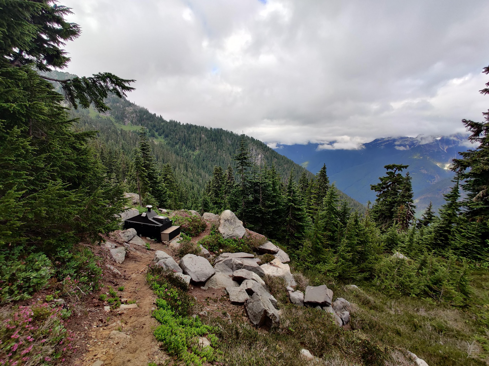
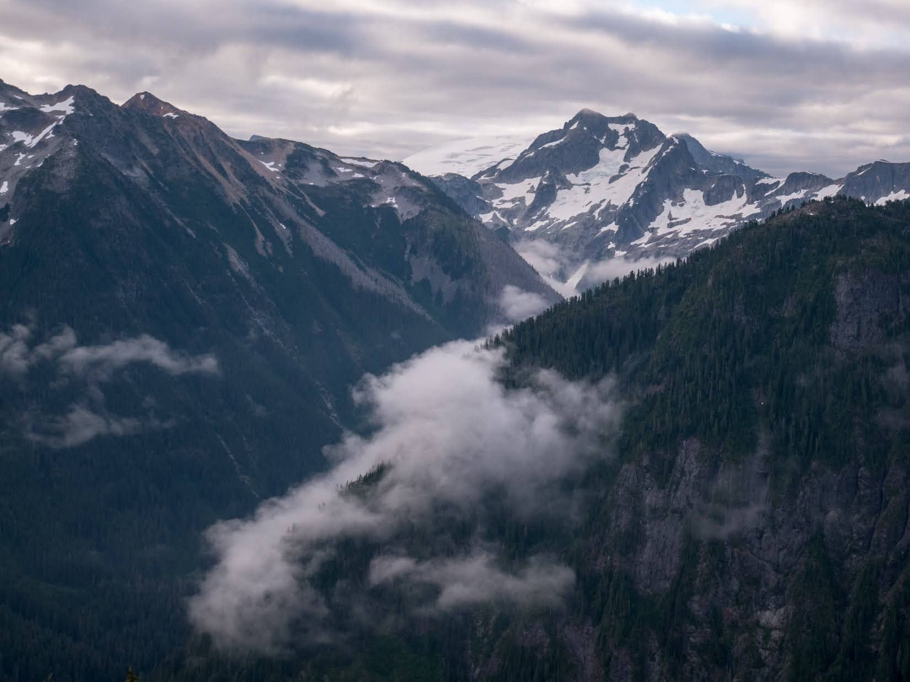
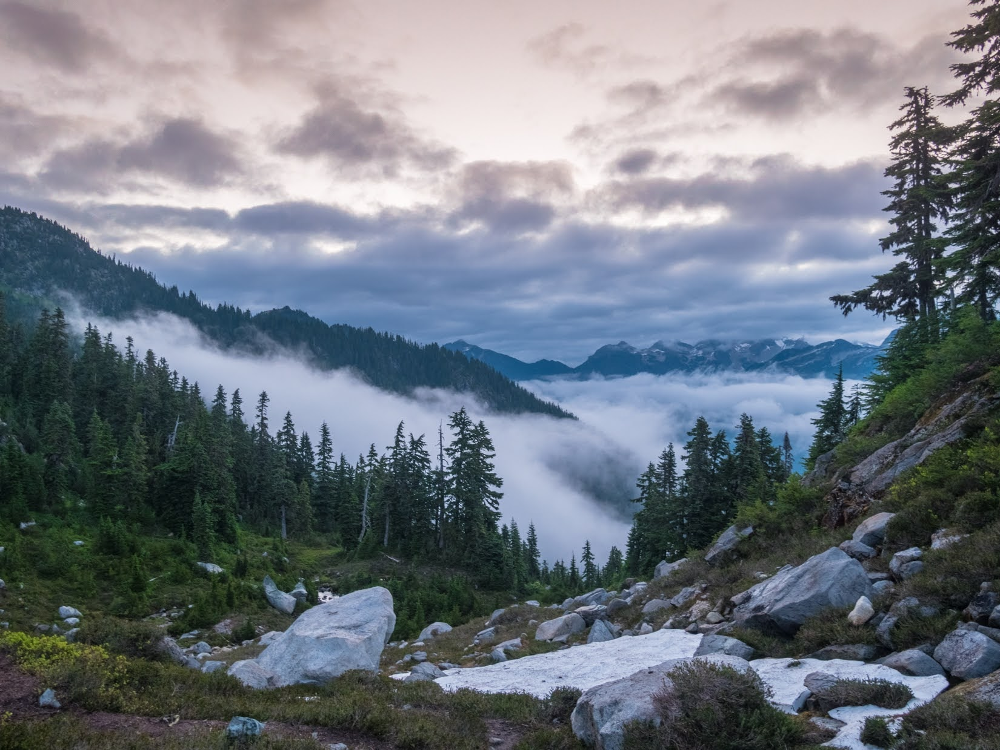
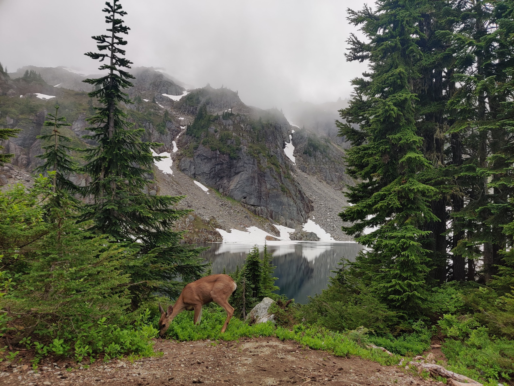

Went out for a two night trip hiking Copper Ridge counter clockwise on 7/15-7/17, and camped at **US Cabin** first night, then **Copper Lake** on the second. We knew this would be a hard hike given the elevation gain we would be expected to climb on the second dish, and the ranger writing the permit warned us too, but we thought it was doable.

## Trail Description

<iframe src="https://www.google.com/maps/d/u/0/embed?mid=1vokvD9z61OPSZS-sotv1Pwb8V03Ku5U&ehbc=2E312F" width=”100%” height="480"></iframe>
<figcaption>Google Maps of our route and points of interest</figcaption>

**Day 1**

Getting to the Hannegan Pass trailhead was easy enough and the road, even if gravel, was pretty easy to drive even in a sedan.

The trail starts off easy enough through a steady ascent to Hannegan Pass, we found the trail to be in good shape but there was a lot of bugs, interestingly they more or less disappeared once we got to the other side of the pass and entered the National Park. There are some dispersed campgrounds at the pass in USFS land, and no permit is needed there. This could be a decent choice if you weren't able to score a permit and still want to explore the area.

From there we descended to the valley floor into the dense forest canopy, which was a very welcome shelter from the afternoon sun. There isn't too much to see except the occasional waterfall, but it's a pretty quiet trail away from most day hikers, so we found a lot of solitude hiking to US Cabin.

The campsite is pretty decent, you can get a nice view of the valley if you walk over to the Chilliwack River, and the campsites themselves are quite spacious. You won't even notice the other campers there!

**Day 2**

The next day, we got a very early start because we know it would be a difficult day to day the least. We were looking at 14 miles of hiking up 4200' elevation. We started off the trip right away with one of the highlights of the loop, the Chilliwack River Cable Car. It was quite enjoyable and definitely not something you see hiking!

The rest of the riverside trail is rather overgrown and quiet. Since it's so overgrowth and there are numerous blowdowns, wearing long pants is a food idea in this section.

We bumped into just another group in this section. After hitting Indian Creek Camp (and a suspension bridge!), we had to ford the Chilliwack River. At the time of this writing, the water level is a little bit strong and more than knee high, so some caution is warranted. You also want to pay attention to the pink tapes in trees indicating where to go, we had to double back a few times to find the trail there.

Then came the ascent up to Copper Ridge and boy that was a knee torcher! Since we started early we took our time going up, but the trail is indeed quite steep and there's a few downed trees to navigate.

Eventually we made out way to Copper Lake and that was just a beautiful campsite. There is a food storage locker and a high tech composting toilet on-site, so it was great to see so many amenities there! There was a rather friendly deer at our campsite, but we heard from campers that a bear frequented the campground the night before, but we did not see it.

**Day 3**

On our third and last day we broke camp early and headed to the Copper Mountain Lookout, where we met with Mashka, who is a volunteer who is staffing the lookout. She provided us with great conversation as we looked at the views of Baker and the North Cascades! It just so happened that the whole valley below us was covered with clouds, and it was really beautiful.

After that it was just a long hike back to the trailhead, and we bumped into a WTA work crew working hard building more drainage on Hannegan Pass.

Overall I loved the trip and the weather conditions were just perfect (cloudy and overcast). If I were to do it again I would add extra nights to explore Whatcom Pass or Hannegan Peak, they looked beautiful from a vantage point, and might be even better there in person!

## Permits
North Cascades National Park requires overnight permits to camp in the entire park, and they can be reserved via Recreation.gov. It's a fairly sough after backpacking route, so expect lots of competition!

You’ll also need a National Parks pass, and it’s good to have it ahead of time as there is no pay stations at the rather rustic parking lot.

## When to go
Mid to late summer is the best time to go. The trail is snow covered before mid-july which makes traverse difficult. Snow was still present on the ridge in many places when we went in mid-July.

## How to get here
The trailhead is located at Hannegan Pass up the road to Mt Baker. You'll have to contend with a gravel road (totally traversible by Sedan!), and a pretty basic trailhead at the end.

## What to pack
I’ll probably write a more in-depth post about my backpacking gear later, but it’s good to carry your 10 essentials as with any hike.

There are plenty of resupply/filter points by the river, and by the campsites, but there are sections that are pretty exposed to the sun up the ridge, so it's good to stay hydrated!

A bear canister is also required for all overnight trips in the area per NPS regulations, and as always, please observe Leave No Trace principles. Enjoy!

