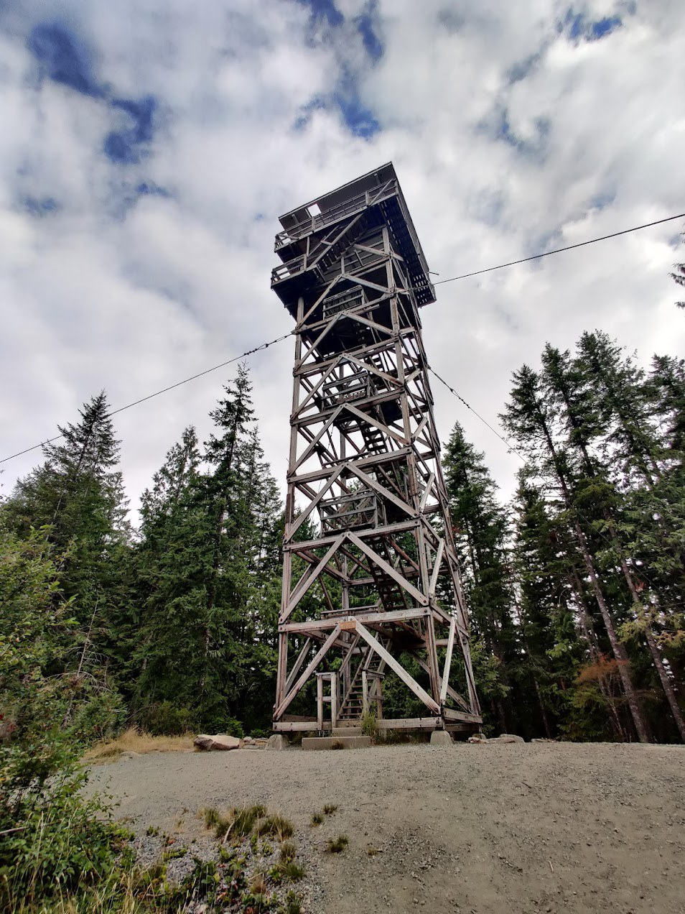
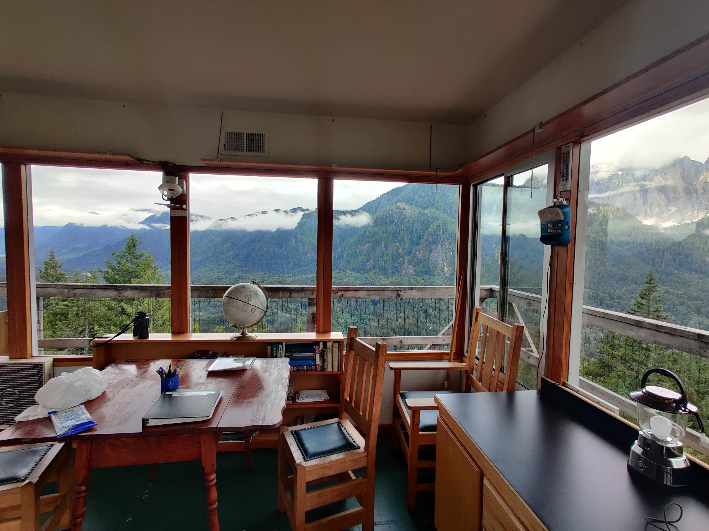
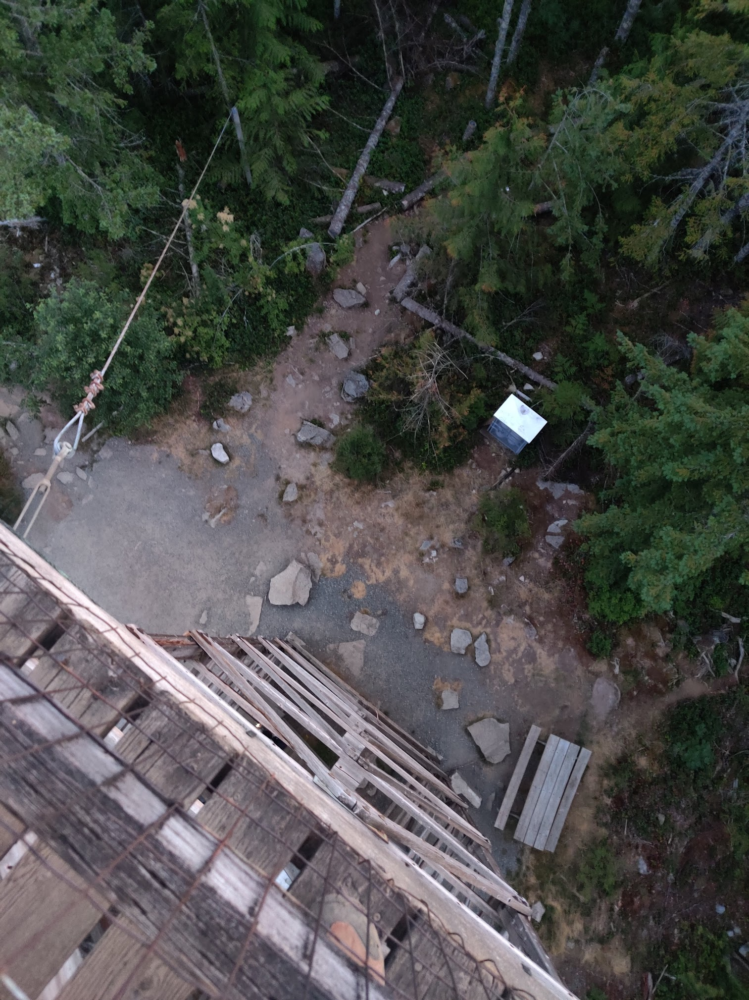
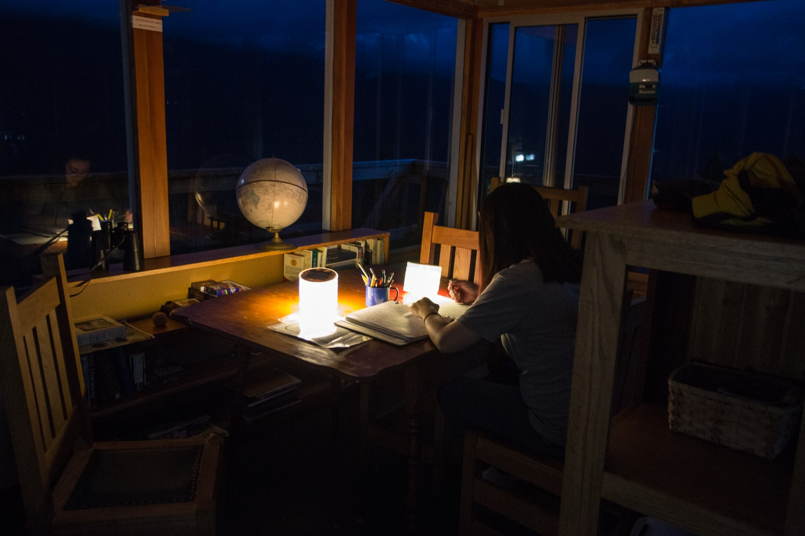
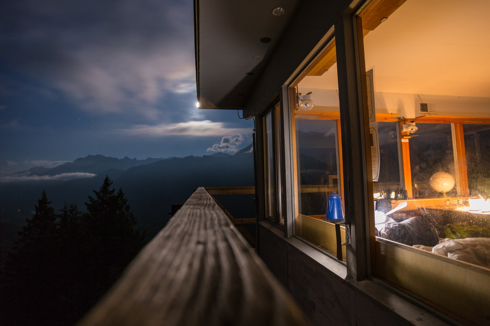

Heybrook Lookout is one of the most unique places to spend a night in the state. Who wouldn't want to stay atop a lookout tower? Now, there are a number of fire lookouts you can get to around Seattle, but most of them are first-come-first-serve, and with how popular they are, you might very well have to get lucky. 

Heybrook is a rare gem as it is bookable through [recreation.gov](https://www.recreation.gov/camping/campgrounds/269838) ahead of time, and you get keys and private access to the top floor away from dayhikers!

My girlfriend and I stayed overnight at the lookout (with a prior booking), and hiked in at around 8PM on a weekday. We bumped into the last of the departing dayhikers as the sun set.

By the time we reached the lookout we had the whole place to ourselves! The hike was definitely a little bit more exhausting than I expected, since most of the climb was in the first half mile of the hike, and is basically just a continuous climb with a full pack.

The lookout was very clean, and came with a lot of amenities, like a radio, heater, and stove! The furniture provided almost feels like what you would find in a cabin, and you can get very comfortable here, far more comfortable than other lookouts I've been. The toilet is at the bottom of the lookout, though, so it is a pretty long trip getting down there at night.

Surprisingly there is reception near the tower too. We had fun signing the logbook and taking photos at night, and hiked out first thing next morning before the crowd came in. The logbook is especially worth a read! Lots of really fun messages in there.

## Permits
Anyone can hike to the lookout without a reservation, but [you need one](https://www.recreation.gov/camping/campgrounds/269838) to stay there overnight, and to get to the top floor. Spots are booked months in advance, so (very) advance bookings are required, and cancellations do happen!

Although staying there overnight is the best way to experience this magical place, [day hiking there](https://www.wta.org/go-hiking/hikes/heybrook-lookout) is a pretty quick hike and there is a large parking lot at the trailhead.

## When to go
Mid to late summer is the best time to go. The trail is snow covered before mid-july which makes traverse difficult. Snow was still present on the ridge in many places when we went in mid-July.

## How to get here
The trailhead is located on US 2, just past Index. There is a sign at the gravel parking area for the lookout. If you headed there overnight, it is a good idea to get there an hour or two earlier than you plan to, as you need to visit the Skykomish ranger station to pick up your keys. So coming from Seattle, you will need to drive further along US 2 than the trailhead to get the keys, and then backtrack 20 minutes to get to the trail again.

## What to pack
You will receive a detailed email with what to bring, but we brought the usual essentials:

- Sleeping bags and pads
- Pillows
- Water
- Camera
- Card games and books

The lookout has mattresses, lighting, and heating provided, so you don't need to worry too much about it.
