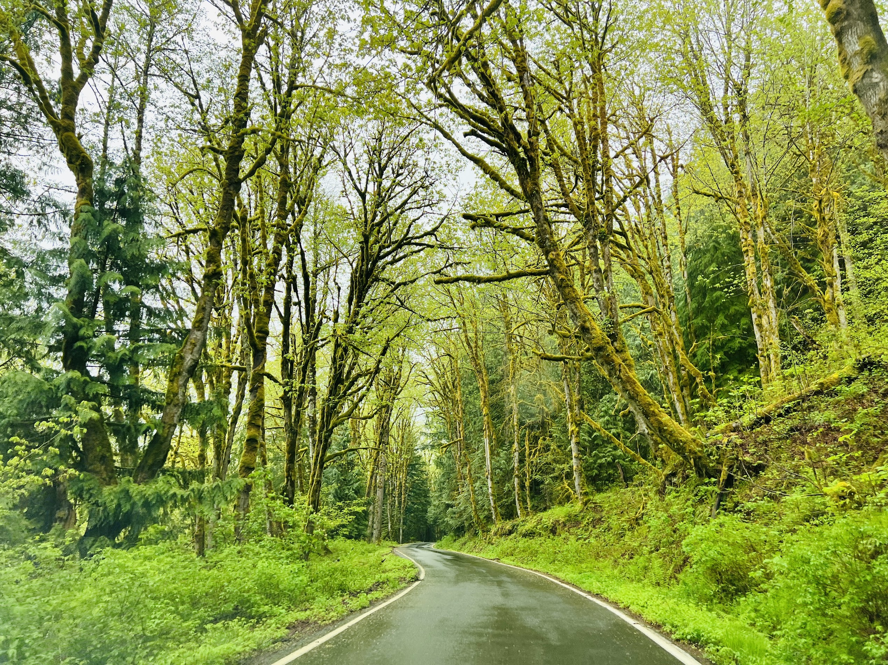
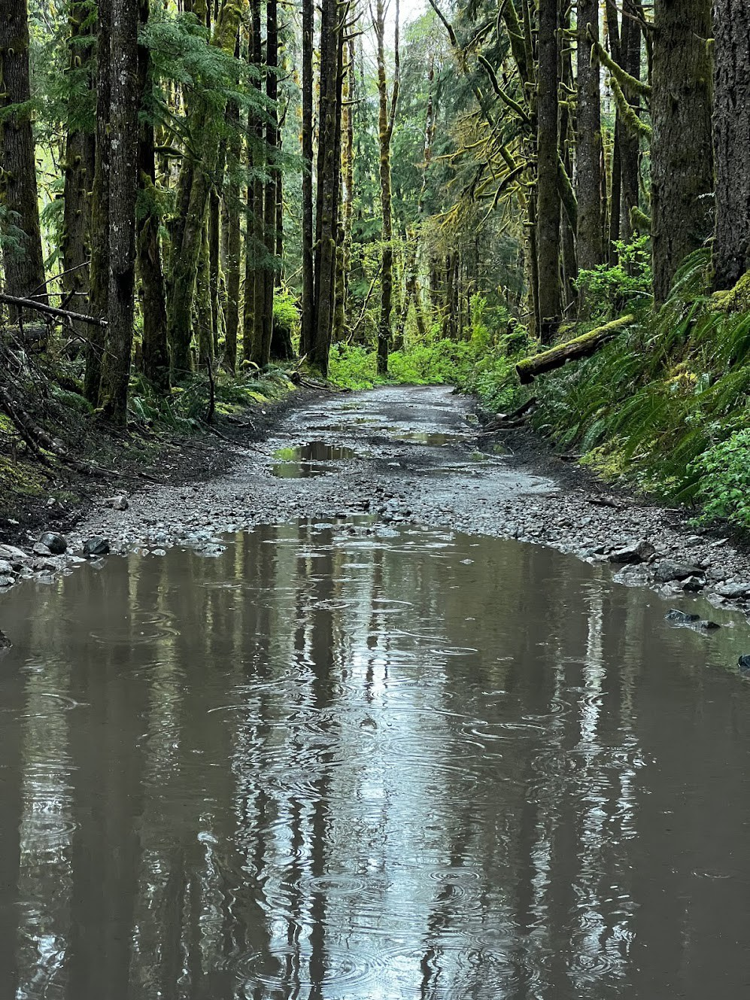
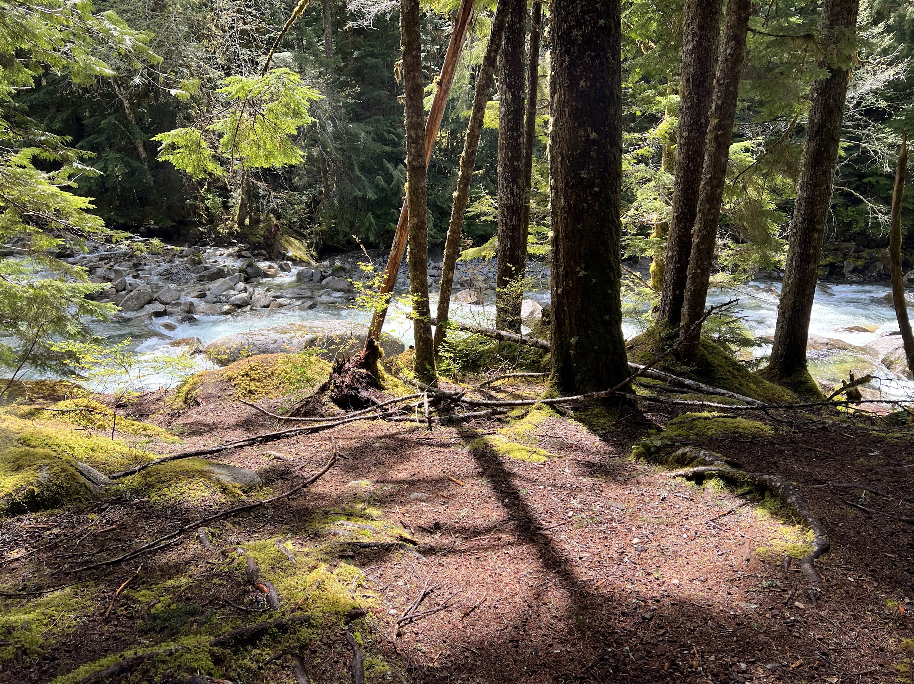
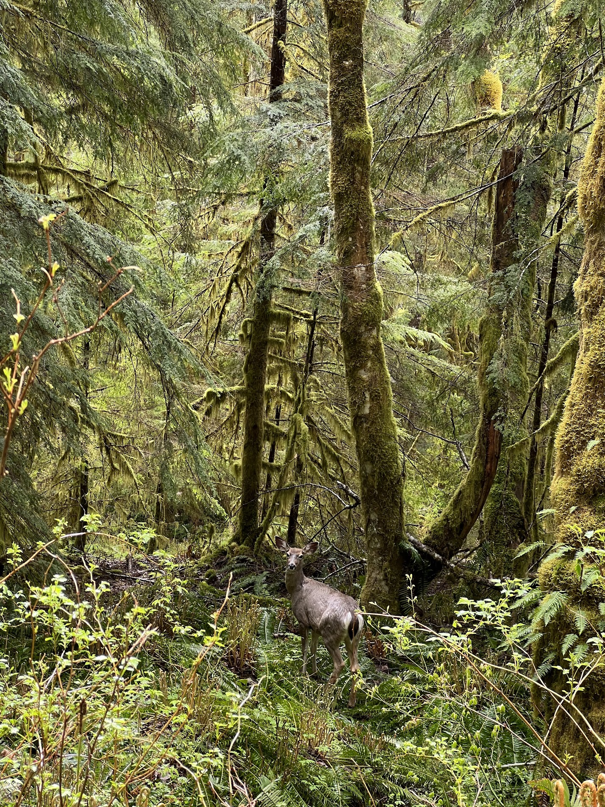
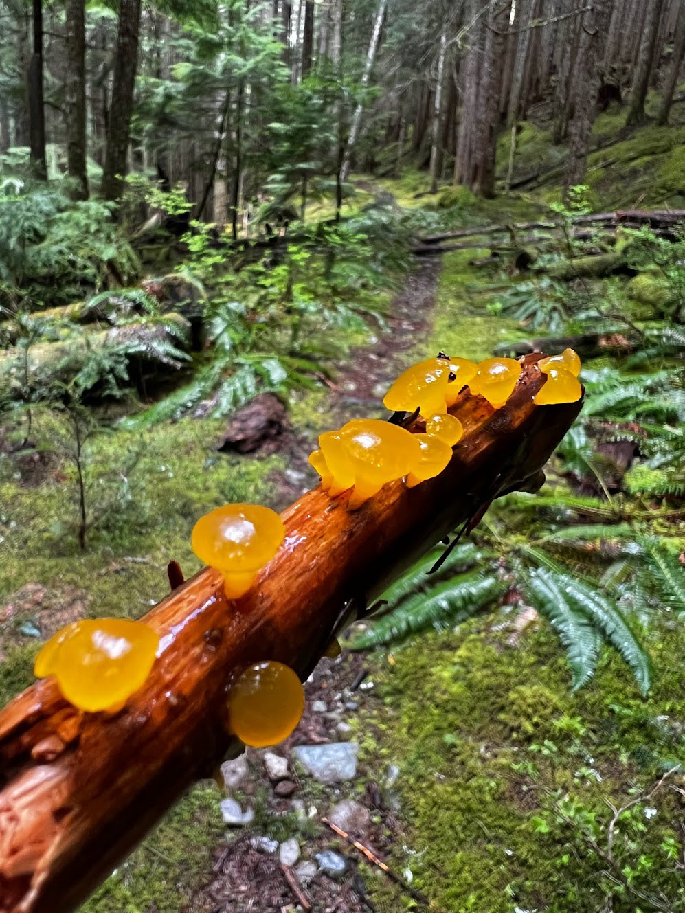
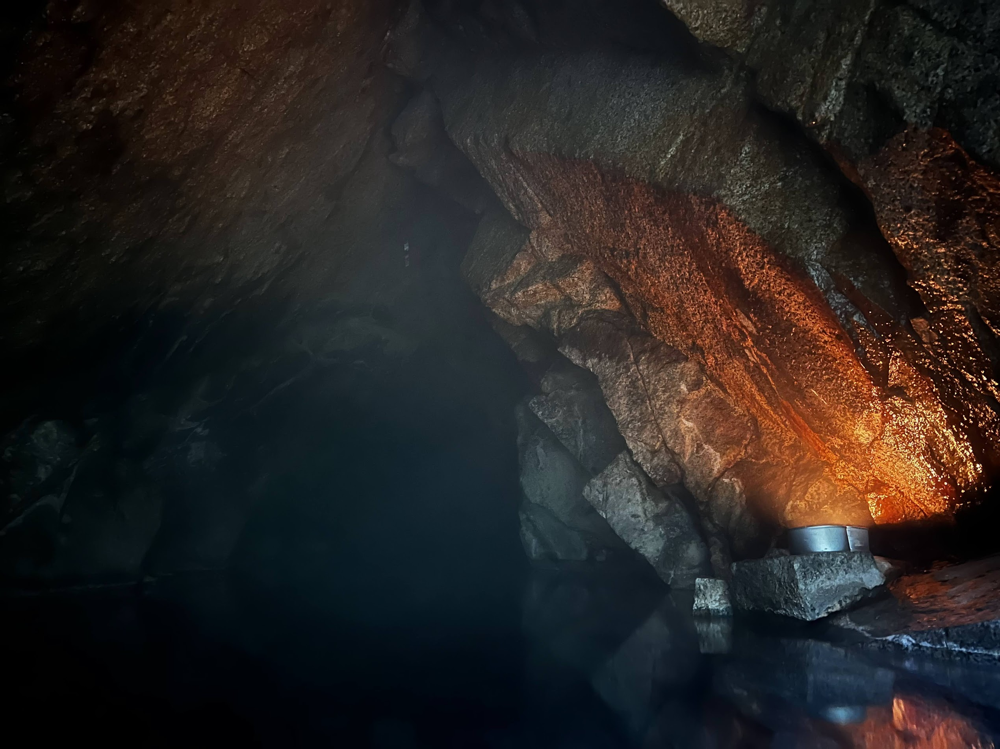
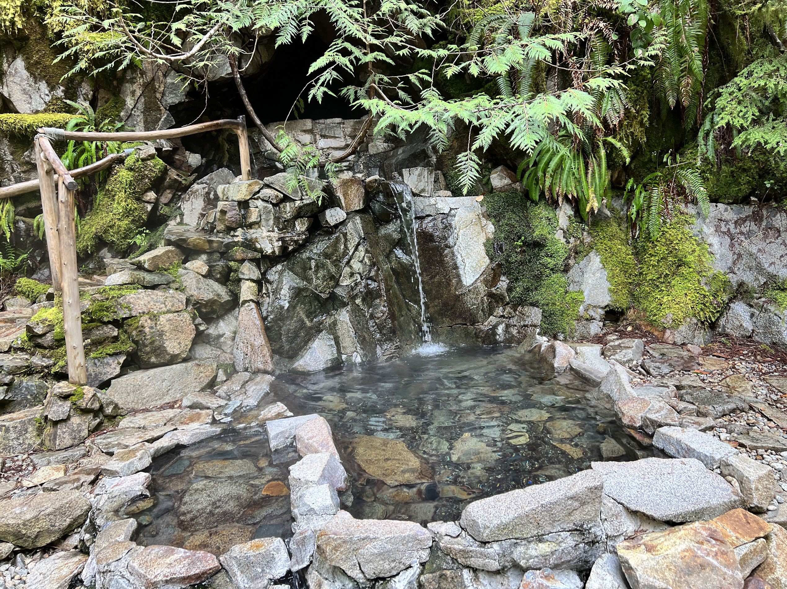
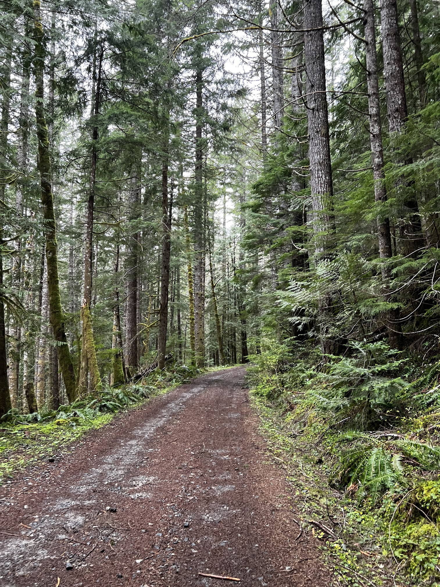
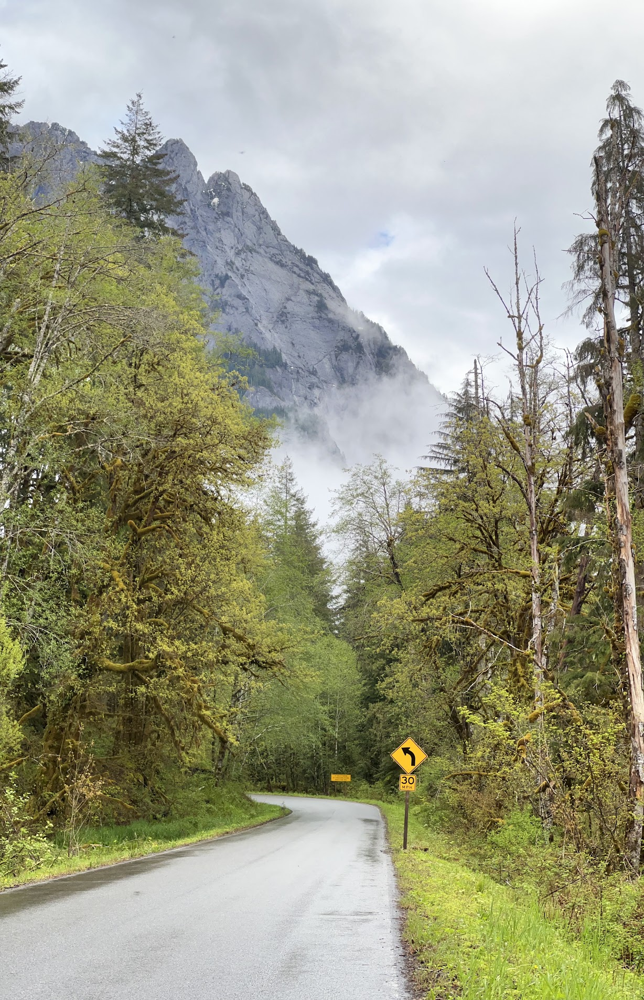

We had an overnight reservation at Goldmyer Hot Springs and decided to hike 7 miles on the Middle Fork trail in a loop from Dingford Creek Trailhead to the hot springs, and come back the next day via the old road. You can also alternatively choose to hike to the hot springs via the old logging road and back (and avoiding the loop). While it is pretty boring, it will get you there the fastest (and you can even take a bike), and you won't have to contend with river crossings.



We managed to make it to the Dingford Creek parking lot in a RAV4 (and saw a few CX-5s and RAV4s), but it was pushing the limits of the car a little bit. Lots of flooded potholes. We saw a trail crew working on the road, but until the work is done there are some washouts to be careful of! There's a very steep washout but luckily you can navigate around the steep part to get across. We definitely recommend at least a high clearance car, and to keep a close eye on the [access report](http://www.goldmyer.org/accessreport.php) updates. It is by far the worst "road" I have driven, so take it slow and sleazy. That road took us an hour to navigate, and we had to get around a few washouts, and some really nasty potholes.

At the trailhead, we took the Middle Fork trail because we heard it is more scenic, and it was, at least at first! There are plenty of interesting foliage and mushrooms along the way, and we ran into plenty of other hikers until Rock Creek, after which the trail conditions started deteriorating quickly. Most folks were headed to the hot springs via Digford creek road (the old logging road), which takes you to the springs faster. 

The trail conditions does get noticibly worse after the junction with the trail to Snow Lake (about halfway through), there were more blowdowns and the creeks we have to cross did not have bridges, so problem solving was required.

All in all, there were a few hazards: many downed trees and few sketchy stream fords and crossings, notably at Thunder Creek where we had to do some careful balancing on rocks and logs to get across. 

The worst one was at the very end, at Burntboot Creek. The log bridge over the creek has been washed out for some time now, but the water flow especially at this time of the year, is quite strong and crossing it was sketchy, with ice cold water up to more than knee high. If I knew how sketchy this ford was, I wouldn't probably have hiked the Middle Fork trail and gone for the old road instead. The crossing should be a lot easier in the summer when the flow at the creek is lower, though.

 creek crossing at Thunder Creek")
")

The hot springs was very nice and luckily we had it to ourselves. There's a small cave beind the springs where you can go hang out with candles, and if you're feeling the heat, there's a cold pool right next to the spring.

For a natural hot spring, there is a lot of care and love that is put into this place, and so our stay felt special. There are little details like hand crafted fences and chairs by the springs. You'll also find amenities like areas to change and to hang your stuff by the pools, and clean bathrooms, and friendly caretakers at the campground.

The caretakers from Goldmyer Hot Springs gave us a lot of advice and were a little surprised we managed to make it there from the Middle Fork trail, through the raging creek. We camped on the property overnight and had another soak the next morning, and headed back to the car on the old road. There is a bucket provided where you can hang your food, and that came in handy because we encountered mice that was vying for our food.

The road is very much less interesting than the trail but much faster going. It started raining - well, pouring- on our way out, but managed to reach the car and head home after that.

## Permits
It's not an invite-only adventure, but you do need a reservation to access the hot springs, both for a day hike or to camp, and more information can be found at [Goldmyer Hot Springs](http://www.goldmyer.org/). Since this is private property, you will be turned away if you do not have one! The reservation is competitive and is given out through a lottery system, but last minute bookings are possible.

We managed to win the lottery by signing up a month before, and I received a phone call from the caretakers a few days later. I believe they still proceed by bookings by phone so make sure you're available by phone and ready to take the call when it comes! Otherwise, last minute openings do free up on their calendar page, so it's worth looking at it closely too.

## When to go
Goldmyer Hot Springs are open year-round, but the property is much easier to access in the summer than the winter, where the road could be impassable to everything but the hardiest trucks.

## How to get here
Check out the [access report](http://www.goldmyer.org/accessreport.php), which should have information on how to get there. You're looking at at least 4 hours of driving and hiking time to get to the hot springs (2 hours of driving, and 2 more oh hiking).

## What car do I need?
That's a pretty good question to ask! The access road to Goldmyer is one of the worst roads I've driven (It's not shown on Google Maps, to give you an idea). Conditions vary by the season. The [access report](http://www.goldmyer.org/accessreport.php) should talk about clearance needed on your car. When we went in the spring (when the road conditions were impacted by a couple washouts), we made it to the trailhead in a RAV4, but we saw a number of trucks, but also a few CX-5s. 

Conditions to get there should improve in the summer season because of roaf maintenance by staff, but you absolutely still need something more than a sedan. In the winter, due to snow, something like a truck would be required.

## What to pack
I’ll probably write a more in-depth post about my backpacking gear later, but it’s good to carry your 10 essentials as with any hike. There is easy river water access at the Goldmyer property, but you'll want to filter the water.

For the hot springs, bring your swim gear! It's also popular to bring candles so you can light up the cave, but ask the caregivers to lend some candle holders to avoid leaving wax inside the cave area.

A bear canister is not required, there is on-site food storage containers at the campsites.
