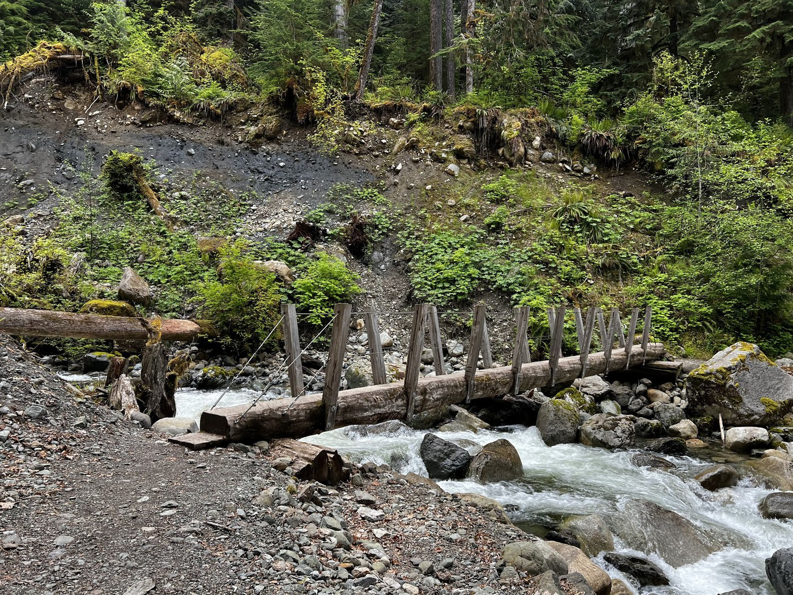
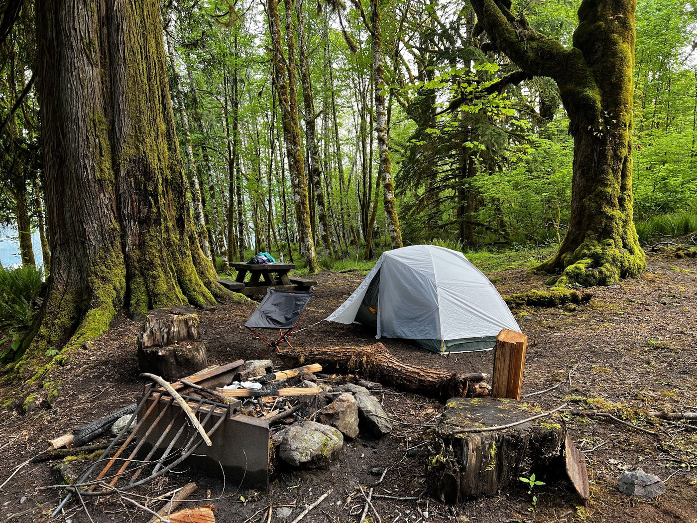
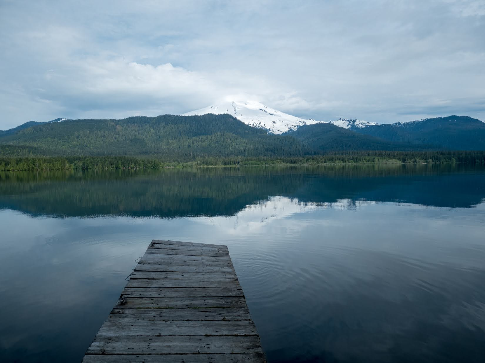
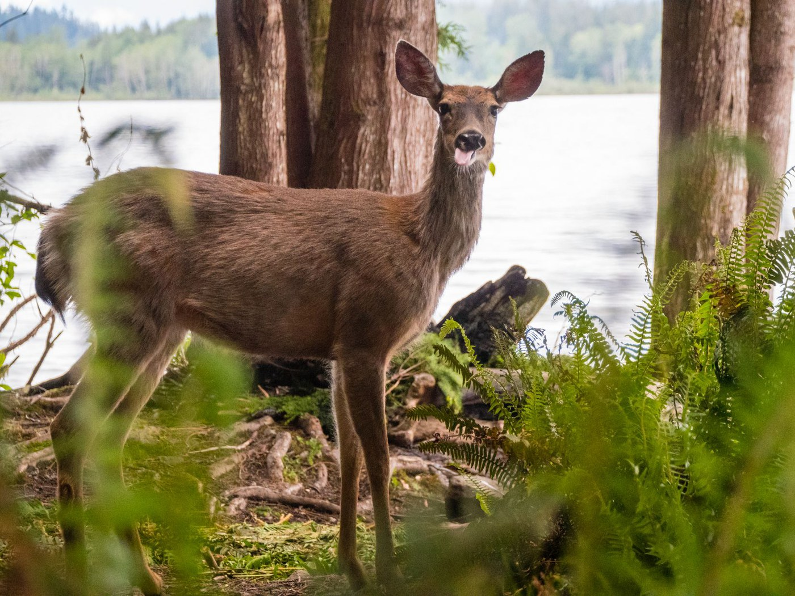

Went midweek with my sister who is new to backpacking, and we chose an easy trail for something that's both do-able early season and does not offer too much of a challenge. I do think this trail is the one for that!

The road to the trailhead was a little rough with potholes, but also quite short, but I think any car can probably make it with careful driving. My Rav4 handled it just fine.

The trail itself is very serene and quite enjoyable rain or shine. We've had a bit of a wet week and the first day of our hike was very cloudy, so we did not catch a glimpse of Baker at all on our hike in, but we still had a good time looking at the mossy forest and the occasional giant tree. Not much to say about the trail, you're walking in a mostly flat forest with glimpses of the lake, and all creek crossings have bridges. There's one blowdown that's yet to be cleared, but we saw fresh sawdust around many other tree stumps, so those were probably cleared recently. Thank you to the trail crews!

When we arrived at Maple Grove camp about 2 hours in, we had a campground mostly to ourselves, there were 2 other groups there, but lots of space. Each site had a bear locker and fire pit. The toilet was probably one of the best I've seen in the backcountry in recent times, it uses a conveyor belt system so the inside of the toilet was really clean and there's no smell at all. How amazing! There was a friendly deer in the campground and hung around for a while before leaving. We tried (but didn't manage) to start a camp fire due to how damp everything is, and went to back sometime later.

Next morning the weather was a lot better and we managed to catch a view of Mt. Baker before heading back to the car.