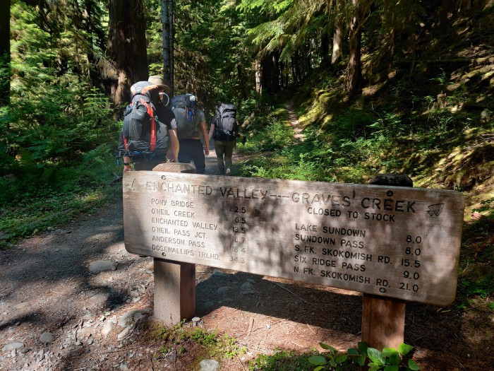
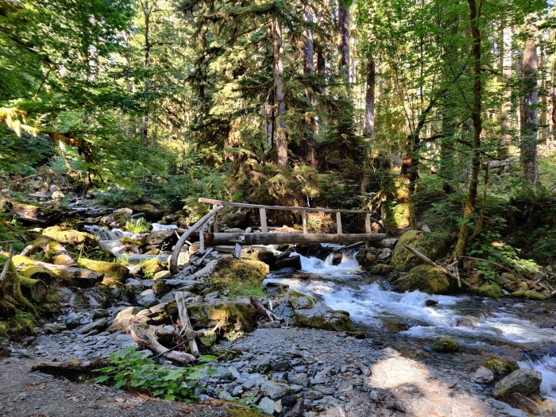
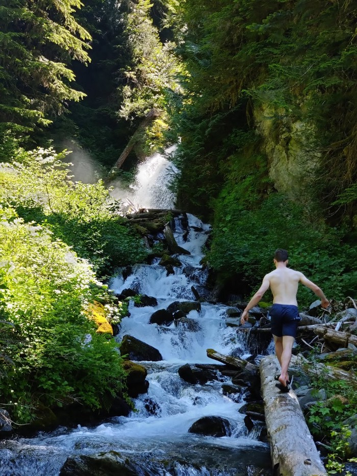
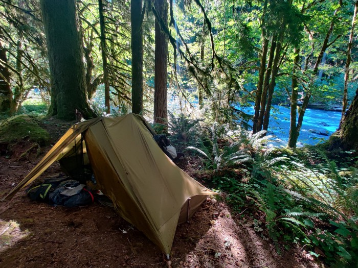
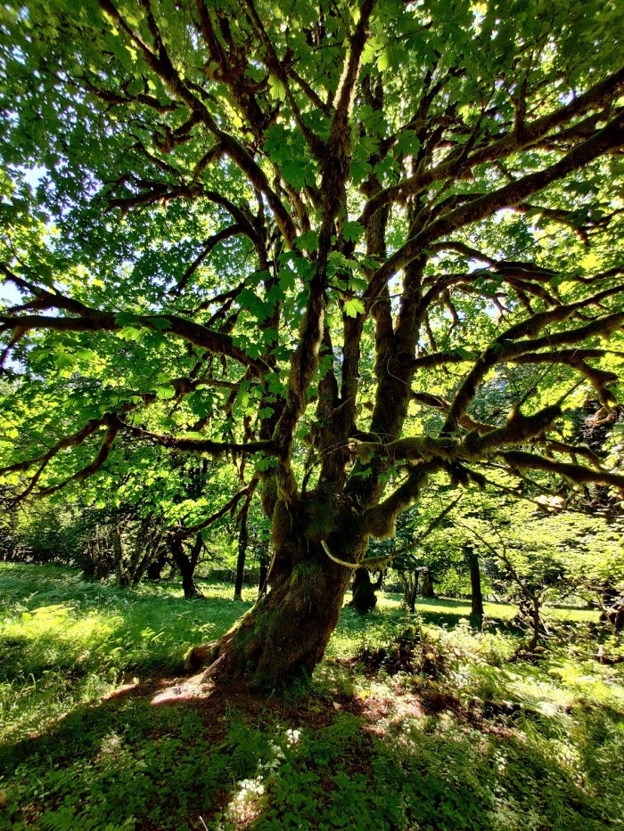

On June 25, some friends and I headed out to Olympics National Park for a two nighter backpacking trip to check out the iconic Enchanted Valley chalet.

We did go on the same weekend Seattle experienced the historic heat wave, so the trail was quite toasty, however the river was quite helpful in cooling us down, with the ice cold water coming from the melting glaciers acting as a sort of natural AC, cooling the air near it.

Let me tell you that I’ve found a profound appreciation for riverside trails. Without the fresh snowmelt water cooling down the area around it, this would have been an absolutely miserable trip. I’m normally a mountain lake or coastal view guy, but this is one of the few times I’ve really appreciated being close to the mighty Quinault river.

## Trail Description
The Enchanted Valley the destination of the East Fork Quinault Trail, a roughly 26.0 mile roundtrip trail, but the there’s a number of side trips you can do once you reach the iconic chalet, if you want to add some days or mileage to your trip.

<iframe src="https://www.google.com/maps/d/u/0/embed?mid=1m9GZPRtma_KTgPx1PCWBTPiMkH7GwEMD&ehbc=2E312F" width="640" height="480"></iframe>
<figcaption>Google Maps of campsites and points of interest</figcaption>

While the trail is long, it makes up for it with little elevation gain as you are mostly following the Quinault river. This also means that you have reliable access to water almost along the whole trail, so you could pack less water and just refill as you go.

Most of the trail is just following the river, but there is a moderate uphill at the very beginning of the trail for about a mile and half, followed by a downhill that’s just as steep until you finally rejoin the river. I hope you like the burble of the river as you will be within earshot of it for the remainder of the trip! There isn’t an awful lot to see until you make it to the valley, but the many bridges of the creek crossings and the old growth cedar forest are cool to look at.

Once you reach the last mile of the trail, the river valley dramatically opens up until a clearing, giving you a nice view of the Chalet. If you show up when the snow melt is at its maximum, there will also be a lot of cascading waterfalls along the walls of the mountains lining the valley, and it really is a pretty sight.

I recommend at least two nights to get the most out of this trip, but three would be ideal if you want to camp right by the chalet.

There’s a lot of fun goodies at the Chalet. While you can go bask in the sun next to this old historic building, there’s a few waterfalls you can walk to to keep yourself refreshed on hot summer days. There’s a waterfall really close to the south-east of the valley that was absolutely refreshing during our heat wave.

More adventurous groups can press on to Anderson Pass, where you can get a peek at a glacier. It is about 4 miles further down the trail from the chalet, and may not be passable as it requires fording White Creek, and the climb up the pass may be dangerous without the right gear early season when the snow is still there. We opted to skip this side trip as we’ve heard that the pass is still pretty hard to get up.

## Where to Camp
There’s a lot of camping options along the trail, but they need to be reserved ahead of time (see the Permits section below). The marked campsites are:

**Graves Creek (at trailhead) —** This is the ideal campsite to stay at if you’re looking to car camp before or after your trip, no water is supplied though, so you’ll need to pack in or filter your own.
Pony Bridge (2.5 miles from trailhead) — This is the closest backcountry campsite to the trailhead, it is not immensely popular, though, but is located near a nice bridge that crosses the river.

**O’ Neil Creek (6.7 miles from trailhead) —** Potentially the most popular campsite on the trail, this campsite marks the halfway point to the valley, so it is an excellent stopping point if you’re backpacking for two nights. There is a privy and food storage area on-site.

**Pyrites Creek (9.6 miles from trailhead) —** Also a popular campsite closer to the valley, it’s a good stopping point as an alternative to O’Neil.

**Enchanted Valley (13 miles from trailhead) —** Great spot to camp, and probably the most scenic one! There’s not one but two privies here, but we’ve noticed that the campsites are not as secluded as the other ones, since there’s fewer trees here. Still, it’s possible to find a campsite closer to the sides of the valley if you want more quiet.

**Honeymoon Meadows and Camp Siberia (6 miles beyond Enchanted Valley) —** The great beyond. From these campsites you can make your way to other areas in the National Park, and maybe even make this a thru-hike if you go all the way to Dosewallops.

Additionally there is a number of established (but unmarked) campsites along the river shore. I am unsure if those need to be reserved as well, so it is a good idea to call the ranger station for details.

Unfortunately, it seems like we’re not the only fans of the river as our campsite (O’Neil Creek) was completely packed the second night and we had to seek out an alternative (unmarked) campsite a mile away, so be prepared for crowds on weekends.

## Permits
Olympics National Park now requires overnight permits to camp in the entire park, and this includes all campsites on the way to Enchanted Valley. You can book them online here, do it early as spots tend to get snagged up quickly.

You’ll also need a National Parks pass, and it’s good to have it ahead of time as there is no pay stations at the rather rustic parking lot.

## When to go
With the low elevation for the entirely of the trail, this backpacking trip is an ideal early-season destination. Even as early as April, the trail is relatively clear of snow, but always check a recent trail report before going!

If you go early summer, expect to encounter a good amount of bugs on the trail, our group certainly did.

## How to get here
The trailhead is located near the Graves Creek, which is located in the Quinault area of the park. Note that the last 20 minutes or so of the road is gravel, so you will probably get mud or dust over your car.

Olympic National Park is big, really big. So, it takes a while to get to the trailhead. Allow 3:30 to 4 hours to get to the trailhead.

## What to pack
I’ll probably write a more in-depth post about my backpacking gear later, but it’s good to carry your 10 essentials as with any hike.

You could get away with less water on this hike, as there are plenty of resupply/filter points by the river.

There is absolutely no signal in the valley, so I highly recommend bringing a beacon or inReach device for communication. A bear canister is also required for all overnight trips in Enchanted Valley area per NPS regulations, and as always, please observe Leave No Trace principles. Enjoy!

