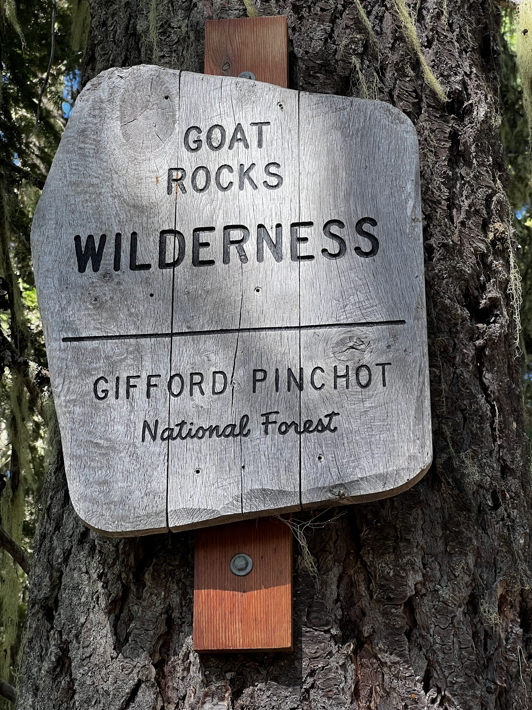
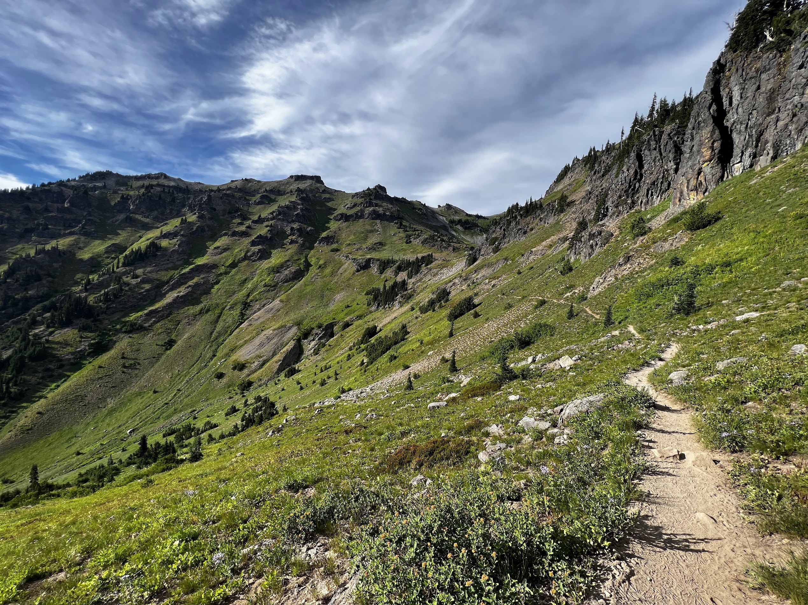
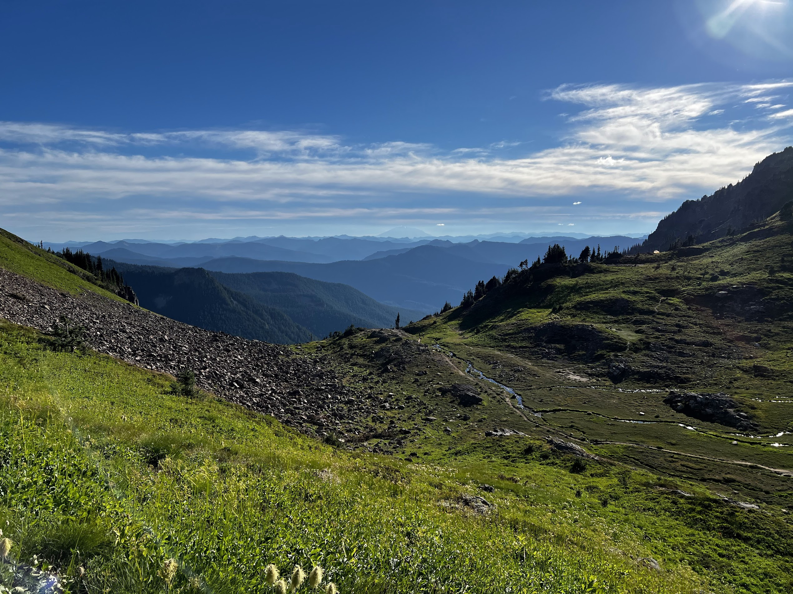
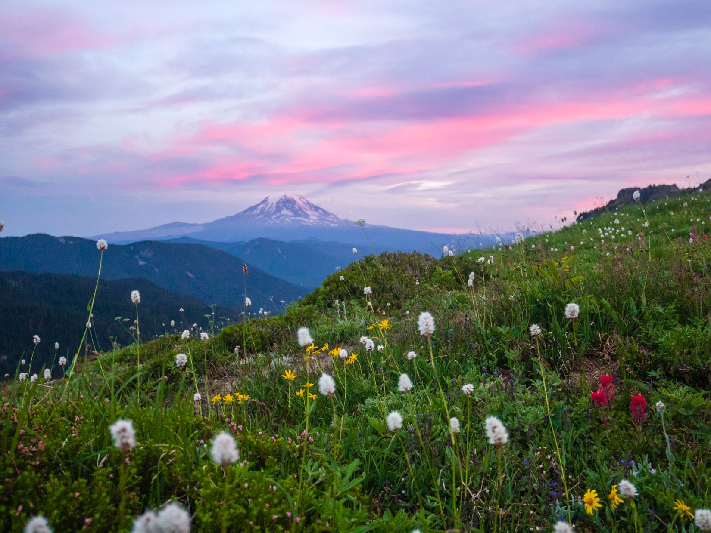
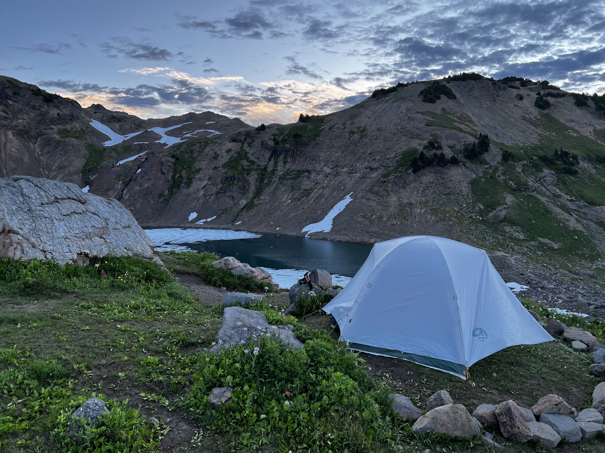
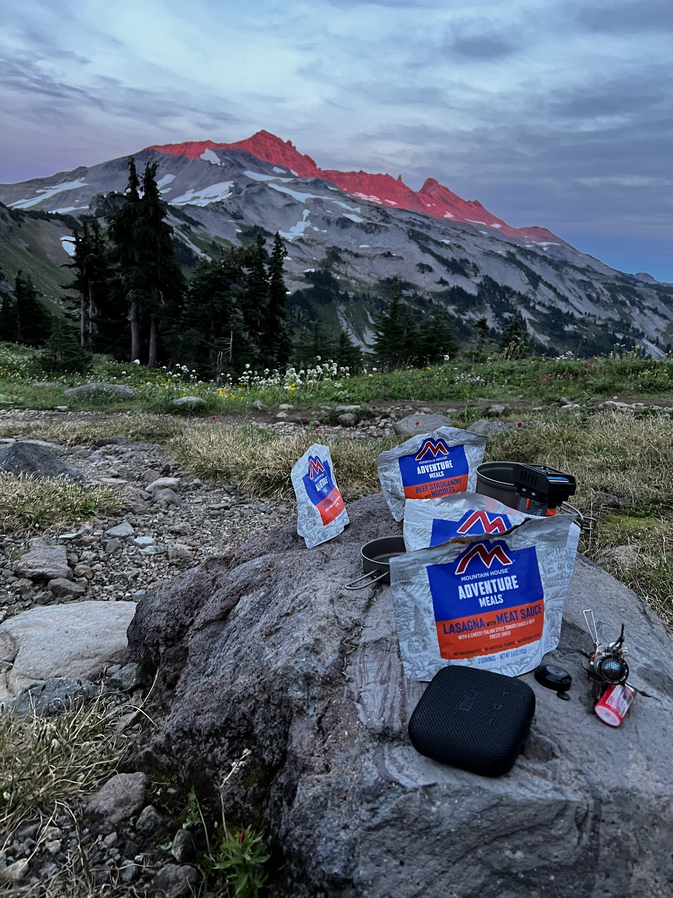
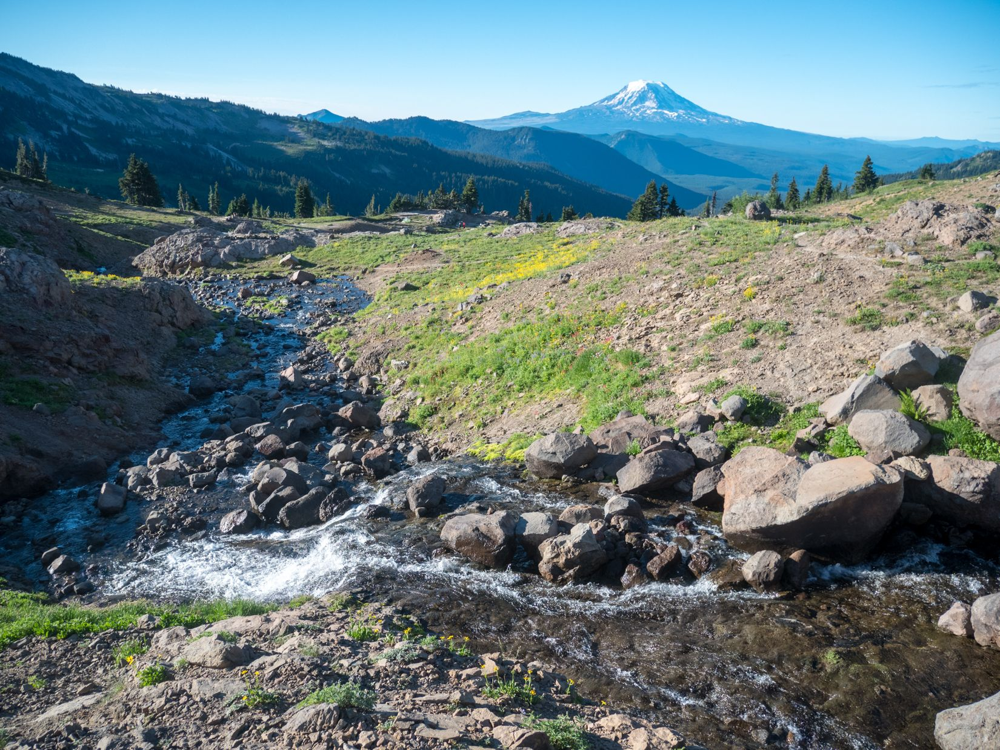
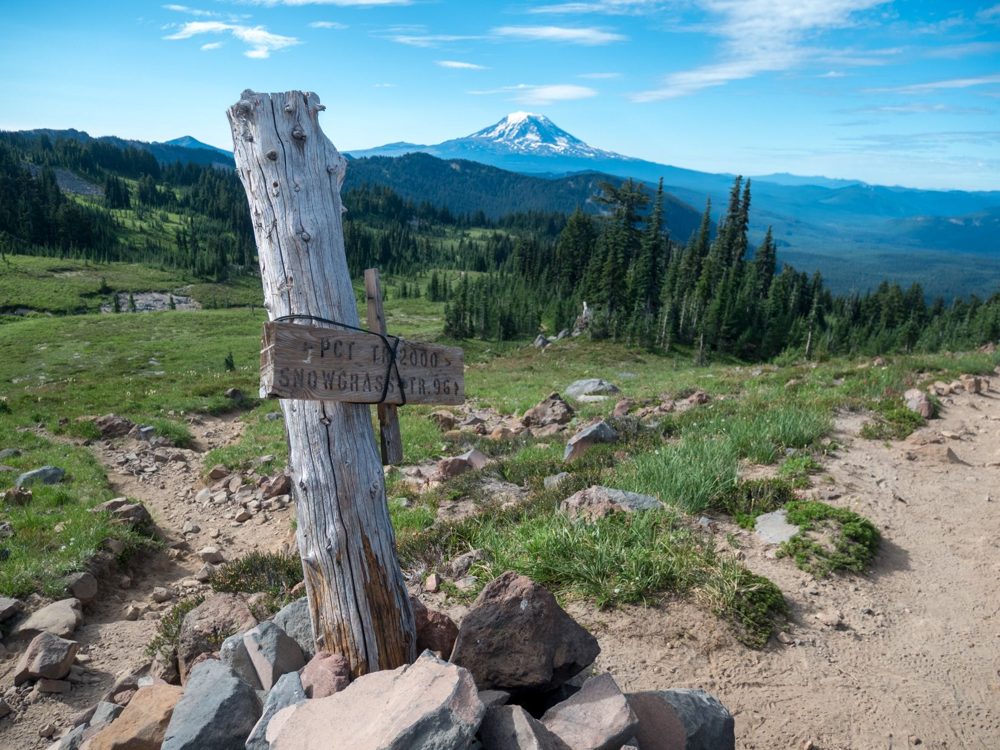
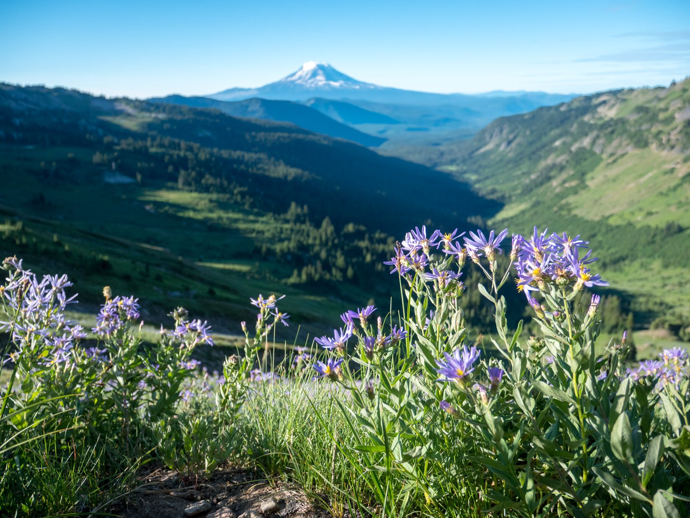

Goat Rocks Wilderness is a popular destination for backpackers of all levels. With the Pacific Crest Trail (PCT) passing through it, you will likely encounter many long-distance hikers, as well as a variety of shorter trips in the area.

Goat Lakes is a great destination for a weekend trip or something longer. At around 12 miles, it is very doable over two days for beginners, but offers wonderful views of Mt. Adams, Rainier, and St. Helens from above the tree line. In my opinion, this hike offers some of the best views for the effort of any trail in Washington. If you want to extend your adventure, you can easily add side trips along the PCT for additional days of hiking. However, be aware that there are several Goat Lakes in Washington, so make sure you're heading to the right one!

This guide outlines a loop route that I did in August 2022, starting from the Berry Flats trailhead, going up to Goat Ridge, camping at Goat Lake, and coming back by looping around Snowgrass Flats before ending at the Snowgrass Flats trailhead, just half a mile from the starting point.

This is a very popular backpacking route, so while we had no trouble finding a campsite on Sunday night, the area can get quite crowded on weekends. I recommend starting earlier or finding a campsite further away from Goat Lake, where most people will likely set up camp.

## Trail Description



You can start this loop in either direction, by starting at the Berry Flats trailhead for a clockwise hike, or at the Snowgrass Flats trailhead for a counter-clockwise hike. The two trailheads are connected by a 0.6 mile connector trail, so a shuttle is not needed for this loop. You can just walk back to your car at the end (or drop off the car at the finishing point, like we did)! We chose to hike clockwise, so that we could see views of Mt. Adams as we were hiking out and get most of the tough elevation gain out of the way right at the start. The Berry Flats trailhead also has a vault toilet and a picnic table, but we did not see any facilities at the other trailhead.

The adventure begins once you turn onto Forest Road 21 from US-12 near Packwood. The trailhead is about 15 miles down the dirt road, and it took us about 40 minutes to get there. Note that you need to take a turnoff about 13 miles in, but we were able to navigate by GPS and the turnoff was well-signed.

After getting our self-issued permit at the trailhead, we started the ascent up Goat Ridge (on Trail 95). There aren't many views until you reach the tree line about 2 miles and 1,000 feet of elevation in. This is also where we had the most trouble with bugs, as they were quite a nuisance until we reached higher ground. Bug spray and a head net are highly recommended.

Once on the ridge, the trail levels off, and you're greeted with your first views of the volcanoes around you. There's also campsites along the way, but the best views on this section of the hike can be found at the meadow at Jordan Creek.

Jordan Creek is the first major point where you can access water, and there is a nice meadow here where we saw a few campers. You can get a pretty nice sunset here if you choose to camp around here, as Goat Lake itself is shaded and does not have a sunset view. You can also scramble to Hawkeye Point here for a panoramic view of the surroundings, although we did not have time to do that.

As you continue on the trail, you will finally approach Goat Lake. This is a great spot to set up camp for the night. In the summer, you will see plenty of wildflowers along this area and great views of the basin below. There are several campsites (but no campfires allowed!), but we found that the wind can pick up quite a bit in the evening in the area. It is probably better to find a more sheltered spot. We picked an exposed campsite with great views from the tent, but we slept poorly due to the wind and the noise at night. However, there were very few bugs at the lake when we went, likely due to the wind, which was nice.

The next day, we continued the loop after checking out the lake and getting some water. The trail is pretty mellow until you get to the trail that takrs you up to the PCT. A little uphill here, but nothing like Goat Ridge.

Once you're on the PCT, you can continue on along the loop back to the trailhead, but a popular side trip is to go uphill towards the north to get to Knives Edge, one of the more scenic spots of the PCT (see map). We didn't do it, but lots of other hikers were headed there.

Otherwise, head south through Snowgrass Flats and catch your last views of Mt. Adams and the wildflowers before dropping back down into the forest. It's all downhill from here. At this point, it's a long hike back to the trailhead, with a couple occasional and easy creek crossings on log bridges or actual bridges.

After about 4 miles from when you enter the forest, you will find yourself back at the Snowgrass Flats trailhead, where you can hop back in the car (or you can walk an extra half mile to get to Berry Flats if you left your car there). From there, it's just a long drive out on a dirt road! There are lots of great restaurants and breweries in Packwood to end your adventure. We went to Packwood Brewing for a drink and sandwich before driving back to Seattle.

Overall, I loved the trip and the weather conditions were perfect, except for the bug situation, which was a nuisance but not too terrible. If I were to do it again, a couple of extra nights to hike along the PCT would be a great addition.

## Permits
No advanced permits are needed for this trip, but you need to fill out a self-issue permit at the trailhead. This trail can get crowded on weekends, so plan ahead (or around this)!

You’ll also need a National Forest / Interagency pass, or pay $5 at the trailhead in cash.

## When to go
Mid to late summer is the best time to go. The trail is snow covered before mid-july which makes traverse difficult. Goat Lake was partially melted when we were there mid August, and according to reports, still completely frozen in July.

## How to get here
The forest road to the trailhead starts off near Packwood, WA, about 2 hours south of Seattle by car. A pretty scenic drive though, taking you through Mount Rainier National Park.

## What to pack
I’ll probably write a more in-depth post about my backpacking gear later, but it’s good to carry your 10 essentials as with any hike.

There are plenty of resupply/filter points by creeks and of course, at Goat Lake, so filtering water is not a problem.

A bear canister is not required but recommended for all overnight trips in the area, and as always, please observe Leave No Trace principles. Enjoy!

