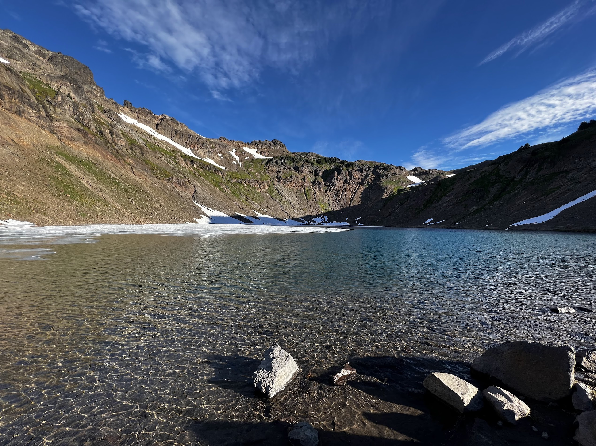

Goat Rocks Wilderness is a popular haunt for backpackers of all levels. With the PCT going right through it, you'll no doubt find many long distance hikers, but you'll also have nice selection of shorter trips in the area. 

Goat Lakes is a great destination for a weekend, or for something longer. At around 12 miles, it is very do-able over two days for even beginners, but offers wonderful views of Mt Adams, Rainier and St Helens from above the treeline. In my opinion, this hike's got some of the best views for the effort for a trail in Washington. If you're craving more, you can easily add on side trips along the PCT for some extra days of adventure. Don't get confused though, there are several Goat Lakes even in Washington, but this one is my favorite!

This guide outlines a loop route I've done in August 2022, starting from the Berry Flats trailhead, going up to Goat Ridge, camping at Goat Lake, and coming back by looping around Snowgrass Flats before ending up at Snowgrass Flats trailhead, just half a mile away from the starting point.

This is a very popular backpacking route, so while we had no trouble finding a campsite on Sunday night, this area can get quite crowded on the weekend. I recommend starting earlier, or settle for a campsite further away from Goat Lake where most folks will want to set up camp.

## Trail Description



You can start this loop any direction you like, by starting at Berry Flats trailhead for clockwise, and to Snowgrass Flats trailhead for a counter-clockwise hike. The two trailheads are linked by a 0.6 mile connector trail, so a shuttle is not needed for this loop, you can just walk back to your car at the end (or drop off the car at the finishing point, like we did)! We oped to hike clockwise, so that we can see views of Mt Adams as we are hiking out, and to get most of the tough elevation gain out of the away right off the start. Berry Flats also has a vault toilet and a picnic table, but did not see much at the other trailhead.

The adventure starts off once you turn on Forest Road 21 from US-12 near Packwood. You're looking at 15 miles or so of dirt road driving, and the drive took us about 40 minutes to get to the trailhead. Note that to get to the trailhead you need to take a turn about 13 miles in, but we were able to navigate by GPS, and the turnoff was well signed. 

After getting our self-issued permit at the trailhead, we started the ascent up Goat Ridge (on Trail 95), there isn't a lot of views until you reach the treeline about 2 miles and 1000ft of elevation in. This is also where you'll have the most trouble with bugs, as they were quite a nuisance until we got to higher grounds. Bug spray and head net highly recommended.

Once on the ridge, the trail levels off, and you're greeted with your first views of the volcanoes around you. There's also campsites along the way, but the best views on this section of the hike can be found at the meadow at Jordan Creek.

Jordan Creek is the first major point where you can get water access, and there's a nice pleasant meadow here where we saw a few campers. You can get a pretty nice sunset here if you choose to camp around here, as Goat Lake itself is shaded and does not get a sunset view. You can also scramble to Hawkeye Point here for a panoramic view of the surrondings, although we did not get the time to get up there.

As you press on, you will finally approach Goat Lake. This is a great spot to set up for the night. You'll see plenty of wildflowers along this area in the summer, and great views of the basin below you. There are quite a few campsites (no fires here though!), but we found that the wind does pick up quite a bit in the evening in the area, so finding a more sheltered spot is probably better. We picked an exposed campsite with great views from the tent, but we slept poorly due to the wind and the noise at night. However, there were little to no bugs at the lake when we went, presumably due to the wind, which was nice.

The next day, we continued the loop after checking out the lake and getting some water. The trail is pretty mellow until you get to the trail that takrs you up to the PCT. A little uphill here, but nothing like Goat Ridge.

Once you're on the PCT, you can continue on along the loop back to the trailhead, but a popular side trip is to go uphill towards the north to get to Knives Edge, one of the more scenic spots of the PCT (see map). We didn't do it, but lots of other hikers were headed there.

Otherwise, head south through Snowgrass Flats and catch your last views of Mt Adams and the wild flowers before dropping back down into the forest. It's all downhill from here. At this point, it's a long hike back to the trailhead, and a couple occasional and easy creek crossings on log bridges or actual bridges.

After 4 miles or so from when you hit the forest, you'll find yourself back at the Snowgrass Flats trailhead, where we hopped back in the car (or you can walk an extra half mile to get to Berry Flats if you left it at the other tralhead). From there it's just a long drive out on a dirt road! Lots of great restaurants and breweries in Packwood to wrap up the adventure! We went to Packwood Brewing for a drink and sandwich before driving back to Seattle.

Overall I loved the trip and the weather conditions were just perfect, except for the bugs situation, which was a nuisance but not quite terrible. If I were to do it again, a couple extra nights stay to walk along the PCT would be a great add!

## Permits
No advanced permits are needed for this trip, but you need to fill out a self-issue permit at the trailhead. This trail can get crowded on weekends, so plan ahead (or around this)!

You’ll also need a National Forest / Interagency pass, or pay $5 at the trailhead in cash.

## When to go
Mid to late summer is the best time to go. The trail is snow covered before mid-july which makes traverse difficult. Goat Lake was partially melted when we were there mid August, and according to reports, still completely frozen in July.

## How to get here
The forest road to the trailhead starts off near Packwood, WA, about 2 hours south of Seattle by car. A pretty scenic drive though, taking you through Mount Rainier National Park.

## What to pack
I’ll probably write a more in-depth post about my backpacking gear later, but it’s good to carry your 10 essentials as with any hike.

There are plenty of resupply/filter points by creeks and of course, at Goat Lake, so filtering water is not a problem.

A bear canister is not required but recommended for all overnight trips in the area, and as always, please observe Leave No Trace principles. Enjoy!

