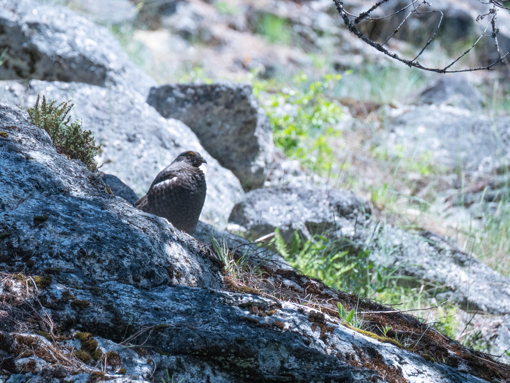

This early season May backpacking trip in North Cascades National Park is a rewarding adventure. The route from Prince Creek to Stehekin showcases the park’s diverse beauty. Staying overnight at Moore Point and Lakeview campground in Stehekin allowed us to immerse ourselves in the stunning scenery at a leisurely pace. This hike is pretty unique (at least in the US) because you need to take a ferry as part of the journey, and you get to explore Stehekin, a quaint little town popular with PCT hikers and folks trying to get awway from the city life.

Wildflowers bloomed profusely along the trail, especially lupines, balsamroot, dogwood, and pemberton. The lack of bugs made the experience even more pleasant. Although the logistics require advance planning due to ferry schedules and limited services in Stehekin, the rewards of this unique trek are well worth it.



The highlights

- Unique thru-hike, with ferries and a quaint town
- Great early season route, before the mountains melt
- Moderate difficulty
- Beautiful lake, plentiful creeks
- Well equipped campsites
- Wildflowers and no bugs
- Finish off the hike with hot food and a shower

The lowlights

- Heat can still be an issue due to lack of shade
- A little more complicated to plan logistically
- Can be crowded at the campgrounds

**Before the Hike**

We opted to start the hike by boarding the Lady Express at Fields Landing. We thought about starting in Chelan, but the overnight parking fee is cheaper, plus we can board the ferry an hour later, which saves us a bit of time that morning. The parking lot is quite big and there's a staffed office where you can get information about the hike and pay for parking with cash or card!

**Day 1**

Prince Creek to Moore Point. 
Distance Hiked: About 12 miles. 2400 ft elevation gain.

The 12-mile hike from Prince Creek to Moore Point is the longest and most strenuous segment. Half of the ferry's passengers, around 20 to 30 of us, were dropped off at Prince Creek. However, we soon found solitude on the trail as hikers spread out. After disembarking from the Lady Express ferry, the trail pretty much only winds up and down, gaining 2,400 feet in elevation the whole day. Despite being called the Lakeshore trail, it does not actually closely follow the shore, and I joked that it should be instead called the Lakewview trail. The first half of the trail was not so bad with a sun hat, but as the day heated up to the mid 70s-80s after Meadow Creek, the trail got pretty grueling and slow going. A few creek crossings that are a little challenging with high river flows right now, but do-able with good balance or hiking poles. A few blowdowns, but we saw a trail crew working on it so it should be cleared up by late May.

While the first half of the hike offers little shade, the trailside blooms and emerald lake below distract from the heat. When we hiked this trail in early May, wildflowers bloomed profusely along the trail, especially lupines, balsamroot, dogwood, and pemberton. The lack of bugs made the experience even more pleasant.

We passed by a handful of campgrounds on the way, including Meadow Creek. They're nice spots, and made for a good spots for breaks, but we pushed on to reach Moore Point before the heat became unbearable. 

Moore Point was crowded, and another trail crew was camping there on weekends this month, but I think everyone found spots eventually. There's a big grassy field where folks were able to set up if the more secluded spots were taken. Clean pit toilets and there were bear lockers to use. Lovely place to chill in the lake and hang out.

No rattlesnake or bears for us, although some other hiker saw a snake. Lots of wildflowers out, and we saw a grouse.

**Day 2**

Moore Point to Lakeview Camp in Stehekin. 
Distance Hiked: 8 miles. 1300 ft elevation gain.

To avoid the heat, we started hiking at 6am and managed to cover 8 miles into Stehekin by 10am, as we wanted to snag a good spot to camp before the first ferry is schedule to arrive in Stehekin. I highly recommend starting early as the entire hike is shaded before the sun rises above the mountains, making it much more pleasant. There's less elevation to cover in this segment, although there's a few great cliffside view points on the way. The trail brought us within close proximity of Lake Chelan’s pristine shoreline, a refreshing change from the rugged and sweltering terrain of the previous day. We found the dense forest at the end of the trail a welcome respite. All told, this scenic and verdant segment of the hike proved a bit more enjoyable than the first.

We set up camp at Lakeview (formerly called the Puple Creek Overflow Camp) before it became too crowded and took the shuttle to the bakery at 11am (be sure to check the schedule!). The NPS visitor center and Stehekin ranch were closed for the season, as we heard they don't open until Memorial Day. The restaurant at the landing and store were open.

Personally, I preferred the Lakeview campground over Purple Point. Although both had running water, Lakeview seemed newer and less steep. It was also easier to access the restaurant and boat landing, but a bit further away from the shower. If you're interested, the shower was well maintained, and required $1 in quarters for 2.5 minutes of use.

**Day 3**

"Zero day" in Stehekin

We decided to rent a bike to Rainbow Falls and had an amazing time visiting in May. The waterfall was roaring due to the snowmelt and heat wave, and we even got quite wet at the upper lookout. We also made stops at the Orchard and old schoolhouse, which were both great.

After exploring Rainbow Falls, we took the ferry out around noon and were able to make it back to our car by 2pm.

**Logistics and Planning**

For now, this trail does not require a permit, though I suspect things might change in future years as the trail gains in popularity. That being said, there are still a few things to consider to ensure a successful trip.

Obviously, the ferry is the biggest things to figure out. Two competing ferry services exist, [Lady of the Lake](https://ladyofthelake.com/), and the [Stehekin Ferry](https://stehekinferry.com/). You'll need advance reservations, and make sure that you can be dropped off at Prince Creek, as some boat runs do not stop there.

There's no need to reserve the campgrounds on the trail before you reach Stehekin. It's all first come first served. However, in Stehekin, reservations are necessary and obtained on [Recreation.gov](https://recreation.gov) from late May to October if you plan on staying a night. HIt's best to hike before it becomes too hot, either in April or May, and avoid the need for reservations in town.

Some folks we met decided to hike into Stehekin on the last day before the last ferry of the day, and get back earlier. This would allow you to complete this trip as a simple weekend overnighter, but we found staying in Stehekin to be really worth it.

If you are planning on breaking the trip into more days, and stopping at other camps other than Moore Point, or dispersed camping, you may need to bear-proof your food with a canister of rope. Bear vaults are only provided at Prince Creek, Moore Point, and in Stehekin.

Lastly, information for things to do in Stehekin is a little scarce. To get to the Bakery, you can ride the shuttle (schedule [here](https://stehekinvalleyadventures.com/shuttle-bus/)) which is generally timed around the ferry arrival and departure times. It's also a short bike ride if you opt to [rent a bike](https://stehekindiscoverybikes.com/) near the ferry landing. In early May it was $10 an hour on an honor system, but advance reservations may be required later in the summer. There's also a shuttle to Rainbow Falls ($10 one way), or about a 20 minute bike ride (more fun!). The shower is quarters-only and you can exchange coins at the store by the landing.

