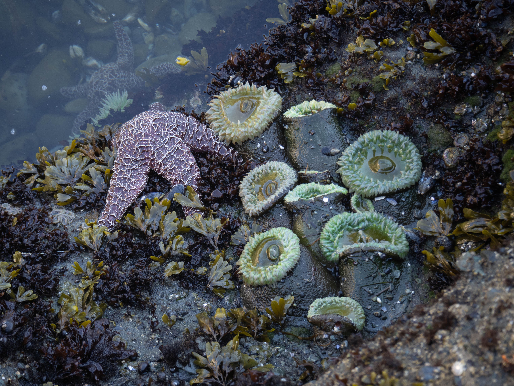

This summer, my partner and I embarked on a delightful backpacking adventure to Shi Shi Beach on the Olympic Coast for a two-night stay. Having traversed a portion of this area two years ago, I was eager to return and share this incredible experience with my partner. It quickly became her favorite adventure, and it's easy to see why.



The highlights:

- Arguably the best beach in the Pacific Northwest
- Fascinating tide pools teeming with life
- Abundant camping spots along the shore
- Exciting side hike to Point of the Arches and beyond

Things to Keep in Mind:

- The trail can be muddy at times
- Parking may be limited during popular weekends
- A little costly compared to other coastal backpacking options

**Logistics and Planning**

Shi Shi Beach is not located close to Seattle, and it's definitely worth planning for a longer trip to fully experience the area. Driving for 5 hours may seem like a long journey, but the stunning beach, cool tide pools, and side hike to Point of the Arches make it well worth the effort. Spending more than an overnighter would allow you to fully appreciate the beauty of the area and have enough time to explore all that Shi Shi Beach has to offer.

When planning your trip to Shi Shi Beach, make sure to obtain a permit from Olympic National Park and store your food in bear canisters. You can obtain permits online in advance and pay the required fee. Although there is no cap on camping permits, it's a good idea to stop by the visitor center in Port Angeles to have your permit printed and pick up a bear canister (which can be borrowed for free if you don't have your own). Fires are permitted, but do check with the rangers for any fire bans enforced during your visit. You're encouraged to get the Makah Reservation's visitor permit in Neah Bay ($20), but as the overnight parking location is on a private lot (more below), it is not really required. I still recommend getting it so you can check out other sights in the area, like Cape Flattery, and to support the trail maintenance in the area.

Parking is not available at the trailhead. Instead, you'll need to park at a "secure location" roughly half a mile back, which is essentially on the lawn in front of a private residence (see the map above for location). The fee for parking is $10 per day, and we paid $20 in cash for our two-night stay. While it's unfortunate that there is a fee, the owner takes safety and security seriously, and we felt comfortable leaving our car there for three days.

We heard of another house you can park at but it the owner seems to have changed their mind about it recently, and parking there is no longer an option.

According to Recreation.gov there just have been 50 or so groups with a permit to camp during our long weekend! That’s a lot. The overnight parking lot (the lawn around the house) was completely full by the time we got there and it took a bit of creative parking with the owner in order to get us in. Some folks that got there right after us got turned away, actually. So if you’re coming in on a popular weekend beware of this.

It's important to check the tides before your trip, as it will help you plan the best time to explore the captivating tide pools. While there are no tidal restrictions on the trail or on the way to Point of the Arches, it's still beneficial to know the tides to help budget your time there.

**Our experience**

The trail to Shi Shi Beach features two distinct "personalities." The first part of the hike takes you through a lush, second-growth forest, adorned with beautifully crafted bridges and boardwalks to keep your feet dry. After about a mile, the trail transforms into an old logging road, where the terrain becomes muddy. In July, when we visited, the muddy sections were manageable with hiking boots. There are also bypass trails available to avoid the muddiest spots, and salmonberry bushes line this portion of the trail, offering a tasty treat along the way if you like to forage. A few spur trails are not well-marked, so be sure to bring a map or cache it on your phone to avoid taking a wrong turn.

As the sound of crashing waves grew closer, we reached a steep dropoff, where switchbacks guided us to the north side of Shi Shi Beach. Despite the parking area being full, the beach offered plenty of excellent camping spots. We set up camp at the section of the beach near the base of the switchbacks by the shore.

If you prefer to stay closer to the year-round water sources, consider walking 1-2 miles south towards Point of the Arches to find two creeks. However, we carried plenty of water with us, so camping on the north side was a perfect choice for us. We arrived rather late in the day, and wanted to set up camp and leave some time to see the sunset.

During our visit, we experienced some of the lowest tides of the summer, which made exploring the tide pools the next morning an absolute delight. We spotted sea stars and enjoyed a breathtaking sunset over the ocean. The surf was quite intense during our stay, which likely discouraged surfers, as we only saw one throughout the entire weekend. Do keep an eye out for the sand fleas on the beach, while they won't bite you, they do jump around quite a bit.

For our relaxed two-night trip, we packed extra snacks, drinks, camping chairs and comfort items. Since we weren't covering long distances each day, we were able to bring more amenities than on longer multi-day hikes. Packing extras made for an even more enjoyable trip, and definitely made every meal something to look forward to!

On our second day, we hiked to Point of the Arches, a truly mesmerizing location with towering sea stacks. Be aware of the tidal restriction just beyond the point if you plan to venture further. We enjoyed lunch and turned back, spotting an otter and seal in the water as we strolled along the beach. Walking through the thick marine layer added a touch of enchantment to our experience.

The outhouses on the beach vary in quality; the one nearest to the north end is somewhat dirty, but the two on the south end are in better shape. They are, however, a little exposed along the trail.

After one last exploration of the tide pools on the morning of our third day, we said farewell to Shi Shi Beach and began our journey home. We capped out the trip with a stop at Cape Flattery, another short hike nearby.

