I've wanted to hike the Teton Crest Trail for some time now, but planning proved time-consuming and permits were elusive. After a couple years of trying, I finally were able to score permits for some campsites along the trail in July! It was a wonderful trail despite a couple of hiccups - more in this trail guide! I loved that the view in every canyon is different, and has it's own "personality".

The highlights

- Lots of variations of the route, if you want to add on or take off some mileage
- A ride on an aerial Tram and a boat shuttle
- Sweeping views on several mountain passes
- Lots of wildlife (moose, marmots... and more!)
- Cool views on an iconic trail

The lowlights

- Mosquitos can be a nuisance
- Ravenous marmots, squirrels and porcupines
- Competitive permits
- Few bear lockers, and the need for heavy bear canisters
- A few hot, exposed sections



**Logistics and Planning**

***Permits***

This is the most challenging part of the whole planning process. GTNP opens registration for backcountry permits on Janurary 1st of every year, far ahead of other permit lotteries and bookings for other parks that are normally in March. I completely forgot about the registration dates a couple of years, which meant that all of the best permits were long gone when I wanted to book it. 

I also noticed that in mid-July, walk-ins were not too bad. We were able to change our campsites around for better ones by talking to the rangers in the morning the day before our hike, and it didn't seem too competitive and many sites were still up for grabs.

***Transportation***

This is a thru-hike, and you won't end at the same place you started. Shuttle services exist for this trail that you can book for, but we had two cars in our group so we were able to just drop a car at Jenny Lake trailhead, and head to the Aerial Tram. 

Additionally, if you want to make the hike a bit easier, It costs $45 to take the Aerial Tram at Jackson Hole resort. This is a nice option if you want to avoid hiking 4000 ft of elevation!

On the way back, if you end at Cascade Canyon like we did, you can also take the Jenny Lake Boat Shuttle. It's $16 for a ride, and cuts 2 miles of hiking. It's not much, but it was the last two miles of the hike when we were absolutely exhausted.

***Gear***

Bear canisters are required in the park. I think there are some bear lockers at every camp area, but they were few and far between, and there's no guarentees that they won;'t be full by the time you get to them. Bear sprays are a very good idea, too.

You will need to keep your gear and food safe from bears, but in our experience, the bigger threat seems to be marmots and porcupines, who are somewhat habituated to our presence and will not besitate to get to your gear. We've got some of our gear chewed up overnight, and we bumped into some backpackers who fared much worse than us with their gear.

**Day 1 - Aerial Tram to Death Canyon Shelf**

We took the aerial tram in Teton Village and reached the alpine zone really quickly. After a brief photo stop, we headed towards the Rendezvous Mountain trailhead, entering Grand Teton National Park from the ski/summit area and officially beginning the hike. Unfortunately, the correct path was challenging to identify due to the lack of proper signage at the top, and we ended up taking the wrong spur trails a couple of times. We had to rely on our topo map to find the correct trail.

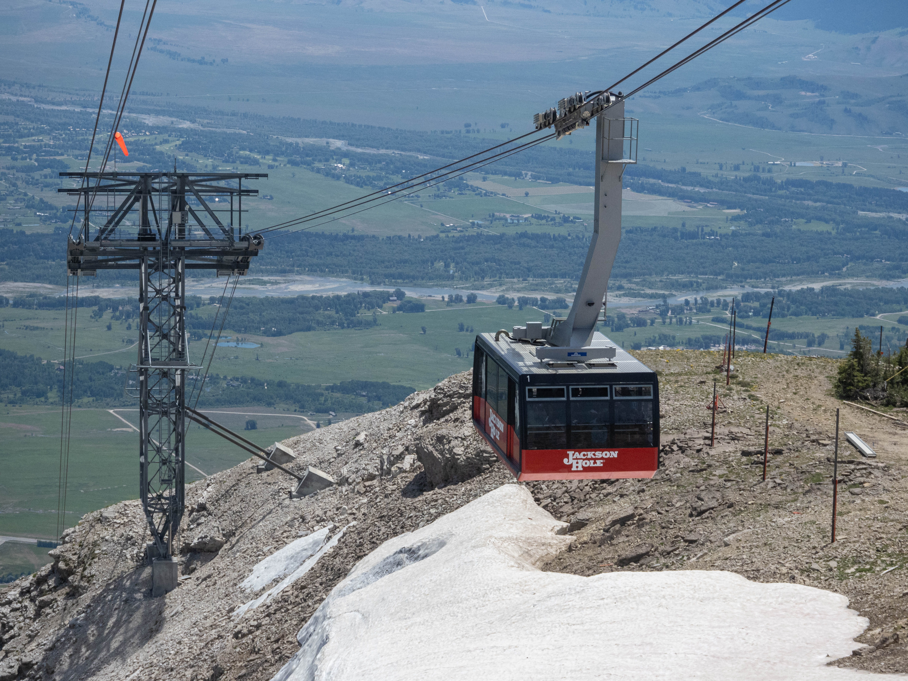

The trail began with a downhill section, quickly followed by an uphill climb. This became a recurring theme throughout the hike, with plenty of ascents and descents but not much flat terrain. If you prefer flat hikes over inclines, this trail may not be for you. Nevertheless, the views were breathtaking as we ventured deeper into the park and gradually lost cell reception.

The weather was hot and sunny, and I decided to put snow in my hat to cool down during the uphill sections. After hiking for about six miles, we made it to Marion Lake, a stunning blue-green alpine lake. 

We took a brief rest before continuing on to Fox Creek Pass, which was a very exposed section of the mountain with limited water and trees. Despite this, we enjoyed panoramic views of the surrounding area, including our first glimpse of the Tetons, which we hadn't seen since we began the hike. We quickly passed this section of the trail and arrived at our desired camping zone, Death Canyon Shelf.

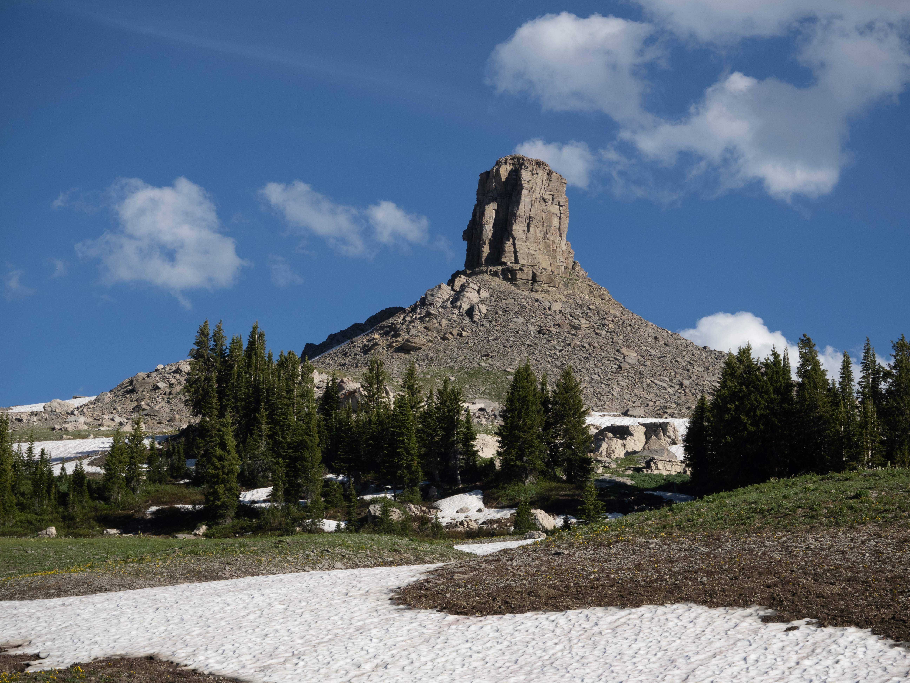

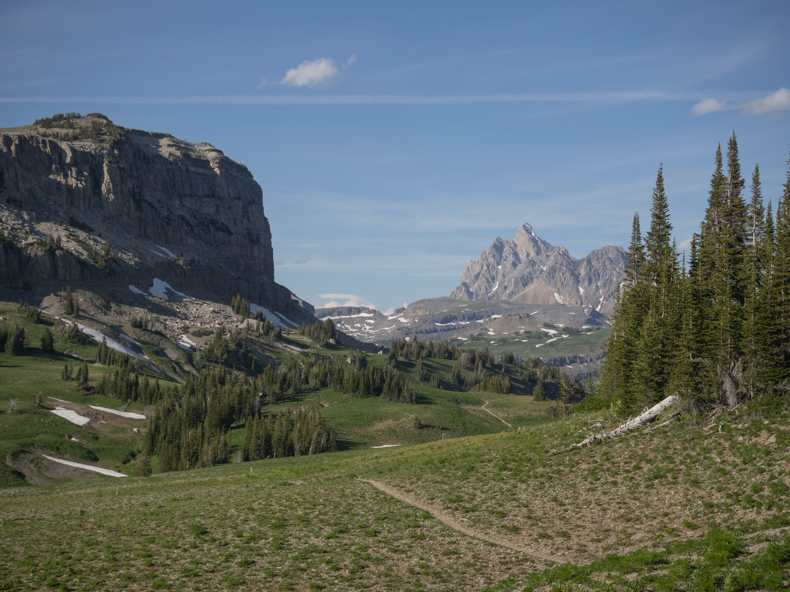
Death Canyon Shelf is a vast camping zone with no signs indicating available campsites. It took us some time to find a suitable spot, and we were initially discouraged by the talus boulder fields at the start of the camping zone. However, we soon discovered an abundance of streams for water filtration and several excellent campsites after hiking for half a mile.

The camping zone had a lot of marmots, and we spotted more than a dozen hanging out around our campsite. They seemed unafraid of us and would likely try to get to our food. The area also had lots of rocks which gave us a few sightings of pikas! They were adorable, but very timid.

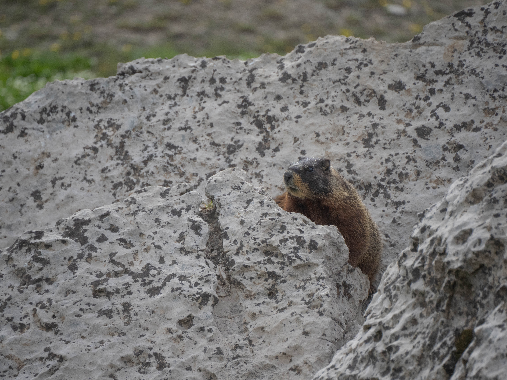

**Day 2 - Death Canyon Shelf to North Fork Cascade**

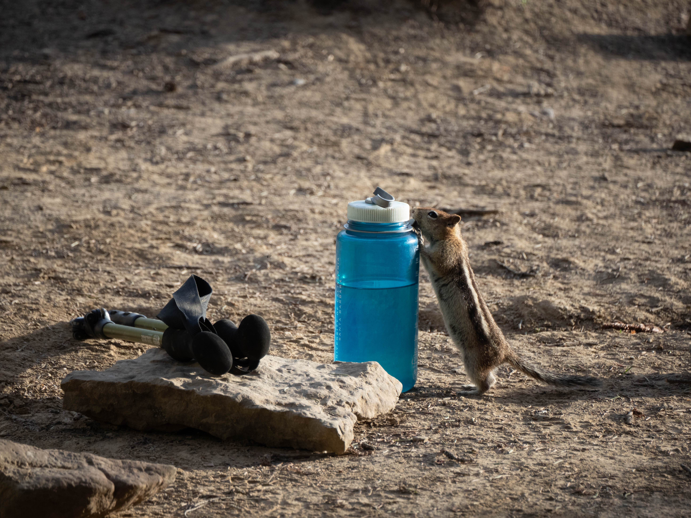

On Day 2 of our hike, we woke up to find that some ground squirrels had chewed on my friend's hiking poles. Despite this, the rest of our hike along Death Canyon Shelf was enjoyable and flat, and we encountered many marmots along the way that we've grown very accustomed to by this point. We made good time and soon reached Alaska Basin, which reminded me of the beautiful lake basins of the Sierra Nevada with its pine trees and granite slabs that made for easy walking. Think of the lakes near Yosemite.

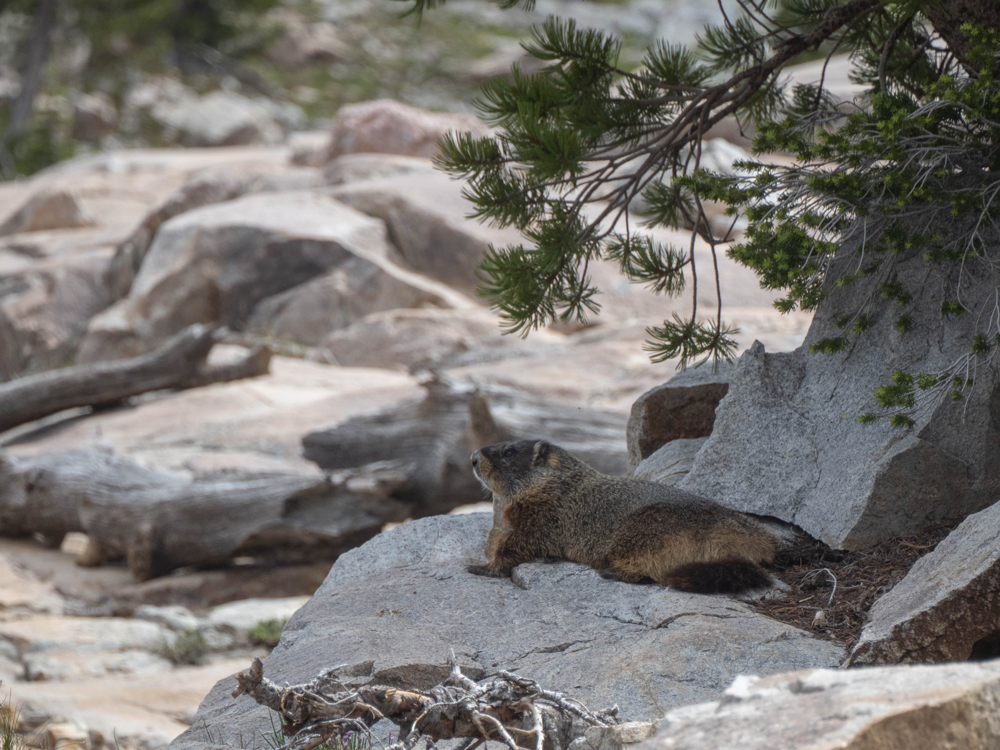
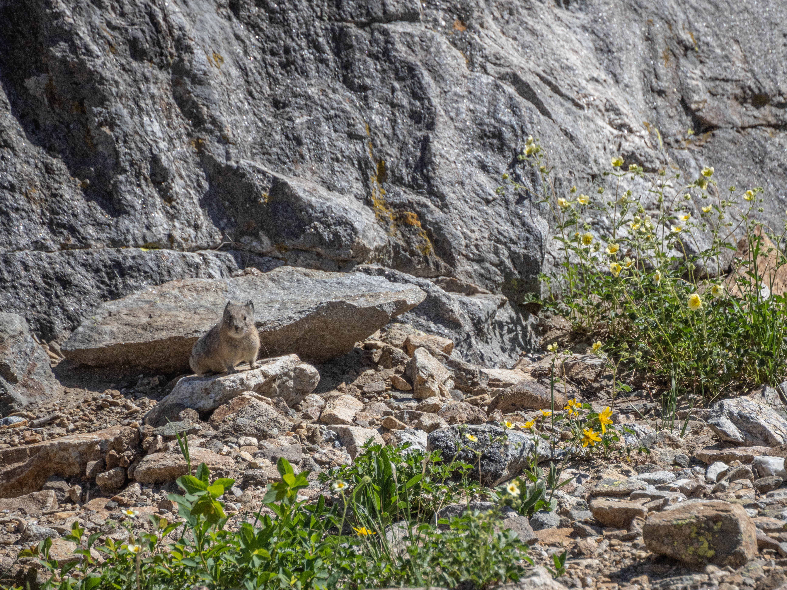

The rest of Death Canyon Shelf is a pleasant walk, as it is relatively flat, and full of marmots, whom we've grown very accustomed to by this point. We made it to Alaska Basin relatively quickly, after descending the Sheep Steps, a rather steep rocky section. I really liked the basin, it was very reminescent of the beautiful lake basins of the Sierra Nevada, with pine trees and large granite slabs all over that makes for easy walking.

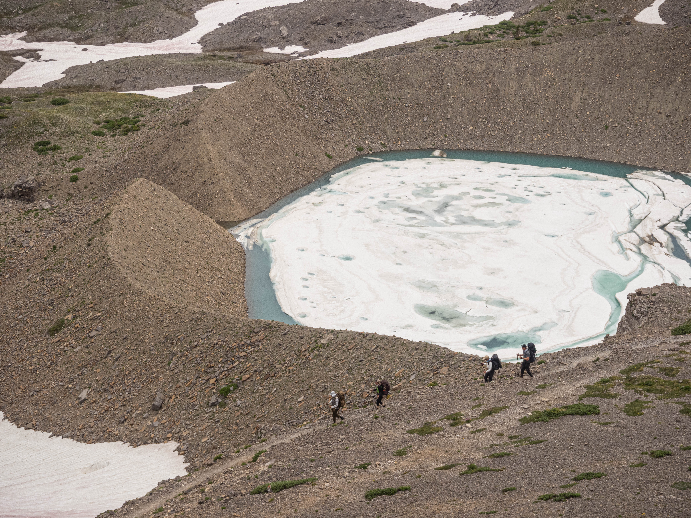

We had to ford a stream near Basin Lake, which was the only one we had to cross on the trail, but the freezing water made it a bit of a challenge. I wish we brought some water shoesto make it a bit less of an annoyance.

After Basin Lake, we faced a few miles of steady uphill climbing to reach Sunset Lake, followed by a final push to the top of Hurricane Pass. Fortunately, we were lucky to encounter many clouds on this day, which made the hike a bit easier and cooler.

Once we reached the top of Hurricane Pass, we understood why it was named as such due to the strong winds. we went from feeling warm to being cold within minutes. We quickly put on our windbreakers to stay warm. From the pass, we had spectacular views, including a glimpse of Schoolroom Glacier. We took a short spur trail to visit the moraine of the glacier, which was a worthwhile stop!

We bumped into another group of backpackers here, who were much more embattered with the critter attacks overnight. They had chwed up backpacks and boots... apparently a porcupine destroyed their gear overnight and was still gnawing on a backpack strap when they got up!

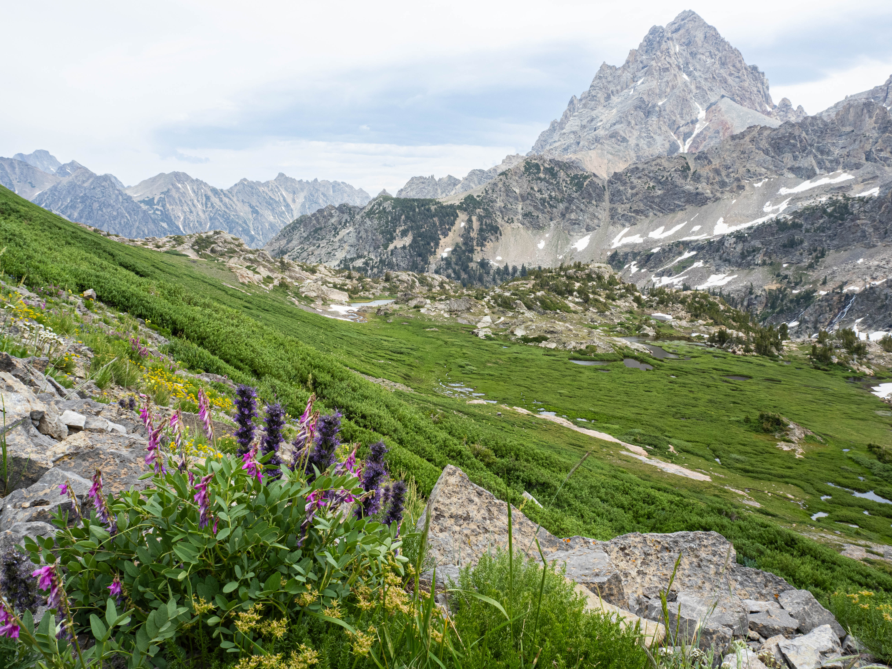

From here, it's a long, 6 mile stretch of downhill to get past South Fork Cascade Canyon. It's a very pretty canyon with tons of cascading waterfalls all over you, but we were feeling pretty tired after our push up Hurricane Pass, and the heat made this part of the hike a bit of a slog.

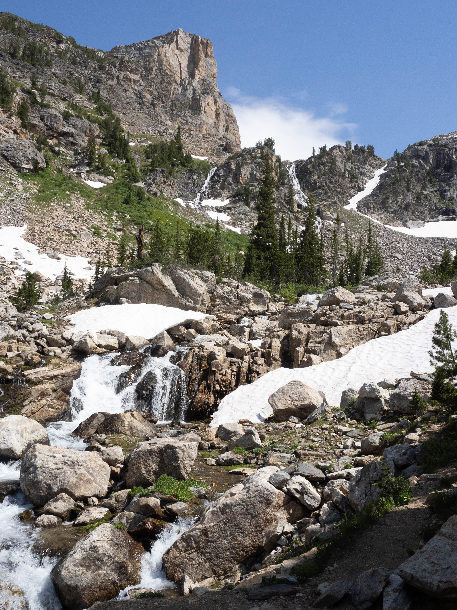

Eventually we made it to the junction of the north and south forks of Cascade Canyon, had dinner, and walked up a mile or so to a campsite on the north side of the canyon. 

Day 2 was the most challenging of the three days, with the longest mileage and lots of elevation gain. Nonetheless, the stunning views made it all worth it.

**Day 3 - Exit with a side trip to Paintbrush Divide**

While the "traditional" hike of the TCT would include hiking up Paintbrush Divide and exiting via Paintbrush Canyon, due to time constraints we wanted to leave a day earlier by Cascade Canyon. Nevertheless, we heard that the view on the divide is well worth it, so we were up for a side hike up Paintbrush Divide. To make it a bit easier, we left most of our gear at the group campsite bear locker. We knew that there was a bear locker there, and checked with the ranger before our hike whether or not it is okay for us to leave our gear.

")

Without our heavy gear and essentially hiking up with a daypack, we were hiking at a good pace, until Lake Solitude. We wanted to stop there for a bit to appreciate the lake, but it was absolutely swarming with mosquitoes so we quickly gave up on that idea. We decided to rename that lake to Mosquito Lake. 

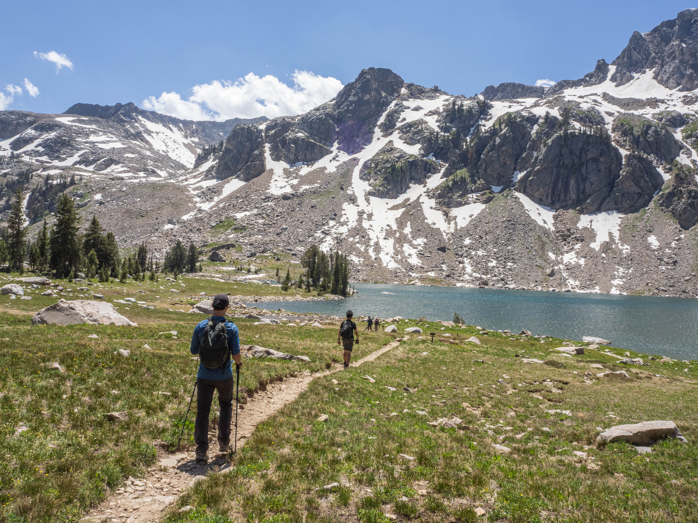

Going up to the divide was challenging even without our gear, and I can hardly imagine going up with a full pack in the sunny valley heat. The trail is pretty much a long beeline to the top, and not too many switchbacks... Eventually we made it and I was very glad we did, because the views from the top was absolutely worth it. The breeze at the top kept us cool and views gave us the energy to keep going. Most of the problematic snow patches on the trail had melted by now, but there was still a couple snow fields on the steep sections of the trail that we had to walk very carefully on.

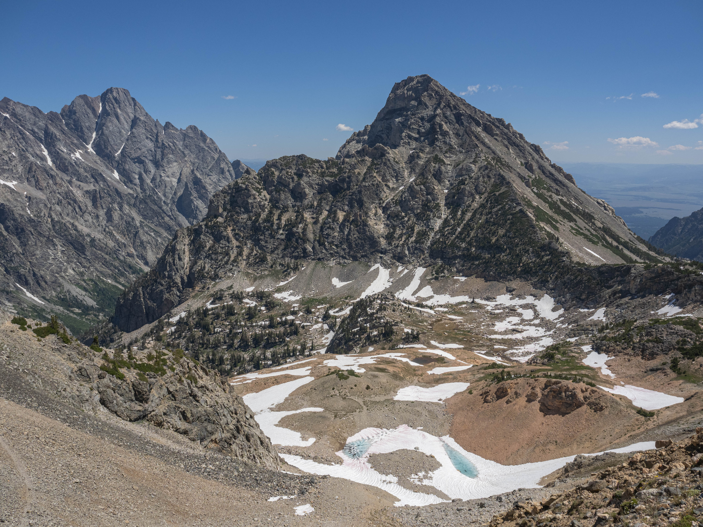
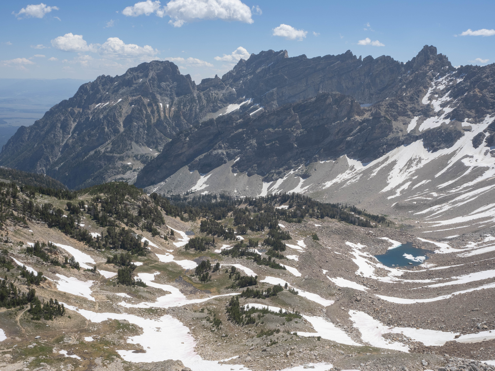

At this point it was already past noon, and we need to hike 8 miles to get to the ferry dock before the last ferry to get out, or we would have to skip the ferry and hike an extra couple miles, which we really didn't want to do. We packed up and made our last push out of the backcountry.

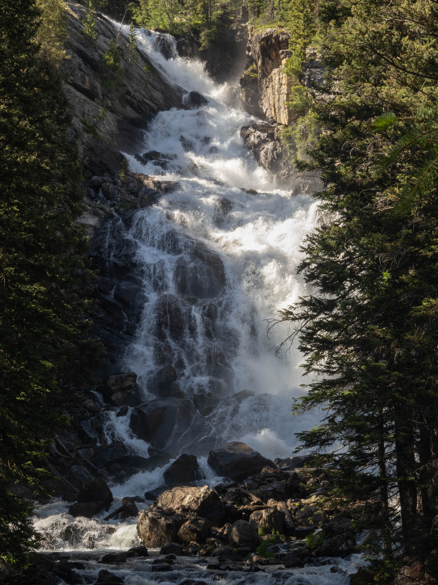

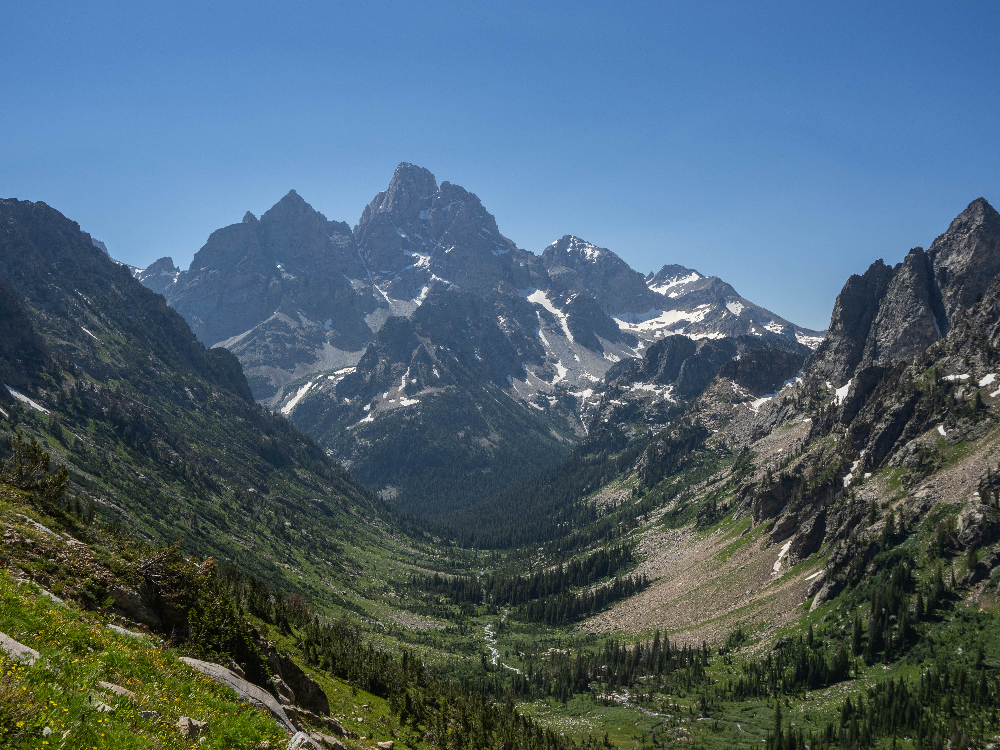

It was long, and hot, and it only got hotter as we descended Cascade Canyon and the breezes became more and more infrequent. The shade gave us relief from the sun, and we dreaded every exposed patch of trail.

When we were just about 2 miles out from the dock, we ran into our first moose. It was just blocking the trail taking its time eating the brush, and we (along with dozens of dayhikers) were stuck waiting for it to move away.

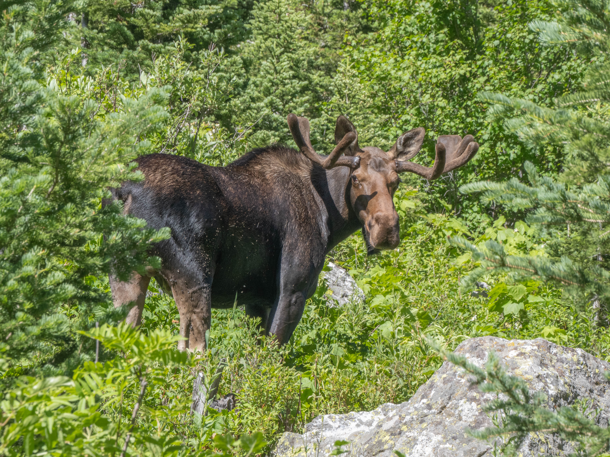

After it had cleared the trail, we quickly made our way to Inspiration Point, and to the dock shortly afterwards, and caught our ride back to the car.

