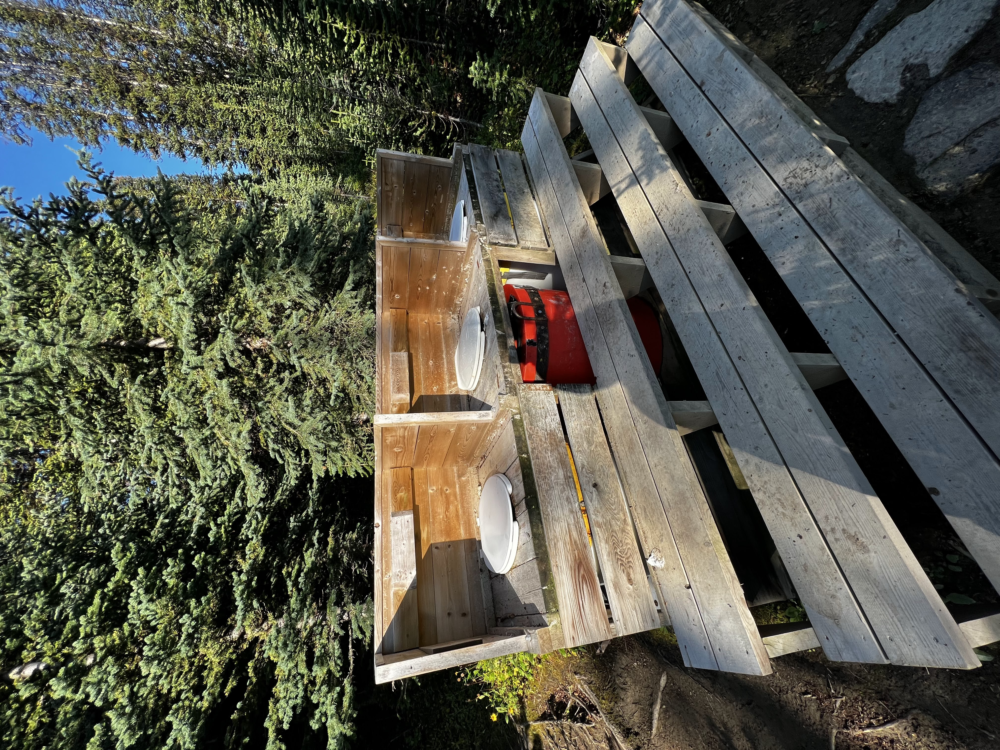

I had the opportunity to hike Jasper's famed Skyline Trail and couldn't pass it up. My buddy had booked a permit for late August after our permit last year was cancelled due to a wildfire. After two nights on the trail, I'm glad to report it lived up to its reputation!

The highlights

- The second day treated us to continuous panoramic views.
- The campgrounds boasted excellent infrastructure.
- We encountered abundant wildlife and critters.
- The alpine hike featured a relatively gentle grade, especially if hiked northbound.

The lowlights

- Above the treeline, there is absolutely no shade on the trail.
- Shuttle logistics posed some challenges.
- Obtaining permits can be highly competitive.



**Logistics and Planning**

***Permits***

You don't need a permit to hike the trail, and we've seen trailrunners do it in one day, but you do need to reserve a spot at the backcountry campgrounds. Reserving campsites at Snowbowl and Tekarra for two nights is a popular option, allowing hikers to break up the trail and enjoy a more relaxed pace. However, it is indeed possible to complete the trail in one night by staying at Signal Campground if you are comfortable with longer hiking days. Reserving campsites at Signal and Little Shovel is another possibility.

The booking process with Parks Canada typically opens in March, although it's always a good idea to check the official Parks Canada website for the most up-to-date information regarding permit availability and booking dates.

To increase your chances of securing a permit for the desired dates, it's recommended to be prepared and ready to book as soon as the permits become available.

***Direction***

We hiked northbound, starting from Maligne Lake. This avoided about 600 meters of ascent since the north trailhead is higher elevation. However, we met some hikers going southbound, either by preference or lack of permits.

***Transportation***

This is a thru-hike, and you won't end at the same trailhead you started. Shuttle services exist for this trail that you can book for. We used [Maligne Adventures](https://maligneadventures.com/shuttle/).

***Gear***

This trail warrants all the usual backcountry precautions. It's nice to not have to bring a bear canister for this trip as each campsites had abundant storage in the food lockers. It's a good idea to bring hiking poles for the climbs, and microspikes for the Notch, if snow is present. However, if the snow is fully melted, as was the case during our trip, we left the microspikes behind.

Remember to check the weather forecast, trail conditions, and any updated safety advisories before embarking on your hike. Stay prepared and enjoy your adventure on the Skyline Trail!

**Day 1 - Start from Maligne Lake- 13km**

We started early to allow time for preparations and to park at the north trailhead, ensuring access when we finished. It was good we arrived early as the small lot was nearly full. We even saw a bear crossing it as we got ready!

The shuttle arrived on time around 9am and took 30 minutes to Maligne Lake where we were dropped off. After a trailhead selfie, we hit the trail around 10am.

The first few hours had uneventful views. We followed a gradual incline towards Little Shovel Pass. Recent rain left muddy trails, so I was glad to have waterproof boots. Mushrooms were abundant all along the trail!

We made a quick stop to Mona Lake. It's nothing special but the lake was a very short walk from the trail, and a good spot to take a break.

Next top, Evelyn Creek, a major creek (thankfully with a bridge), and the last creek before our ascent up to Little Shovel Pass.

As we approached the pass, we finally broke past the treeline. For the first time, we got to see beyond the trees that line up the trail so far. We were finally reading the alpine zone, and trees gave way to small shrubs and grasses. This section of the trail, from the treeline to Snowbowl Campground, was a delight to walk on, and we got our first taste of what's to come tomorrow...

The campgrounds all along this trail are quite nice. You'll find that about half the campsites are on new wooden tent pads, brand new bear lockers (assigned per campsite!), outhouses, and plenty of picnic tables for cooking and eating.

**Day 2 - The Notch - 20km**

On our second day we got to an early start, as this is by far our longest day and with 20km and two mountain passes to cover, we could use all the time we can get. We packed up and left Snowbowl and headed north towards our campground for the second night at Tekarra.

The first few kilometers were mellow meadows, but **Big Shovel Pass** awaited in the distance. As we approached, the trail steepened and we passed the first pass of the day. The views made it worthwhile though.

From the ridge, we could make out a couple of small glaciers and snowfields, still holding on. We could also see the moraines that showed how big and mighty these icefields once was. 

At last, we made it out to Curator Lake, the little lonely lake right under the Notch. We were warned by a group of backpackers that this would be the last water source until Tekara, so we decide it would be wise to fill up for the day here. While resting there, We were almost at the Notch, the highest point on the Skyline Trail, which makes it the highest point on a maintained trail in Jasper National Park. We looked wistfully at the trail as it winds up the mountain, and wondered if there's an easier way up.

It took a while, and lots of breaks, but we made it to the top. The trail to the Notch is entirely on exposed rocks and scree, so a stable foothold was essential. We witnessed a few small rockslides along the way. This is not somewhere you want to linger for too long!

With these grand panoramic views on both sides of the trail, this part of the Skyline Trail has a way of making you feel like you're on top of the world. There was even reception here as we had a direct line of sight to nearly everything in the valley. We walked on relatively flat ground for a couple of kms until our descent into a valley.

The descent was _not_ fun. One of my buddies was getting sore knees from the Notch, and we had to take it slowly. It's a steep and rocky descent with many switchbacks, and while the view is amazing, the campground never seems to get any closer.

Once down at the valley, once again, we ran into a lush meadow with lots of flowing creeks. We are getting closer!

We finally made it to the campground right as the sun was setting. Day 2 was the most challenging of the three days, with the longest mileage and lots of elevation gain. Nonetheless, the stunning views made it all worth it. We had an big meal for dinner, and witnessed a wedding shoot in the campground. It looks like a couple brought all of the dresses, with two photographers in tow, to take photos at this magical trail!

**Day 3 - Exit down the fire road - 14km**

After Tekarra, the last day was mostly downhill, all the way to the trailhead. There were a few views at the start of the hike, as we had to cross a large creek and a few open meadows here and there, but then you will hit Signal Campground and the fire road.

We heard a lot of dreadful things about descending the fire road, but I didn't find it all that bad. Still, almost 1000 meters of descent in one go is tiring. Supposedly there is an alternate, more narrow, trail down to avoid walking on this fire road, but we were not able to find it, and we weren't sure if that's any more fun.

It's not the most exciting day as most of the day's walk will look like this:

With good company and fun conversations to pass the time, we made it back to the trailhead right around noon. We celebrated with a lunch reservation at The Raven Bistro, thanks to the reception we had at the Notch the day before. 
What other backcountry trail could you do that?