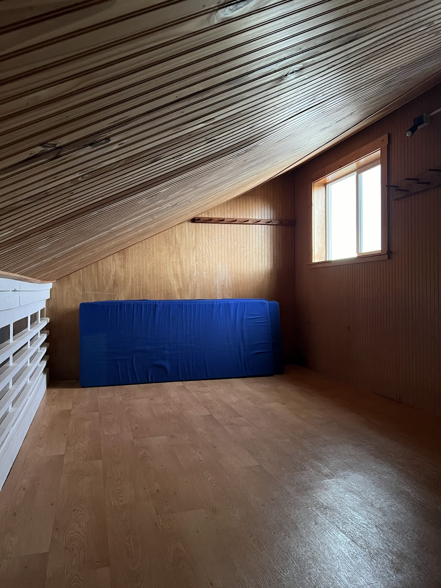

This is a bit of a lazy trip report, but I had the opportunity to spend a night at the popular [High Hut](https://www.wta.org/go-hiking/hikes/high-hut) near Mt. Rainier in December 2023, and it was a fantastic experience! Despite the low snowpack, which made access more of a road walk without snowshoes or skis, I still had a great time.

The highlights

- The mountain hut at High Hut is incredibly well-equipped, providing everything you need for a comfortable stay.
- The views of Mt. Rainier from High Hut are breathtaking.
- Fairly short (if not boring) hike to the hut

The lowlights

- I'm not too sure here... Maybe the availability cell reception if you're trying to go off the grid?

**Logistics and Planning**

***Permits***

[Reservations](https://skimtta.org/high-hut/) required from MTTA for $15/night, and a Sno-Park or Discover Pass is required to park.

Booking the hut can be competitive, especially during peak ski season (January to March). Arriving early or attending the Gala event may increase your chances of securing a reservation.

**Impressions**

The hike to the hut is short but steep, covering about 3 miles (5 km) with a constant uphill climb of 1,750 ft (540 m) from the upper parking lot. The terrain is relatively easy to navigate, mainly following a well-marked forest service road. The panoramic views open up towards the end of the hike, at the last ridge.

The hut is really nice! MTTA definitely managed to do a lot with the resources have. The hut has ample heating, power. The kitchen is better stocked here than many of the Airbnbs I've been to. Since it wasn't the busiest night at the hut, we managed to  have the top floor to ourselves. There's even mattresses, and pillows. We had packed much of our campinmg gear but was surprised to find that that was not even necessary.

I had decent cell reception in the hut with T-Mobile, which I was not expecting at all.

I was worried about not being able to see the mountain given that previous trail reports in the winter often mentioned that the mountain was hiding behind clouds, but despite concerns about cloudy weather, we were lucky to have clear skies, allowing us to enjoy stunning views of Mt. Rainier, Mount Adams, and Mount St. Helens.

I enjoyed reading the guest log and chatting with the other three guests staying at the hut that night. We did some cooking and shared stories with the others over a drink and warm meals.

Overall, my stay at High Hut was a memorable and enjoyable experience.

