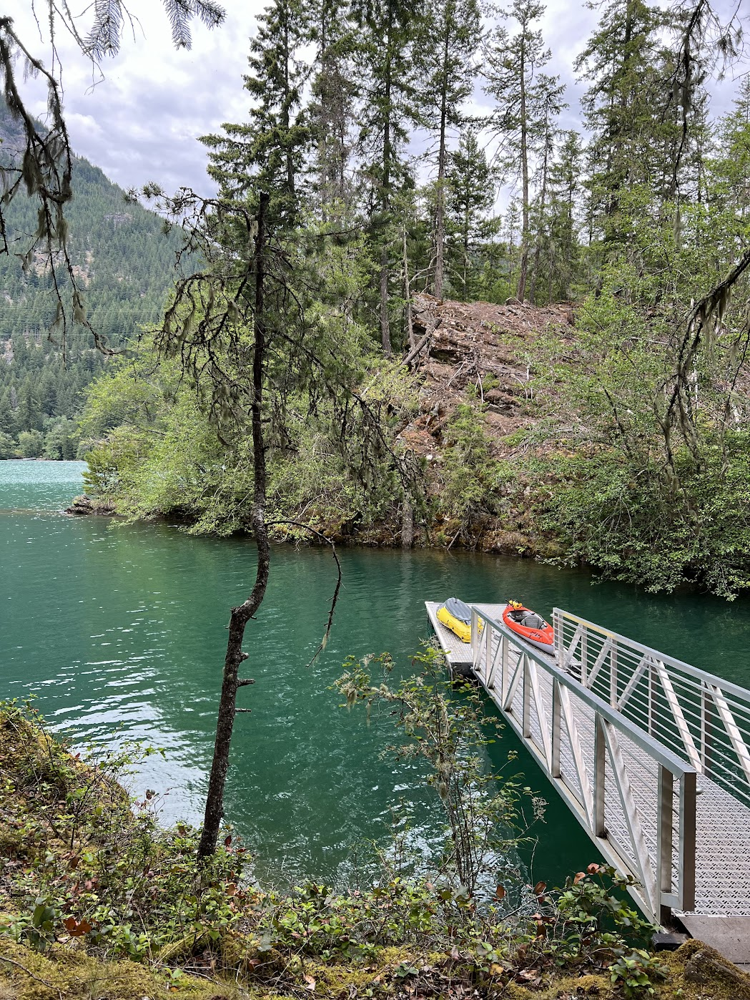

We recently had the pleasure of spending a night at the Hidden Cove Boat-In Campground in Diablo Lake, nestled within the North Cascades National Park. Despite the simplicity of this report, my experience was truly unforgettable. 
 
Highlights of the Trip: 
- The mesmerizing blue waters of Diablo Lake created a serene and picturesque backdrop.
- The solitary campsite at Hidden Cove provided a sense of exclusivity, allowing for a peaceful retreat without distraction.
- Convenient amenities such as a bear locker and clean vault toilet.
 
Lowlights of the Trip: 
- One downside of the trip was the lack of rental services at Hidden Cove Boat-In Campground, requiring campers to bring their own gear for kayaking and camping. This limitation may pose a challenge for those without access to personal equipment. 
- Getting the right wilderness permit can be hard, as there is only a single campsite.
- It is worth noting that the wind can pick up in the afternoon.

<iframe src="https://www.gaiagps.com/public/ahLCIdvf1qsFooH6eCLlle6R/?embed=True" style="border:none; overflow-y: hidden; background-color:white; min-width: 320px; max-width:800px; width:100%; height: 420px;" seamless></iframe>

**Logistics and Planning**

***Permits***

A wilderness permit from Recreation.gov is required ($10/person), but on the flip side the National Park is completely free and does not require an entrance fee.

***Camping***

Booking the campsite can be competitive, especially during the summer. I was able to secure it during the North Cascades Early Access lottery that opens up in the spring. Luckily there's also 2 other campsites on the lake, and lots more on Ross Lake!

**Impressions**

June can be an unpredictable time to visit the North Cascades, with weather changes happening suddenly. During our trip, we experienced a mix of sunshine and rain, but we were prepared for potentially wet conditions. 
 
This outing was also a chance for us to test out some new gear we had purchased. We used an Advanced Elements AdvancedFrame Tandem kayak, which proved to be more than capable of carrying all our supplies. 
 
After unloading our gear at the Colonial Creek boat ramp, parking the car, we set off on our quick weekend getaway around 1 pm. However, we soon realized that the wind was not in our favor. Despite being told by rangers and the weather forecast that the wind should be coming from the southwest to help propel us towards Hidden Cove, it was actually blowing directly against us. This made our progress slow and challenging, with each break feeling like we were being pushed back. 

 
Despite the wind, we enjoyed the vibrant blue waters of Diablo Lake, the sight of Rainbow Trout leaping out of the water, and the sun shining through the increasingly cloudy skies. As we paddled past Thunder Point, another campsite on the lake, we knew we were nearing our destination.

After about an hour and a half of steady paddling, we reached the mouth of Hidden Cove. The sheltered boat ramp nestled in a small inlet provided a welcome respite from the wind and choppy waters. It really is hidden from view and the cove is quiet and very protected from the elements. The campground itself was lush with moss and greenery.

 
The campsite at Hidden Cove was pleasant, offering a single tent pad suitable for one large tent or two smaller tents, accommodating up to four people. Amenities included a relatively clean pit toilet, a weathered picnic table (we were glad we brought a picnic blanket), and a bear locker. We settled in, enjoyed an early dinner, and gathered around the fire with some firewood left by previous campers.

 
We followed an unmaintained trail behind the camp area, and discovered a rocky knoll overlooking the lake, providing a serene and peaceful spot reminiscent of the popular Diablo Lake overlook view but without the crowds. 

The rain persisted throughout the night but eased off by morning. After breakfast, we packed up our rain-soaked gear onto the kayak and began our journey back. 

 
Fortunately, the wind shifted in our favor, pushing us back towards the boat ramp with minimal effort, concluding our memorable trip to Hidden Cove with a smooth return journey.

Overall, my kayak camping journey to Hidden Cove Boat-In Campground in Diablo Lake was a fun escape into the heart of nature. The simplicity of camping by the water's edge and being surrounded by the majestic beauty of the North Cascades left a lasting impression. I look forward to future adventures in this area and discovering more hidden gems like Hidden Cove.