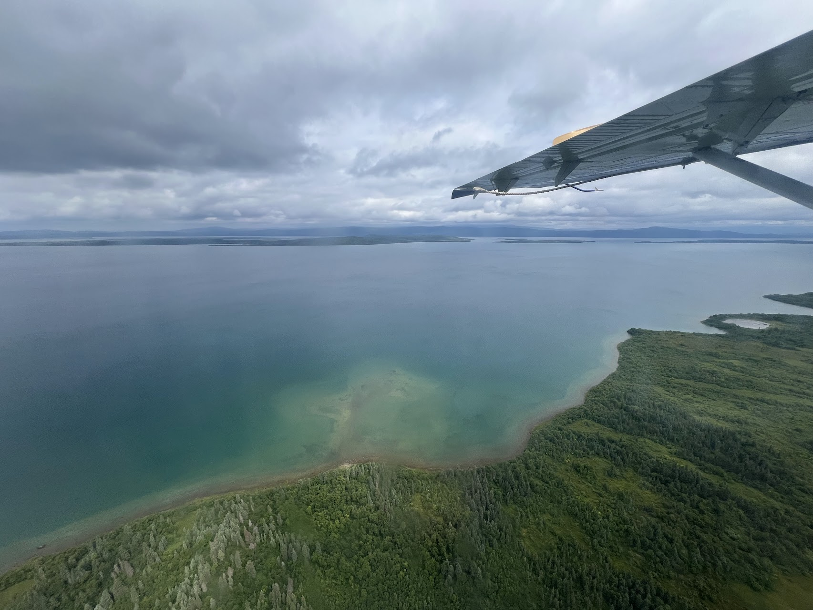

---
title: "Brooks Camp"
meta_title: "Bears, volcanoes, and more"
date: 2024-07-26
author: 
  name: "Yu Chen Hou"
  image: images/author/me.png
  twitter: '@yucombinator'
stats:
  where: "Katmai National Park"
  date: "2024-07-26 to 2024-07-28"
categories: ["Alaska"]
tags: ["Photo Essay"]
description: Bears, volcanoes, and more
thumbnail: "images/trips/brooks-fall.jpg"
image: "valley-5.jpg"
---

The journey to Brooks Camp isn’t the quickest or cheapest. Tucked away in a corner of southwestern Alaska, we took three flights from Seattle plus a seaplane ride. Fortunately, I saved quite a bit on the flight to King Salmon thanks to a companion fare with Alaska Airlines, and even then, getting there was costly. We visited in late-July, the peak season when the bears are most active at the famous Brooks Falls.

Upon landing at the park, our first task was to register at the Visitor Center and watch the orientation video affectionately known as Bear School. It’s a charming [video](https://www.nps.gov/katm/learn/photosmultimedia/bear-school-video.htm) with surprisingly good production quality. After watching, we received a special pin for graduating and set off to explore the park!

We camped at Brooks Camp for two nights, which felt like just the right amount of time. Aside from sleeping and a couple of quick meals, we spent most of our time at the falls or at the Lodge, which was open to all visitors. The Lodge offered buffet-style meals for lunch and dinner, and we indulged a couple of times—it was quite good!

The campsite was relatively well-equipped, featuring a food cache, running water, and free firewood. It may be one of the most unique campgrounds I’ve stayed at, protected by an electric fence around the perimeter.

We also took an optional bus ride to hike the Valley of Ten Thousand Smokes. The journey was long and very bumpy on a dirt road. Interestingly, the Valley is the reason the National Park was established (not just for the bears!). It was the site of the largest volcanic eruption of the 1900s, and the devastation is still evident today. Luckily, the weather cleared up, allowing us to enjoy this remote area of the park.

We hiked down to the river and took photos of the massive wall of ash formed by the eruption, and headed back to Brooks Camp.

The highlight of our trip was observing the bears at Brooks Camp. There were so many bears fishing for salmon! It was fascinating to see the different techniques each bear had developed to catch their meals. Some chose to wait atop the waterfalls, catching the salmon as they leaped up. Others snorkeled at the bottom of the falls, targeting fish before they jumped. Lastly, some bears would beg more skilled ones for scraps.

The viewing area featured an elevated platform overlooking the falls, and the bears were close enough that you could smell them. We happened to be there during a weekend of major bear drama, with a [male bear attacking two cubs](https://mashable.com/article/fat-bear-attack-webcam-livestream). It was heartbreaking to see the injured cub cry for help.

