---
title: "High Divide and the Seven Lakes Basin"
meta_title: "Backpacking a PNW classic trail"
date: 2024-08-26
author: 
  name: "Yu Chen Hou"
  image: images/author/me.png
  twitter: '@yucombinator'
stats:
  where: "Olympic National Park"
  distance: "23.7 miles / 38 km"
  elevation: "5400ft / 1660 m"
  date: "2024-08-26 to 2024-08-28"
categories: ["Backpacking", "Washington"]
tags: ["Backpacking", "Trail Report", "Mountains"]
description: Visiting a PNW classic
thumbnail: "images/trips/high-divide.jpg"
image: "lakes-basin.jpg"
---

The High Divide - Seven Lakes Basin loop is a classic hike in Washington and I've been wanting to hike it ever since I moved to Seattle a few years ago. I reserved permits for three consecutive years but had to bail each time. This year, however, I was determined to make it happen. With plans for our annual backpacking trip with my sister, I snagged a last-minute permit thanks to a cancellation.

**Highlights**

- Beautiful Scenery: Stunning alpine lakes to explore and mountains to see
- Diversity of biomes: While hikiking, you get to experience the environment around you to change a couple times
- Discover the rainforest: On this loop, there are 
- The alpine meadows: Lots of berries to forage, and wildflowers to see!

**Lowlights**

- The Weather: Rain and fog are possible, and the fog can easily affect views. You are in a rainforest after all.
- Competitive Permits: You need to make a reservation on Recreation.gov

<iframe src="https://www.gaiagps.com/public/krQx80U4CZ9pwRiKBjVONcQL/?embed=True" style="border:none; overflow-y: hidden; background-color:white; min-width: 320px; max-width:800px; width:100%; height: 420px;" seamless></iframe>

**Logistics and Planning**

***Permits***

Our route:
Day 1: Start at Sol Duc and hike along the river clockwise to Rocky Creek
Night 1: Camp at Rocky Creek
Day 2: Rocky Creek to Heart Lake, then hike to 7 Lakes Basin
Night Two: Camp at Lunch Lake
Day 3: Head to Deer Lake, then complete the loop!

To camp in Olympic National Park, a reservation is needed, and for this particular loop, the campsites are competitive and go out quickly! Of course, no permits are needed if you want to trail-run it in a day.

***Camping***

There is a many options for camping along the trail. The most "developed" campground are Sol Duc Park, Heart Lake, Deer Lake, and Lunch Lake, where there are more of a ranger presence, and privys. There are lots of riverside camps along the Sol Duc River and canyon Creek, but they have only one or a handful of spots each. There aren't a whole lot of spots to camp along the High Divide though.

**Photo Essay**

One of the best parts about heading to the Olympics is the ferry ride (on a good day, with little traffic). It's a great opportunity to look for marine animals and feel the refreshing sea breeze. The boat acts almost like a buffer to adventure. The boat serves as a buffer to adventure; boarding the ferry feels like the proper beginning of the journey, while returning home marks the end.

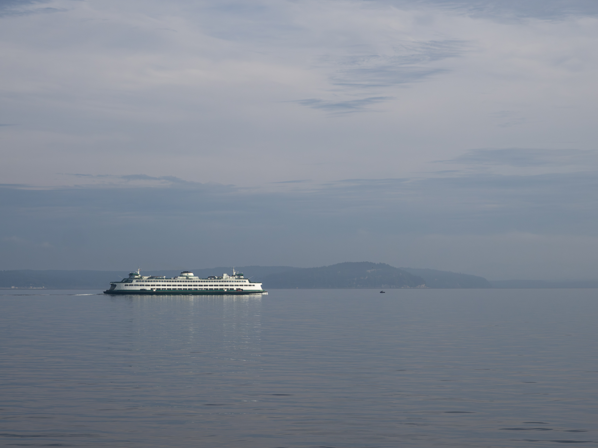

We drove to the Sol Duc trailhead, where parking can be challenging even on a weekday. It took us a while to find a spot since Sol Duc Falls is a popular day hike that attracts quite a crowd. As we hiked the loop clockwise, we first followed the Sol Duc River before planning to climb up to High Divide on the second day. From there, we would camp at Lunch Lake and complete the loop back to our car.

The hike along the river to our first campsite at Rocky Creek was long but gradual. We actually missed the trail since most hikers were heading straight to the waterfall; our turn-off was just before the falls. There weren’t many vistas along this stretch, but it was nice to experience some tranquility compared to the bustle of the trailhead. After five miles, we reached the Rocky Creek campsite, conveniently close to a creek for filtering water. The site was quiet, save for the sound of the flowing stream, but finding flat ground was a challenge—we managed to locate just one area suitable for a single tent.

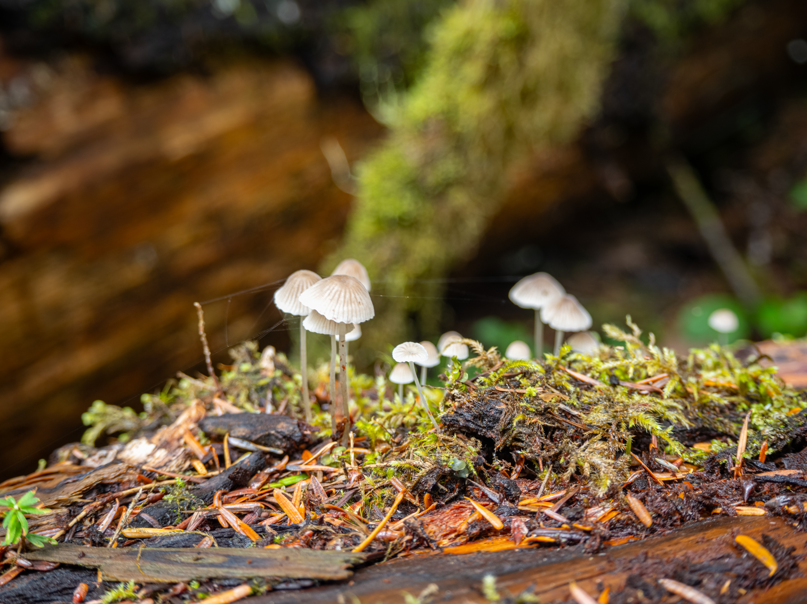
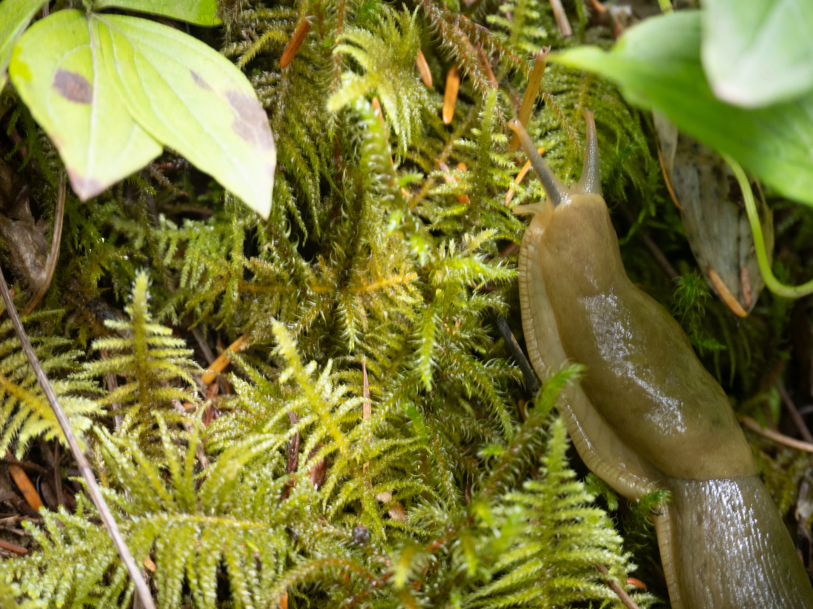

As we hiked in, the weather soured, and by the time we reached the campsite, the rain was really picking up. We quickly set up our shelter and hunkered down for the evening. The vibrant rainforest was filled with interesting mushrooms and banana slugs. Although we anticipated rain on Monday, the downpour brought the forest to life! We were prepared for wet conditions, but everything still ended up soaked and muddy.

The next day’s hike to Heart Lake was uneventful, but it was quite cold when we arrived, as it was windy and foggy. Blueberries were abundant along the trail, and we must have eaten hundreds of them—they were delicious! The berries in the forest were sour, but they became sweeter as we climbed. The fog rolled in as we reached the High Divide, and we were mostly socked in. Despite the fog obscuring one side, we still enjoyed stunning views of the Seven Lakes Basin on the other.

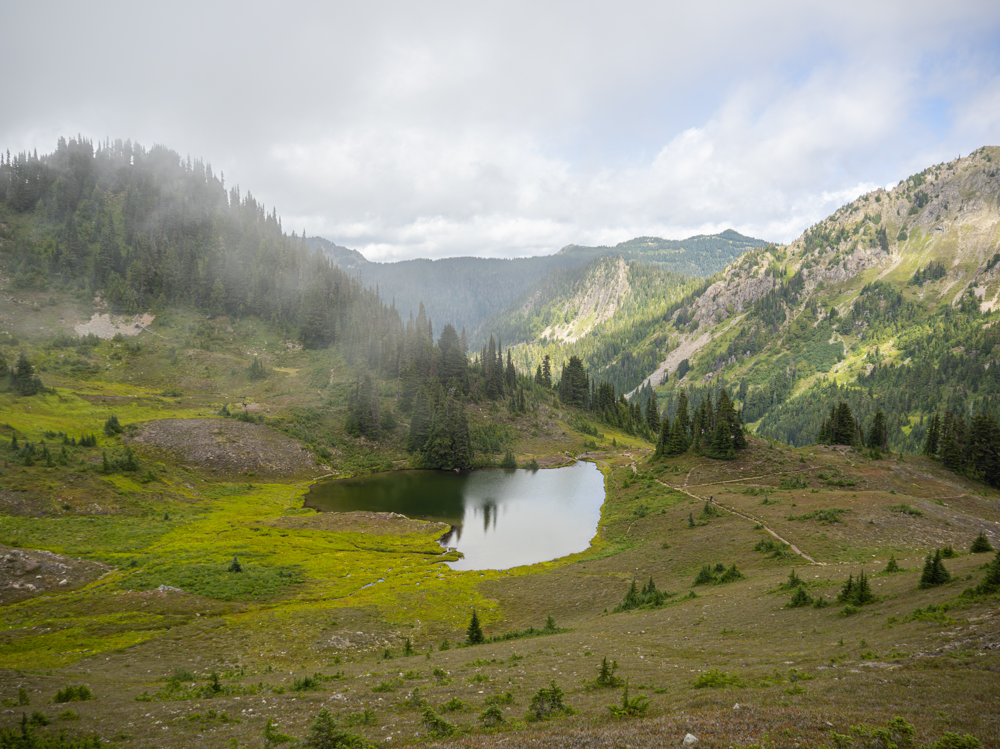

Rangers checked our permit and pointed out a black bear in the distance. We certainly weren’t the only ones enjoying the berries!

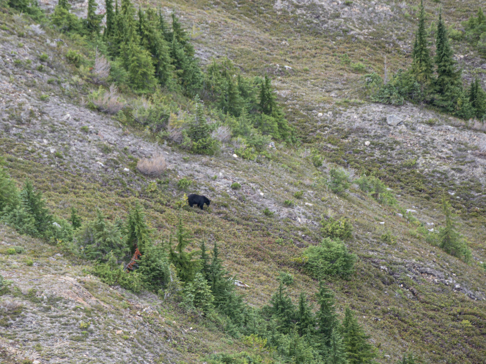

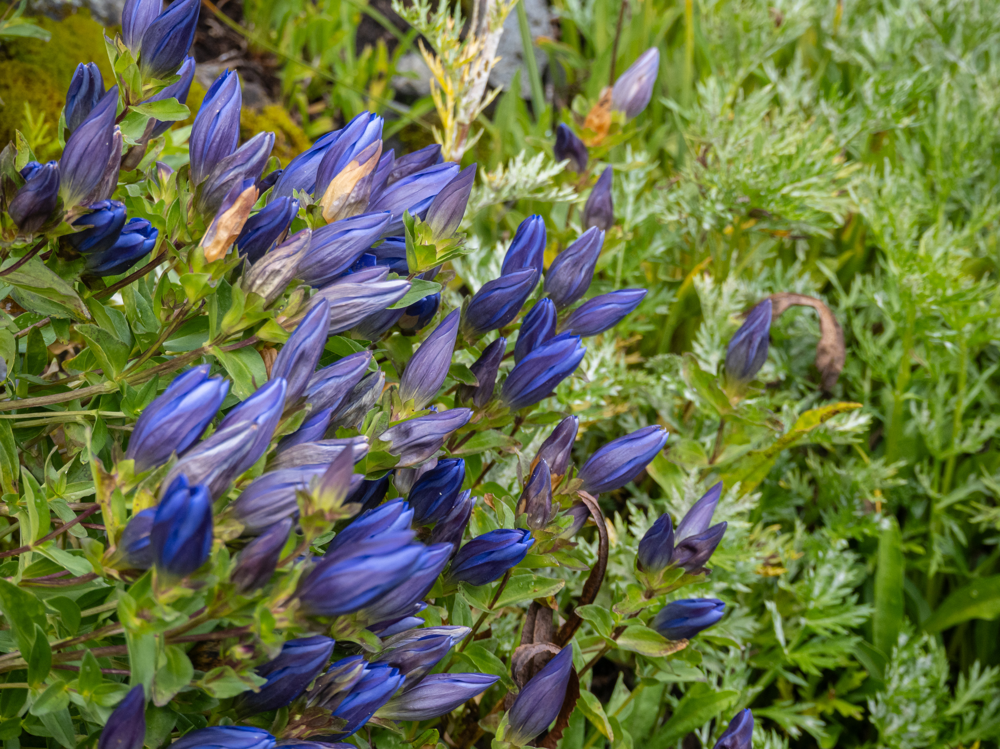

We took the unmaintained trail to Lunch Lake, which allowed us to see several beautiful alpine lakes in the basin along the way. The trail was in decent condition, though a bit steep and easy to miss due to a lack of signage.

Lunch Lake was much larger than I expected, and there were plenty of campsites available. We found a spacious clearing near the back of the camping area that offered a lovely view of the valley below and Clear Lake. As we were getting ready for bed, two deer wandered into our campsite and looked at us curiously.

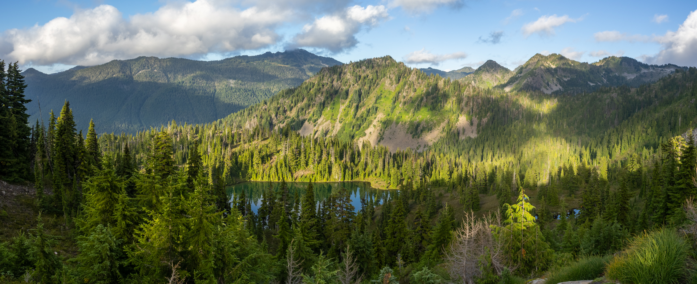
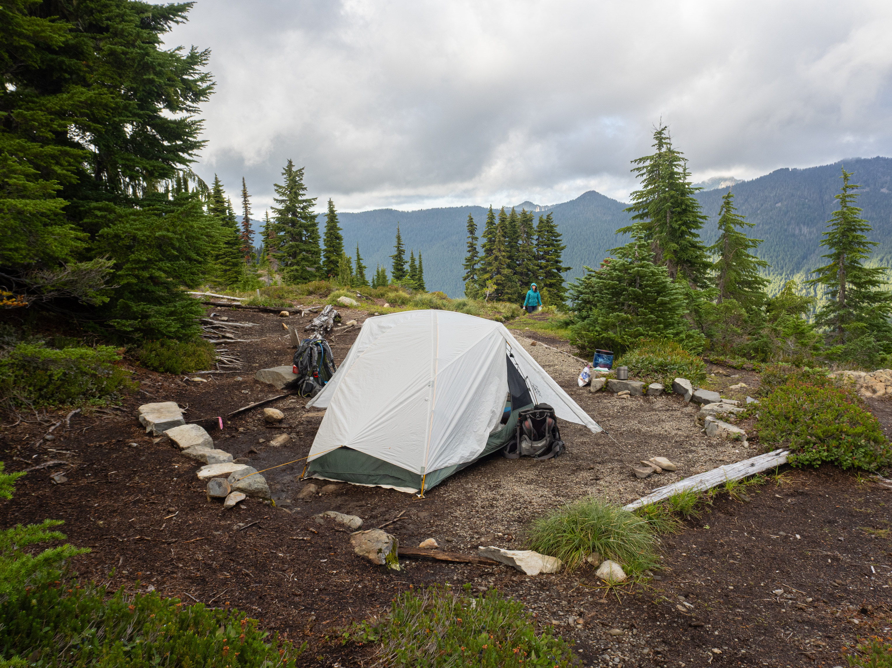
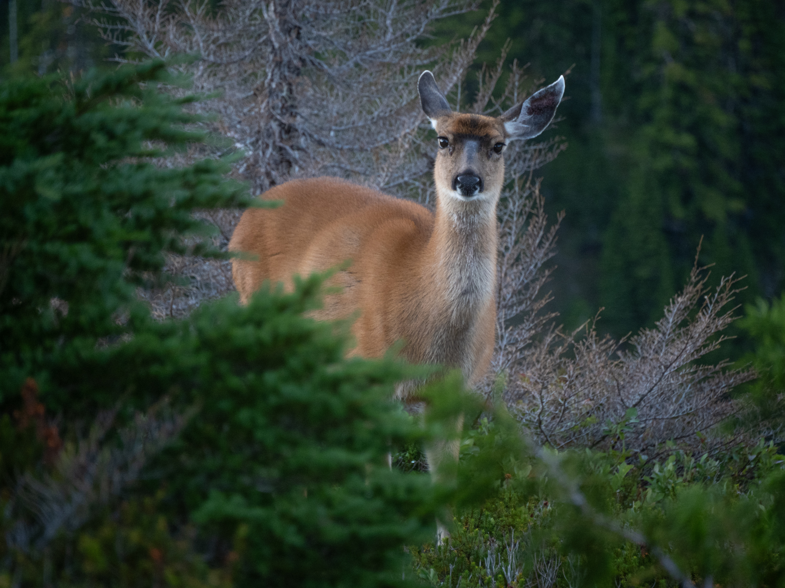

The next day, the weather cleared, revealing a cloudless sky. After breakfast, we headed back to the car. From Lunch Lake, it was seven miles to the trailhead, mostly downhill. Instead of taking the shorter route, we climbed back to the High Divide via the unmaintained trail from yesterday to catch a glimpse of Mt. Olympus. The fog cleared, unveiling a stunning view of the mountain and its glaciers. From there, it was a downhill march back to the car, with the views lasting for a couple of miles before we emerged back into the dense rainforest above Deer Lake.

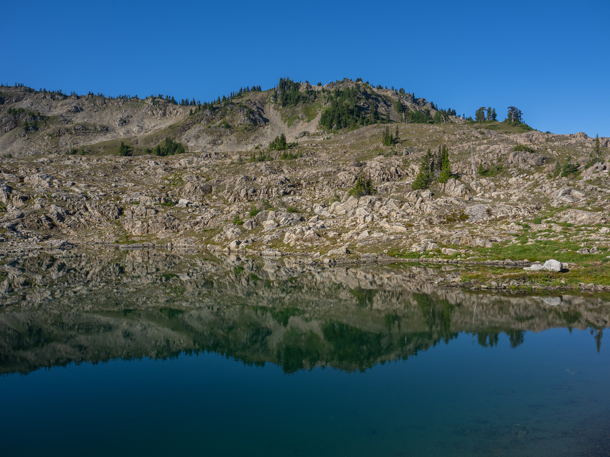
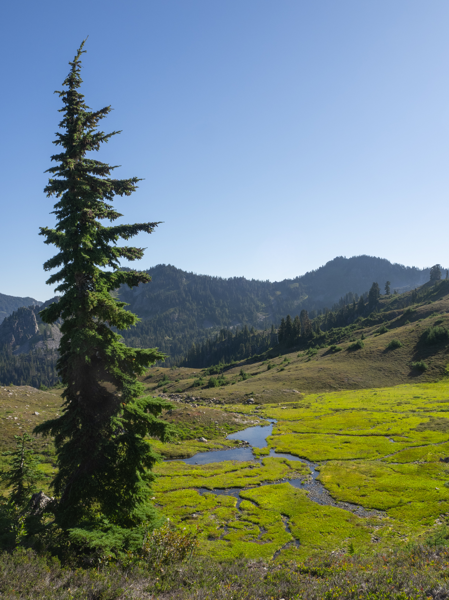

Along the way, we bumped into some hikers coming from the Hoh Rainforest, which sounded like a much more epic journey than ours.

Eventually, after eating many more berries, and a couple hours past Deer Lake, we finally heard the distant rumble of Sol Duc Falls!

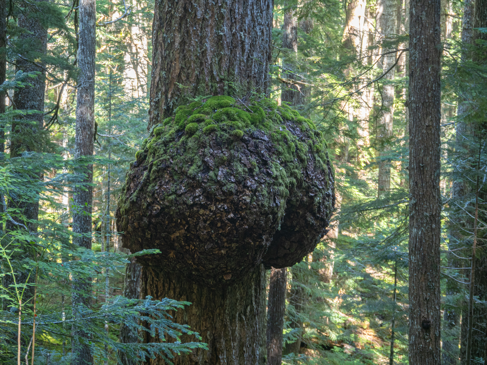
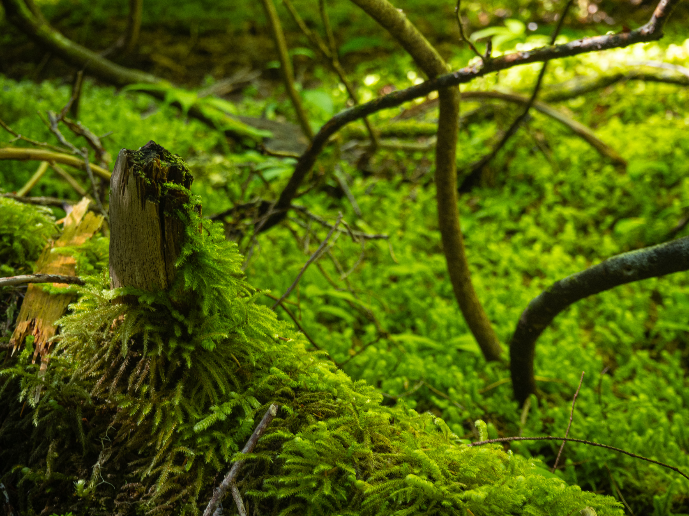
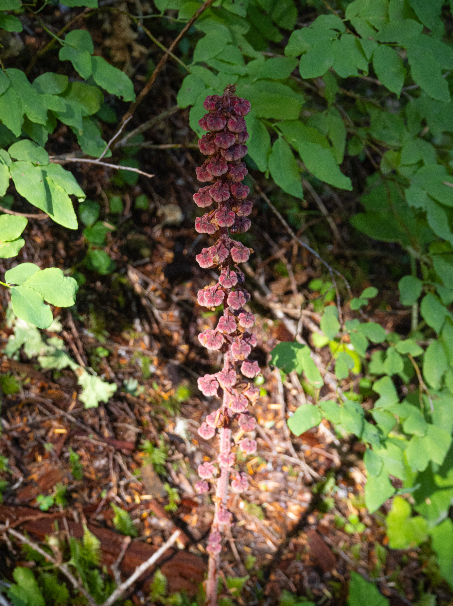

I loved the diversity of biomes on this loop. Experiencing the rainforest up close along the Sol Duc River and at Canyon Creek was a highlight, and the scenery gradually transitioned from lush rainforest to subalpine forests and, eventually, beautiful lake and granite basins. Though if I would to do this trip again, I would skip the forest walk in Sol Duc, and just beeline for the Seven Lakes Basin directly.
