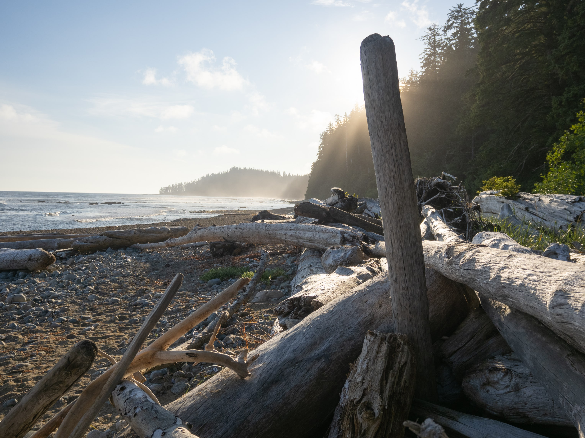

---
title: "West Coast Trail"
meta_title: "6 days in the mud"
date: 2025-07-05
author: 
  name: "Yu Chen Hou"
  image: images/author/me.png
  twitter: '@yucombinator'
stats:
  where: "Pacific Rim National Park Reserve"
  distance: "75 km"
  elevation: "5400ft / 1660 m"
  date: "2025-07-05 to 2025-07-11"
categories: ["Backpacking", "BC"]
tags: ["Backpacking", "Trail Report", "Beach"]
description: Bliss and Blisters on the Coast
thumbnail: "images/trips/high-divide.jpg"
image: "lakes-basin.jpg"
---

I finally backpacked the West Coast Trail, a week-long, point-to-point adventure along the edge of Vancouver Island in BC. I’ve wanted to hike the trail ever since I moved to BC for an internship and started camping and backpacking. Coastal hiking presents different challenges than alpine hikes in the mountains, and very different views.
The opportunity came up to hike the trail this July with my partner and a friend. This would be the longest backpacking trip any of us had done, and we had to work out a lot of logistics since the trail is point-to-point.

**Highlights**
Beautiful sunsets and long beach hikes
Lots of interesting wildlife
The famously hard-to-get burgers and fresh crabs
The cable car and dozens of ladders

**Lowlights**
Mud. So much mud.
Some long days. It would have been better with an extra day
Beach hiking can be exhausting

<iframe src="https://www.google.com/maps/d/u/1/embed?mid=1NLIanh7HDertfBC9Ev0uREG_nfCEGWU&ehbc=2E312F" style="border:none; overflow-y: hidden; background-color:white; min-width: 320px; max-width:800px; width:100%; height: 420px;" seamless></iframe>

**Logistics and Planning**

Permits for the WCT open early in the season, and the best dates with optimal tide windows go fast.
The West Coast Trail app (iOS and Android) is excellent. Created by a friend of the trail, it lets you preview itineraries, check tides, view menus for the two shacks, and read trail history and warnings. I used it to pick a permit window and during the hike to learn about hazards and points of interest.
Because the trail is point-to-point, arrange transportation between trailheads. The Trail Bus is a popular option if you don’t want to leave two cars. Note that parking at the southern end is paid.
Plan your itinerary around ferries and tides. The trail crosses two ferry services (the Crab Shack and the Pacheedaht Nation); they have limited hours and often stop running well before sunset (around 4:00 p.m.). You need to clear those crossings in time or risk being stranded.

***Gear***

We brought our usual backpacking kit, aiming for a lighter base weight. Water is plentiful on the route, and most campsites have easy access to water for filtering.

Highly recommended extras:

Gaiters — keep mud and debris out of your shoes.
Trekking poles — great for balance on slippery roots, ladders, and muddy sections.
Gloves — lightweight work/gardening gloves protect hands when using dirty ladders or scrambling.
Reliable rain gear — essential. The WCT sits in one of the wettest climates on Earth; bring your best waterproof jacket.
Pack rain cover or dry bags — to keep clothing and electronics dry.
Quick-dry socks and camp shoes — for comfort when things get wet.
Water filter/purifier — there’s plenty of water, but you still need a reliable treatment method.

***Permits***

Our itinerary (southbound):

Day 0: Take the ferry, and drive up the Juan De Fuca highway, attend orientation at the Park Canada Office at Pacheedaht Campground

Day 1: Take the Trail Bus to the northern trailhead (Pachena Bay), and hike 14km to Darling River

Day 2: 11 km to Tsusiat Falls

Day 3: 17 km to Cribs

Day 4: 16 km to Cullite Cove

Day 5: 11 km to Thrasher Cove via Owens Point

Day 6: 6 km to Gordon River Trailhead, and take the ferry back to the car!

**Day 0**

Every trip to Vancouver Island starts with the ferry. We took a morning sailing and drove straight to Port Renfrew at the southern trailhead. There we attended the required orientation, got the latest wildlife and bear reports, then received our maps and permits. We stayed at a lodge overnight and packed up for the big day ahead.

**Day 1**

At 8 am, we took the West Coast Trail Bus from the front of the Parks office to Bamfield (Pachena Bay) so we could leave a car at the finish line.

The bus ride seemingly took forever, and took a circuitous and bumpy route through many forest service roads. Once we arrived at our trailhead, we took a moment to enjoy one last lunch and started the hike. After walking along the beach for a very brief moment, we were thrust right away into a steep uphill section and hung out in the forest for most of the day. 

We met many day hikers heading to Sea Lion Rock (km 9), a great spot to take a break and watch a massive colony of sea lions offshore. You could hear them from quite a distance, way before you could even see them.

We passed an old rusty motorbike, a reminder of when parts of the trail were service roads, and saw more banana slugs than we could count. There were a few muddy sections (the WCT is infamous for mud), but it wasn’t too bad yet; we knew worse was coming.

Eventually we arrived at Michigan Creek, the first campsite along the trail. We saw a very real reminder of the origins of the West Coast Trail: an old rutted boiler from the steamship Michigan. The ship hit around in 1893, and many other accidents like this along Vancouver Island led to the creation of a lifesaving trail that eventually formed the trail as we know it today.

While it was tempting to stay here, we decided to push on a couple more kilometers to Darling Creek, where we witnessed a beautiful sunset after our dinner.

One trend we noticed: there was cell reception in many places along the trail, especially on beaches.

**Day 2**

Our goal today was to camp at Tsusiat Falls. We started on tidepools and beaches; the tide was low and exposed pools full of sea urchins. After passing a Guardian cabin at Tsocowis Creek, the trail turned inland.

Here we encountered the first of many ladder systems. The trail has more than a hundred bridges and about 30 ladder systems. This ladder went straight up, and we had to wait for other groups to pass. There are also suspension bridges and some remarkable fungi.

We eventually reached another famous stop on the WCT, a cable car. It’s an unusual but neat way to cross a large river without getting wet, but it was a neat (and exhausting) experience involving a lot of upper body strength! We had to load our packs in the gondola, then slowly pull ourselves to the other side using the attached rope. This was the only cable car we ended up taking on the trail. There were 3 others, but we were able to bypass them because the creek water levels were low enough.

Finally, we arrived at Tsusiat Falls. As this was one of the most crowded and popular campsites on the trail, we met lots of company on the beach. There was even a bear warning out as many bears in the area were habituated to humans. 

The waterfalls were nice to see, especially in the fog. We used the waterfall to shower, and while it was nice to get clean, it was very cold! We were able to warm up afterwards on a nice campfire on the beach before resting early for the long day ahead.

**Day 3**

We woke in tents covered with condensation and thick fog. We hurried to catch a tidal window for the “Hole-in-the-Wall” (Tsusiat Point), a rock arch you can walk through if tides allow.

It was going to be a long day, 17 km to Cribs. After some beach walking we re-entered the woods at Tsuquadra Point and reached our first ferry crossing. Southbound hikers have to time this crossing carefully: the ferry across Nitinat Narrows typically runs only until about 4:30 p.m. Miss it and your closest option is a long backtrack to Tsusiat Falls (about 7 km).

Luckily for us we arrived here around noon, and after a quick stop at the ferry dock admiring the jellyfish in the water, Carl’s crew from the crab shack came to get us across the inlet. 

We ate a hearty meal at the crabshack and spent hours chatting with other hikers. We enjoyed the crabs, loaded potatoes, and banana bread here, even if it costs an arm and a leg ($75+!). We even saw a black bear fishing in the distance.

It was cool to eat here and watch Carl and Shelly prepare the crabs that are caught right on-site. If we had more time, staying at a cabin or camping at the crabshack would be well worth the stop.

We had to push on another 9 kms to get to Cribs Creek, the first campsite on this site of Nitinat Narrows. 

There was a lot more mud, ladders, boardwalks and mangled tree roots,  but we eventually made it to Cribs, exhausted, an hour before sunset.

This campsite was pretty unique because of the natural waterbreak formed by a long rock formation, and the campsite felt like a cozy harbor protected from the rough waters of the ocean. However, since we arrived late and exhausted, we did not get the chance to explore the area too much.

**Day 4**

Another long day, and Day 4 was probably the roughest day for our hike: we had to hike 16 kms today, adjust for the declining shape of the trail as we head into the southern portions where conditions were very clearly rougher than the northern section, and to expect rain near the end of the day. 

That being said, the day started off in a fairly mellow manner, and we only had to hike a short beach section until we stopped at Nytom off Carmanah point. Nytom is a Burger Shack right on the beach and the successor of Chez Monique’s. For many years, Monique ran a popular burger shack on the WCT where she served meals to tired hikers, and all supplies had to be hiked or boated in. I actually heard about this trail years ago because of her, and there were many accounts online of hikers eating “the world’s most elusive burger”. Unfortunately, Monique and her husband both tragically passed away in 2017, and after many years of uncertainty, a member of her family, Katrina, has taken over the business. The hours of operation are sporadic and unpublished as she has to do many supply runs. Luckily for us, we confirmed by talking to some northboard hikers the day before that Nytom might be open when we are passing through, and we were able to enjoy some warm (but expensive - $45) burgers right on the beach! It was a little bit of home comfort before getting back on the rugged coastline.

Soon we reached Walbran Creek, another popular campsite, especially with folks completing a 7 day itinerary. Even if we were not planning on stopping here, we absolutely loved this campsite! We spotted several bald eagles perched on the tall cedar trees calling out to each other, and a nice emerald swimming pool. We could not enjoy this area long enough, as we had to press on the trail.

We met a trail runner here who was planning on completing the hike in a single day. It was humbling to know that people can indeed complete all 75 kms of the WCT in a single day, and the world record is a short 9 hour run.

At this point, the weather was starting to turn, and we still had to hike some slow, tough, miles in the rainforest before we could make it to Cullite Cove, our campsite we had planned for the day.

The trail between Walbran and Cullite was rough. The rain was intensifying and the mud patches were filling with water. We had to navigate large slippery tree roots, and every section of decaying boardwalk was a welcome sight. We also had to cross several large ravines using ladders that had multiple sections and spans. We also crossed the largest suspension bridge on the WCT, a relatively new addition to the trail; the bridge over Logan Creek turned a slow slog through a 40m ladder descent into an easy and scenic stroll.

At last, we made it to the Cullite Creek, but we still had to climb down 6 or 7 sections of ladder (the longest on the whole trail), to get from the high cliffs of the trail all the way down to sea level, where we could finally get to camp.

We were extremely fortunate that some campers that were there already told us about a nice spot sheltered under the cliffs. The area had enough space for two tents and was completely dry. All other campsites here were soaked in the rain and everyone was hunkered down in the tents due to the rain.

**Day 5**

More tough terrain today, and it had rained all night. The trail continued just as we left it, and we had to ascend just as many flights of stairs as we climbed down yesterday. Then, we continued on with the obstacle course in the forest, navigating the mangled tree roots, crossing over tree logs turned into bridges. The winter storms in 2024 had knocked over many trees in this section of the trail, and some of these sleeping giants took down entire bridges as they collapsed. The trail crews worked diligently on re-routes, but it added to the difficulty as some old easy bridge crossings were replaced with slow muddy crawls through ravines.

Eventually, we reached a fork in the trail where we headed down to the beach. We wanted to make it to Owens Point, a beautiful sea cave, and we had a favorable tidal window for it. It’s later on in the day so we would make it to our final campsite, Thrasher Cove, late around sunset, but it was possible.

We dropped to the beach at a fork to reach Owens Point and had a favorable tidal window. We saw a flock of sandpipers on the wet sand and ephemeral waterfalls raining down sandstone cliffs. It was a beautiful scene.

Getting to Owens meant navigating surge channels along the rocky shelf. Thanks to the WCT App and talking to various folks along the trip, we now knew how to navigate them. Every surge channel had an inland trail. If it looks impassable, we headed up towards the forest and there would normally be a faint trail to get around it. We spotted the occasional sea lion and seal along the shore as we hiked along.

Owens Point was gorgeous, but I slipped entering the wet sea cave and got soaked. I strongly recommend water shoes or going barefoot there as the cave is slippery even at low tide. One person can lower the group’s packs down from the cliff to make the cave approach easier.

The boulder field after Owens Point was said to be the most dangerous section of the trail, resulting in the vast majority of Search and Rescue calls. There were large boulders not unlike the talus fields you would encounter on wilderness alpine hikes, but this time you had to navigate it under the time constraints of rising tides. The 2 kms of the boulders took us much longer to complete, and we went slowly because we had to think about the savvyest way to solve this giant puzzle.

And finally we made it to Thrasher Cove right as the sun set. We enjoyed a meal and warmed up by a fire started by some trail friends we had met along the way.

**Day 6**

The final day from Thrasher to Gordon River is not technically hard, but it’s a slog: forest, ladders, and several climbs to reach the highest point on the trail near an old, unremarkable oil barrel. Surrounded by tall trees, there are few views to reward the effort.

Those last kilometers feel deceptively long, as on many long-distance hikes. We were a bit disappointed to miss a final 75 km marker (maybe it was stolen?), but we still made it: down the final (nearly vertical) ladder at the ferry landing, aboard the last ferry back to the Parks Office to sign out, and then back to the car.

