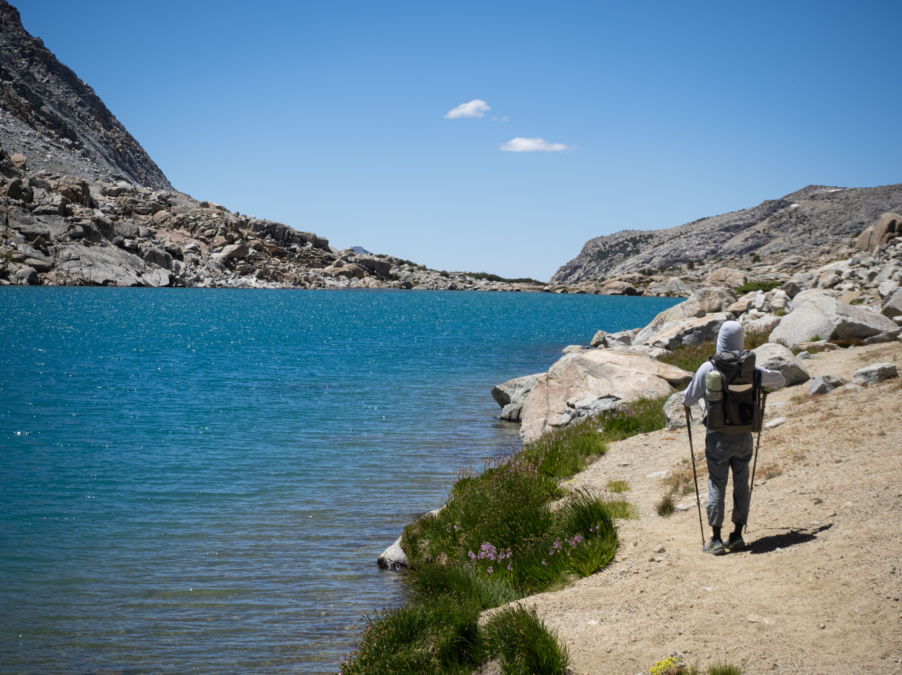

---
title: "Darwin and Evolution Basin via Lamarck Col"
meta_title: "Sierra Hiking Trip in Darwin and Evolution Basin via Lamarck Col"
date: 2025-08-01
author: 
  name: "Yu Chen Hou"
  image: images/author/me.png
  twitter: '@yucombinator'
stats:
  where: "John Muir Wilderness and Kings Canyon National Park"
  distance: "36 miles / 58 km"
  elevation: "9100 ft / 2800 m"
  date: "2025-08-01 to 2025-08-3"
categories: ["Backpacking", "California"]
tags: ["Backpacking", "Trail Report"]
description: Sierras at its finest
thumbnail: "images/trips/evolution-basin.jpg"
image: "evolution-sunset.jpg"
---

This is a quick trip report of a backpacking trip from this summer. A friend invited me along to a trip in the Eastern Sierras. We would near Sabrina Lake and climb over the intimidating Lamarck Col, and hang out a couple of days exploring the pristine alpine lakes of Darwin Canyon and Evolution Basin. It was a journey into the heart of the John Muir Wilderness, and it did not disappoint.

<iframe src="https://www.google.com/maps/d/u/1/embed?mid=1MjQP6osVNgq6vJRiCyZdhLzH5PXMa1k&ehbc=2E312F" style="border:none; overflow-y: hidden; background-color:white; min-width: 320px; max-width:800px; width:100%; height: 420px;" seamless></iframe>

**Logistics and Planning**

**Permits:** Permits for this route in the Inyo National Forest are released on a six-month rolling basis and are highly sought after.

**Facilities:** A heads-up for those used to more developed trails: there are no pit toilets or bear caches along this route. This means you'll need to be proficient with a bear canister for food storage and digging catholes for human waste, following Leave No Trace principles.

**Our itinerary:**

**Day 0:** Drive across the scenic Tioga Road and car camp at Four Jeffrey Campground near the trailhead.

**Day 1:** Hike from the North Lake trailhead, ascend Lamarck Col, cross the Darwin Bench, and make camp near Evolution Lake.

**Day 2:** Leave basecamp set up and day-hike a section of the PCT/JMT through Evolution Basin to the Muir Memorial Shelter. Relocate camp to the Darwin Bench for the night.

**Day 3:** Hike out over Lamarck Col and back to the car.

**Day 1**

Knowing that parking at the North Lake trailhead is notoriously limited, we got an early start. Arriving at 6:30 a.m., we were relieved to snag one of the last remaining spots.

As expected, the hike was a relentless uphill push from the get-go. We began in a dense forest of larch and ponderosa pine, the cool morning air filled with the scent of the woods. About four miles in, the trees thinned, and we emerged above the treeline into a vast, rocky landscape. From here, the defined trail gave way to a rougher scramble over granite slabs and talus, with a couple of snow fields that are still lingering into the late summer.



At the crest of Lamarck Col, standing at nearly 13,000 feet, a simple sign marked our entry into Kings Canyon National Park. It’s a funny reminder that even in the heart of the wilderness, administrative boundaries exist. I was even able to catch a faint bar of cell reception, a signal stretching all the way from the town of Bishop.

The other side of Lamarck Col is pretty rough. It’s a loosely defined scramble all the way until the first lake. We took it easy, and followed the GPS track closely. It’s easy to get lost up here, but it was worth it to see the lakes and glaciers of Darwin Basin from up above.

The lakes were a definite highlight. We were cradled in a valley of jagged peaks, their sharp ridges cutting into the deep blue sky.  It was also peak wildflower season high in the alpine, so I saw lots of pretty August flowers.

It was a joy to hike along four pristine blue alpine lakes, even if the trail here traverses several large talus fields, forcing us to rock-hop across giant boulders left behind by ancient landslides.

I noticed that many, if not most, hikers in  the Sierras wore heavy sun protection. Sun hoodies, gloves, hats. It’s definitely smart to wear that, given the lack of trees and ample sunlight out here. We spoke to a few other hikers with more ambitious plans than we did.

Finally, we began our last major descent of the day from the Darwin Bench down to Evolution Basin. This part was a slog. We were in the full heat of the mid-afternoon, and after gaining 3,600 feet earlier in the day, our legs were feeling it. Still, the trail was broken up by beautiful meadows and a couple of charming waterfalls.

We finally made it to Evolution Lake at 5pm. The area was already bustling with PCT and JMT hikers setting up for the night, but the lakeside was so expansive that finding a secluded spot was easy. We set up camp, took a well-deserved rest and made dinner.

The lake was a beautiful place to rest, and we watched the sunset here with some other hikers. 

**Day 2**

Day two's objective was to hike the six miles to the John Muir Memorial Shelter at Muir Pass. Since we planned to return, we left our heavy gear at the tent and set out with light daypacks. Being in the John Muir Wilderness, it felt like a pilgrimage worth making.

Given that we only had 1000 ft of elevation today, and we are hiking along the very well traveled John Muir Trail, hiking was pretty easy.

We traversed several lakes and unnamed tarns. The first one was Sapphire Lake, dwarfed under the very imposing Mt. Huxley. We also saw more pikas than we could count, their loud and high-pitched "eeps" echoing from the rocks.

Then came Wanda Lake, and with it, the mosquito apocalypse. At this elevation, the lakeshore was completely barren, which seemed to concentrate a ridiculous colony of "skeeters." For about half a mile, the trail was swarmed by these flying pests. Luckily they seemed to be non-biting, but walking through a thick cloud of them was an unpleasant experience. It seems like the skeeter problem is a very known issue on the trail, and many of the hikers we met today brought up this topic. We even heard that there is a trail re-route being built that would bypass the shores of Wanda Lake!



At last, we began the gentle climb to Muir Pass. The ascent was so mellow that before I knew it, I was standing right in front of the iconic stone shelter. Built in the 1930s in memory of John Muir, it was meant as a place for hikers to spend the night. Today, camping at the shelter is not permitted, but there is a logbook, and a thru-hiker confession book inside. Reading the hilarious and heartfelt stories from PCT hikers addressed to "Daddy Muir" was a true highlight.

We left at 7am, and made it to Muir Pass a bit past 10 am. It was a pretty crowded trail, but it was a great opportunity to chat with the PCT and JMT hikers. After a lunch break, and spotting some marmots, we headed back.



We returned to our tent around 2 p.m. with plenty of daylight to spare. We decided to use the extra time to our advantage, packing up our camp at Evolution Lake and hiking back up to the Darwin Bench. We figured we could use this opportunity to shorten our hike tomorrow. We could easily walk a couple miles today so that we can start right at the lakes in Darwin Basin.

We set up camp at an unnamed lake on Darwin Shelf. I went for a dip in the lake, had dinner, and admired the solitude of the area. We were off the JMT/PCT here, and fewer people frequented the area.



It was also nice to spot all sorts of interesting wildflowers out here.



**Day 3**

Today was just Day 1, but in reverse. We hiked along the lakes quickly as we wanted to make as much progress as possible climbing Lamarck Col before the rising sun would begin to bake the canyon.



The climb up to Lamarck Col from this side is a different beast entirely than the first day. It’s less than a mile, but it is a straight up scramble. So, it was pretty slow going, and doing this in the afternoon sun would be torture.

We made it up there around 10 am, and then we spent the next 3 hours hiking down the mountain with occasional peeks of the surrounding mountains and the two Lamarck Lakes. It was a short but unforgettable trip into one of the most spectacular corners of the Sierra Nevada.

