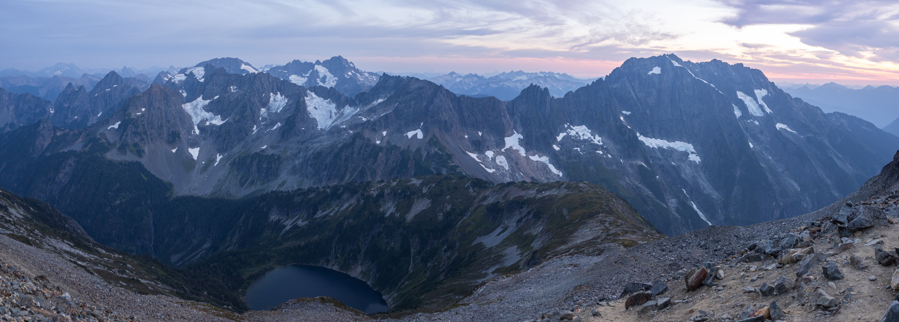
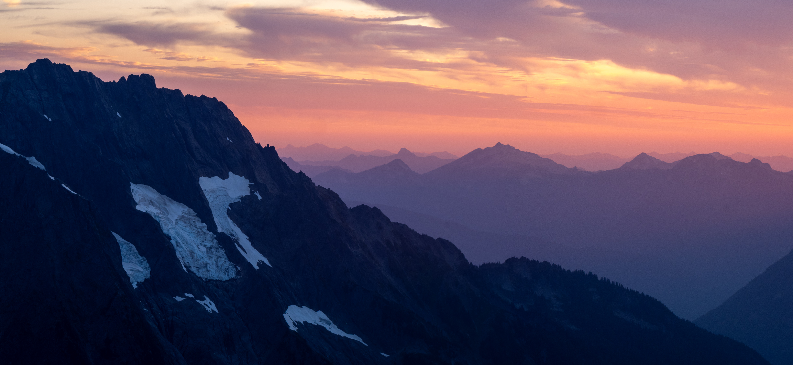

## Trip Overview

Sahale Glacier is one of the most sought-after backpacking trips in Washington State, after the [Enchantments](/blog/2022/08/enchantments-traverse/). Many people try their luck every year at the Early Access lottery for their chance to sleep amongst the jagged peaks of the North Cascades.

I can understand why: the location was spectacular, right at the foot of an actual glacier and a great place to watch the sunset and sunrise. The “most scenic toilet in the state” is up here! 

I had wanted to camp at the glacier for years, but never managed to get quite so lucky with the lottery. This year, I managed to get a permit for Sahale Glacier Camp with a last-minute cancellation, so I only had a two-day notice to plan it out and make the trip!

## Planning & Logistics

- Permit required for Sahale Glacier Camp (high demand, lottery system)

This is probably the most challenging part of the trip; only 4 groups are allowed per night. In the spring, the park opens up an Early Access lottery to offer reservations. Even then, securing this permit is highly competitive. Luckily, cancellations happen, and walk-up permits are offered if you have the chance to swing by a permit office.

Additionally, unlike other backpacking permits in other parks, this permit is issued in-person! This means you need to visit the Wilderness Information Center in Marblemount.

- Trailhead: Cascade Pass
- Water sources: Streams along the trail, glacier melt
- Gear: Standard backpacking kit, bear canister required



## Day 1: Hike to Sahale Glacier Camp

After picking up my permit, I drove down Cascade River Road. The road is in better shape than most forest service roads, but there were still a couple of rough patches. Cascade Pass is a very popular hike, so the biggest challenge was being ready to pass other cars on narrow sections of this dirt road.

Parking at the trailhead can be tough, and I saw cars parked a mile down the road, but I arrived late (2pm), so I got lucky as many of the morning hikers were leaving.

The hike has three distinct sections, each with its own vibes and obstacles:

- **Switchbacks to Cascade Pass:** 

The hike starts with over 30 switchbacks for about 3 miles. This part was crowded with day hikers, and the trail climbs up the valley with few views, but I spotted pikas and ptarmigans. The trail is wide and easy, if a bit boring, as it follows the understory of a forest. The trail is fairly dry here, but there were a couple of seasonal streams to refill water if needed.



Cascade Pass is the first major viewpoint on the trail, and marks the turnaround point for the majority of hikers. Only a few hikers and runners continue ahead up Sahale Arm.

From here, we could glimpse the headwaters of the Stehekin Valley. I met a few groups that were spending a few days hiking all the way to Stehekin—a fun trip, but not for today.

- **Sahale Arm:** 

Turning left from Cascade Pass, we entered another section of the trail for 2 miles, this time steeper and more rugged. As we were mostly above the treeline, the views really opened up, and we got expansive views of our surroundings: from the glaciers of Eldorado Peak to the beautiful Doubtful Lake below us.

After a few steep switchbacks, the grade mellows out. I encountered many pikas hiding in the boulders, some mountain goats, and marmots. In late August, there were tons of ripe blueberries and a good stream—a good spot to replenish water before the boulder field ahead.



It's important to stay on the main trail—lots of social trails are now off-limits. 

- **Sahale Glacier:** The last half mile is a steep slog up boulders and scree. It was slow going, but worth it for the views. I didn't carry hiking poles, but I would recommend it for this section.

Eventually, after 4 hours of hiking, I made it to the campground. Right away, this became one of my favorite backcountry camps. 

Majestic views of the best of the North Cascades. I was able to get a front-and-center view of jagged, glaciated peaks all around me. I saw more glaciers than I can count. I even found a spot to camp right under Sahale Glacier.



After setting up, I met the other campers who were there that night. Some of them were staying two nights, just to have a middle day to take in the views. Together, we watched an epic sunset, and I took photos of the mountains at twilight before retreating to my tent.

In good weather conditions, this place was perfect. It does get kind of windy up here, and I wouldn't want to come up here if any sort of bad weather is in the forecast!



For those prepared, a climb to Sahale Mountain is possible from the campground, but this would require the right training and gear for the required glacier travel.

## Day 2: Return

I woke up early to see the sunrise alpenglow. After enjoying the morning views, I packed up and headed down to the parking lot. On the way, I saw a cloud inversion in the valley. I got back to the parking lot by 9:30 am.



Overall it took me 4 hours to reach camp and 3 hours to hike out.
