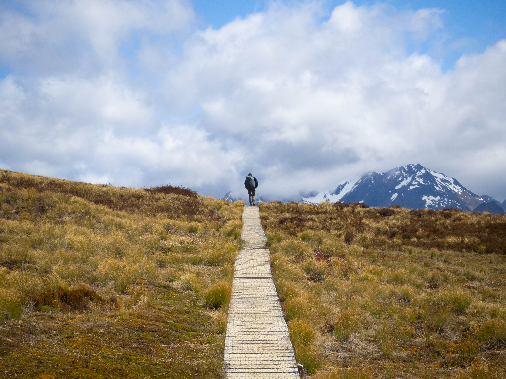
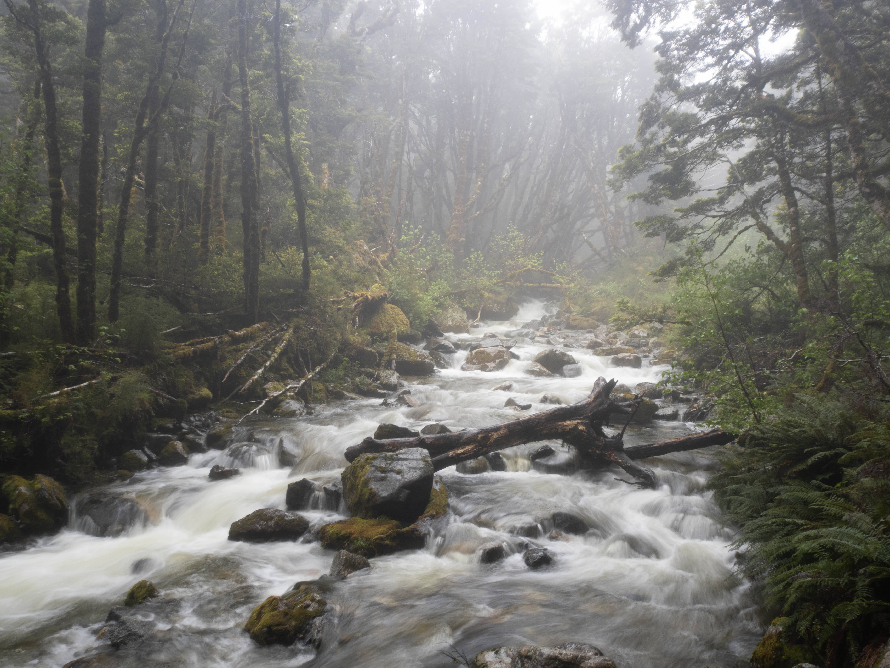
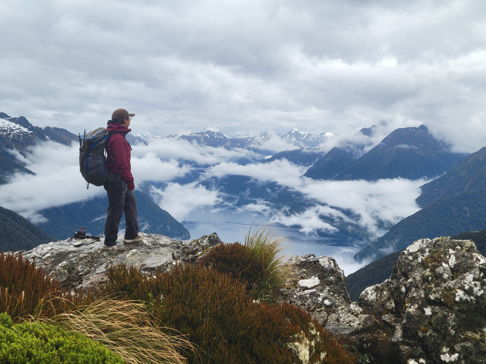

## Trip Overview

The Kepler Track is one of New Zealand's Great Walks, located in Fiordland National Park. This stunning alpine trek takes you through diverse landscapes including ancient rainforests, alpine herb fields, and dramatic mountain peaks. The track offers breathtaking views of Lake Te Anau, the Kepler Mountains, and the Eglinton Valley.



## Planning & Logistics

- **Best time to visit:** November to April (Summer/Autumn in New Zealand).
- **Permits:** Required for Great Walk huts during peak season (October to April). These often book up months in advance, but cancellations are common. We booked ours on the very hour the bookings opened.
- **Trailhead:** We started at Brod Bay (via Water Taxi) and exited at Rainbow Reach.
- **Water sources:** Streams and creeks are plentiful along the trail; huts provide water and gas.
- **Gear:** Standard 4-season backpacking kit. Rain gear is essential, as are warm layers for alpine conditions.

## Day 1: Water Taxi to Luxmore Hut

**Distance:** 8.2 km (5.1 mi) hiking + side trip to summit

On our first day, we woke up early to catch our 8:00 AM water taxi from Fiordland Outdoors to Brod Bay. The boat departed on time with a dozen hikers (mostly day-trippers, and a couple multi-day adventurers like us) and whisked us across the water to a beach landing. Despite the gloomy clouds, we were greeted by a brilliant rainbow over the lake.



At Brod Bay, we found a few damp picnic tables before entering the thick bush. The track here is a steady, unrelenting 800m climb. It wasn't too eventful until we reached the limestone bluffs, where we finally got a clear view of Lake Te Anau resting far below us. The track is wide and well-maintained, making for an easy, rhythmical walk.



All along the Kepler, there are wooden traps, marked with numbers and orange triangles, placed roughly every 100 meters. These are part of a massive conservation effort to protect New Zealand’s flightless birds. Stoats were introduced hundreds of years ago to eradicate invasive rabbits, but that was a failure and now stoats pose a threat to birds and native fauna alike.

Soon enough, we broke through the tree line and were surrounded by vast tussock grasslands. Without the tree cover, we could finally see Mt. Luxmore and panoramic views of the entire park! Unfortunately, Fiordland is known for strong, gusty winds, and we battled a very blustery 45-minute walk to get to the hut.

We checked into Luxmore Hut (by claiming our bunks) and had lunch. Luxmore Hut is worth a trip in itself. The hut perches on the edge of a limestone bluff, offering a panoramic view of the vast South Fjord of Lake Te Anau, with the jagged, snow-capped peaks of the Murchison Mountains rising directly across the water.



For a backcountry shelter, the facilities felt incredibly "luxurious" (living up to the name). It features a massive communal kitchen equipped with gas stovetops and even flush toilets (a true rarity in the wilderness). When staying here, the only essentials you really need to carry are your food and sleeping gear. However, the most important item in my pack was easily a pair of earplugs, it goes without saying that it is an essential in a room full of tired hikers.

In contrast to my past backpacking trips, we arrived around lunchtime, which meant we had the entire afternoon to relax. This is also where I saw my first Kea in the wild. These alpine parrots are incredibly smart and inquisitive, and the resident birds around the huts are a menace.

We used the free time to explore the Luxmore Caves, a short walk from the hut. I'm so glad we did! The caves were larger than I imagined, featuring impressive stalactites and stalagmites that take about 10 to 15 minutes to explore.



Afterward, I decided to push on and climb to the summit of Mt. Luxmore. While the summit is technically part of the Day 2 route, I had extra time and the weather forecast for the next day was less than stellar. I figured I should bag the peak while it was dry. I walked ahead a couple of kilometers before taking the side track up. It was quite windy at the top, and a Kea was waiting there, very interested in my backpack. After snapping a few quick photos, I descended in a hurry.

I made it back shortly before the 6:30 PM "hut talk," where the resident ranger walked us through house rules, tips, and weather advice. I loved staying in the hut and chatting with people from around the world. It felt like a social event, and not having to carry a tent or heavy cooking gear was a literal weight off my shoulders.

## Day 2: Luxmore Hut to Iris Burn Hut

**Distance:** 14.6 km (9 mi)

The second day of the track is usually "picture-perfect." The plan is to walk along the exposed ridgeline for almost the entire day, minus a steep descent down to our second stop, Iris Burn Hut.

The weather transitioned from bright and sunny to cloudy and moody. Aside from occasional rain, we still had excellent visibility of the track and the surrounding mountains.



Even though we were walking a ridgeline, the trail had significant elevation changes. It was also much less windy than the day before, which meant we couldn't stand still for too long without sandflies swarming us. From time to time, we found ourselves walking on a "knife's edge" with drop-offs on both sides, as if we were balanced on top of a blade.

I especially loved the views of the South Fjord of Lake Te Anau. It's not every day you get to see a fjord covered in clouds beneath your feet!



A bit past noon, we arrived at the Hanging Valley Shelter, where the track begins to drop steeply. Luckily, there were newly built stairs providing much-needed tread just as the rain picked up. We were fortunate with our timing, as the rain became intense later in the day. I wouldn't want to be caught up on the ridge in bad weather; the park rangers often close this section when winds are too strong, delaying hikers by a full day.



The descent from the Hanging Valley into the forest was incredibly steep. As we navigated the endless zig-zags, I was immensely grateful that we were walking down rather than up. I do think walking the Kelper counter-clockwise is a better choice purely because you get to avoid walking up so many switchbacks! Eventually, we reached the floor, and the quiet of the alpine ridge was replaced by the familiar, powerful roar of the valley's creeks as we reached the forest floor.

I also did the side track to see the nearby Iris Burn Falls. On a good day, it is a good place to see the endangered blue duck (whio). However, as it has been raining, I instead saw a raging waterfall.



During the evening talk, our amazing ranger gave us tips on how to spot nocturnal kiwi and glow worms near the hut. We woke up at 4:00 AM to put the advice to use. We were told to walk down the track toward Iris Burn Falls and stop halfway, using our red-light headlamps. We were close to giving up when we heard rustling in the bush and spotted a kiwi running away from us! We also saw glow worms tucked under tree trunks—faint, and nothing like the famous Waitomo Caves, but still a magical sight.

We were lucky; we asked around in the morning, and most other hikers hadn't been successful, assuming they managed to wake up early at all.

## Day 3: Iris Burn Hut to Rainbow Reach

**Distance:** 22.2 km (13.8 mi)

The last day was a mostly flat walk through the beech forest. While the valley track lacks the dramatic alpine views of the ridge, it was a neat experience seeing the native flora up close and navigating the many creek crossings. Still, it was a long, somewhat monotonous day. We had a 4:00 PM shuttle to catch, so we started walking at 6:00 AM, just past sunrise. Unfortunately, due to the sheer humidity, both my phone and camera lenses fogged up completely, so I wasn't able to take many photos.

We passed an interesting clearing known as the "Big Slip." This is the site of a massive landslide from 1984 caused by heavy rain, which wiped out the forest and created an open area with views of the valley walls and waterfalls cascading off the cliffs.

Along the track, we also spotted a rare Purple Pouch Mushroom (*Cortinarius porphyroideus*), along with other interesting gems in the understory.




Eventually, we arrived at Moturau Hut for lunch. Situated on the shores of Lake Manapouri with a beautiful beach, it is a picturesque spot to rest. Since it is so close to the trail exit, not many people choose to stay here overnight.

We had originally planned a 4-day hike, intending to sleep at Moturau Hut and walk the final 6km out the next morning. However, with the weather turning rainy and a yearning for a hot shower kicking in, we decided to push through and finish a day early.



From Moturau, it was a final push to the Rainbow Reach parking lot. Our shuttle arrived on time to take us back to the DOC visitor center, capping off an incredible adventure!

## Conclusion

This was my first hut-to-hut trip, and it set a high bar. I'm already eager to tackle other iconic New Zealand treks, such as the Routeburn Track, the Tongariro Northern Circuit, or the climb to Mueller Hut.

The Kepler Track offered an incredible diversity of terrain. Unless you are a purist intent on "closing the loop," taking the water taxi to start and exiting at Rainbow Reach is definitely the better option. It saves you from an additional 10km of flat forest walking that doesn't add much to the experience.

The weather in Fiordland is hard to predict. It is the third wettest place on Earth after all. Rain and wind seems commonplace here and we almost contemplated cancelling to to rain in the forecast, but I am glad things worked out the way they did.

I was also surprised by the amount of cellular reception on the track. I had pretty consistent signal on the first two days until the descent into the valley, including at Luxmore Hut. Then, we were off-the-grid until around Moturau Hut.

